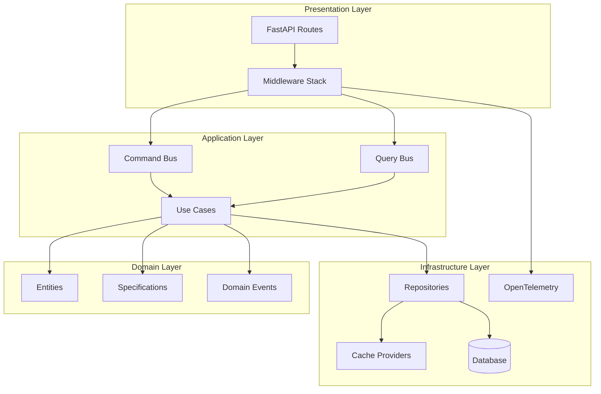

# Design Document: Advanced Reusability Patterns

## Overview

This design document describes the implementation of advanced patterns and practices to enhance the Python FastAPI template's reusability, maintainability, and production-readiness. The design follows Clean Architecture principles with Protocol-based interfaces for maximum flexibility.

## Architecture



## Components and Interfaces

### 1. Protocol-Based Interfaces

```python
# src/my_api/shared/protocols.py

from typing import Protocol, TypeVar, runtime_checkable, Any, Sequence
from pydantic import BaseModel

T = TypeVar("T", bound=BaseModel)
CreateDTO = TypeVar("CreateDTO", bound=BaseModel)
UpdateDTO = TypeVar("UpdateDTO", bound=BaseModel)

@runtime_checkable
class Identifiable(Protocol):
    """Protocol for entities with an ID."""
    id: Any

@runtime_checkable
class AsyncRepository(Protocol[T, CreateDTO, UpdateDTO]):
    """Protocol for async repository implementations."""
    
    async def get_by_id(self, entity_id: Any) -> T | None: ...
    async def create(self, data: CreateDTO) -> T: ...
    async def update(self, entity_id: Any, data: UpdateDTO) -> T | None: ...
    async def delete(self, entity_id: Any) -> bool: ...
    async def list_all(self, skip: int, limit: int) -> Sequence[T]: ...

@runtime_checkable
class CacheProvider(Protocol):
    """Protocol for cache implementations."""
    
    async def get(self, key: str) -> Any | None: ...
    async def set(self, key: str, value: Any, ttl: int | None = None) -> None: ...
    async def delete(self, key: str) -> None: ...
    async def clear(self) -> None: ...
```

### 2. Advanced Specification Pattern

```python
# src/my_api/shared/advanced_specification.py

from enum import Enum
from dataclasses import dataclass
from typing import Any, Generic, TypeVar
from sqlalchemy import and_, or_, not_

class ComparisonOperator(str, Enum):
    EQ = "eq"
    NE = "ne"
    GT = "gt"
    LT = "lt"
    IN = "in"
    LIKE = "like"
    BETWEEN = "between"
    IS_NULL = "is_null"

@dataclass(frozen=True)
class FilterCriteria:
    field: str
    operator: ComparisonOperator
    value: Any

class BaseSpecification(Generic[T]):
    """Base specification with SQL generation."""
    
    def is_satisfied_by(self, entity: T) -> bool: ...
    def to_sql_condition(self, model_class: type) -> Any: ...
    def and_(self, other: "BaseSpecification[T]") -> "CompositeSpecification[T]": ...
    def or_(self, other: "BaseSpecification[T]") -> "CompositeSpecification[T]": ...
    def not_(self) -> "NotSpecification[T]": ...
```

### 3. Multi-Level Caching System

```python
# src/my_api/shared/caching.py

@dataclass
class CacheConfig:
    ttl: int = 3600
    max_size: int = 1000
    key_prefix: str = ""

class InMemoryCacheProvider:
    """LRU cache with TTL support."""
    
    def __init__(self, max_size: int = 1000): ...
    async def get(self, key: str) -> Any | None: ...
    async def set(self, key: str, value: Any, ttl: int | None = None) -> None: ...

class RedisCacheProvider:
    """Redis-based cache with JSON serialization."""
    
    def __init__(self, redis_url: str): ...
    async def get(self, key: str) -> Any | None: ...
    async def set(self, key: str, value: Any, ttl: int | None = None) -> None: ...

def cached(ttl: int = 3600, key_fn: Callable | None = None):
    """Decorator for caching function results."""
    ...
```

### 4. OpenTelemetry Integration

```python
# src/my_api/infrastructure/observability/telemetry.py

class TelemetryProvider:
    """OpenTelemetry provider for traces, metrics, and logs."""
    
    def __init__(self, service_name: str, otlp_endpoint: str | None): ...
    def get_tracer(self) -> Tracer: ...
    def get_meter(self) -> Meter: ...
    
def traced(name: str | None = None, attributes: dict | None = None):
    """Decorator for creating custom spans."""
    ...

class TracingMiddleware:
    """Middleware for HTTP request tracing."""
    ...
```

### 5. CQRS Pattern

```python
# src/my_api/shared/cqrs.py

class Command(ABC):
    """Base class for commands."""
    
    @abstractmethod
    async def execute(self) -> Result[T, E]: ...

class Query(ABC, Generic[T]):
    """Base class for queries."""
    
    @abstractmethod
    async def execute(self) -> T: ...

class CommandBus:
    """Dispatches commands to handlers."""
    
    def register(self, command_type: type, handler: CommandHandler): ...
    async def dispatch(self, command: Command) -> Result: ...

class QueryBus:
    """Dispatches queries to handlers."""
    
    def register(self, query_type: type, handler: QueryHandler): ...
    async def dispatch(self, query: Query[T]) -> T: ...
```

## Data Models

### Cache Entry

```python
@dataclass
class CacheEntry:
    value: Any
    created_at: float
    ttl: int | None
    
    @property
    def is_expired(self) -> bool:
        if self.ttl is None:
            return False
        return time.time() - self.created_at > self.ttl
```

### Health Check Result

```python
@dataclass
class HealthCheckResult:
    name: str
    status: Literal["healthy", "unhealthy"]
    latency_ms: float
    details: dict[str, Any] | None = None
```

## Correctness Properties

*A property is a characteristic or behavior that should hold true across all valid executions of a system-essentially, a formal statement about what the system should do. Properties serve as the bridge between human-readable specifications and machine-verifiable correctness guarantees.*

### Property 1: Protocol Runtime Checkable
*For any* object that implements all methods of a `@runtime_checkable` Protocol, `isinstance(obj, Protocol)` SHALL return True.
**Validates: Requirements 1.2, 1.3**

### Property 2: Specification Operator Correctness
*For any* field value and comparison operator, `FieldSpecification.is_satisfied_by()` SHALL return the mathematically correct comparison result.
**Validates: Requirements 2.1**

### Property 3: Specification Composition
*For any* two specifications A and B and any candidate entity, `(A.and_(B)).is_satisfied_by(x)` SHALL equal `A.is_satisfied_by(x) and B.is_satisfied_by(x)`, and `(A.or_(B)).is_satisfied_by(x)` SHALL equal `A.is_satisfied_by(x) or B.is_satisfied_by(x)`.
**Validates: Requirements 2.2**

### Property 4: Specification Negation
*For any* specification S and any candidate entity, `S.not_().is_satisfied_by(x)` SHALL equal `not S.is_satisfied_by(x)`.
**Validates: Requirements 2.6**

### Property 5: Specification SQL Equivalence
*For any* specification and dataset, filtering in-memory with `is_satisfied_by()` SHALL produce the same results as filtering with the generated SQL condition.
**Validates: Requirements 2.3, 2.4**

### Property 6: Cache Round-Trip
*For any* JSON-serializable value, `cache.set(key, value)` followed by `cache.get(key)` SHALL return an equivalent value (before TTL expiration).
**Validates: Requirements 3.2, 3.7**

### Property 7: Cache TTL Expiration
*For any* cache entry with TTL, after the TTL duration has elapsed, `cache.get(key)` SHALL return None.
**Validates: Requirements 3.3**

### Property 8: Cache LRU Eviction
*For any* in-memory cache with max_size N, when N+1 items are added, the least recently accessed item SHALL be evicted.
**Validates: Requirements 3.4**

### Property 9: Cached Decorator Idempotence
*For any* function decorated with `@cached`, calling with the same arguments multiple times SHALL return the same result and execute the underlying function only once (within TTL).
**Validates: Requirements 3.5**

### Property 10: Trace Span Creation
*For any* HTTP request or `@traced` decorated function, a span SHALL be created with the correct name and attributes.
**Validates: Requirements 4.2, 4.5**

### Property 11: Log Trace Correlation
*For any* log emitted within an active trace context, the log record SHALL include `trace_id` and `span_id` fields.
**Validates: Requirements 4.7**

### Property 12: Command Bus Dispatch
*For any* registered command type and handler, dispatching a command of that type SHALL invoke the registered handler.
**Validates: Requirements 5.3**

### Property 13: Query Bus Dispatch
*For any* registered query type and handler, dispatching a query of that type SHALL invoke the registered handler and return its result.
**Validates: Requirements 5.4**

### Property 14: Code Generation Completeness
*For any* entity name, the code generator SHALL produce all required files (entity, repository, use case, mapper, routes, tests).
**Validates: Requirements 6.1, 6.4**

### Property 15: Health Check Dependency Verification
*For any* configured dependency, the readiness probe SHALL check its availability and include the result in the response.
**Validates: Requirements 7.2, 7.3**

### Property 16: Configuration Validation
*For any* configuration with invalid values (missing required fields, constraint violations), loading SHALL raise a descriptive error.
**Validates: Requirements 8.1, 8.2, 8.4**

### Property 17: Secret Redaction
*For any* configuration value marked as `SecretStr`, string representation SHALL show redacted value (e.g., "**********").
**Validates: Requirements 8.5**

## Error Handling

### Cache Errors
- Cache failures are non-fatal; operations continue without cache
- Errors are logged with warning level
- Metrics track cache hit/miss/error rates

### Specification Errors
- Invalid field names raise `ValueError` with descriptive message
- Type mismatches in comparisons raise `TypeError`

### CQRS Errors
- Unregistered command/query types raise `HandlerNotFoundError`
- Handler execution errors are wrapped in `Result.Err`

### Health Check Errors
- Individual check failures don't stop other checks
- Timeout errors are treated as failures
- All errors include stack traces in debug mode

## Testing Strategy

### Dual Testing Approach

This project uses both unit tests and property-based tests:

- **Unit tests**: Verify specific examples, edge cases, and integration points
- **Property-based tests**: Verify universal properties across all valid inputs using Hypothesis

### Property-Based Testing Framework

- **Library**: Hypothesis (Python)
- **Minimum iterations**: 100 per property test
- **Test annotation format**: `**Feature: advanced-reusability, Property {number}: {property_text}**`

### Test Categories

1. **Protocol Tests**
   - Verify runtime_checkable behavior
   - Test structural subtyping

2. **Specification Tests**
   - Property tests for all operators
   - Composition correctness
   - SQL generation equivalence

3. **Cache Tests**
   - Round-trip properties
   - TTL expiration
   - LRU eviction
   - Concurrent access

4. **Observability Tests**
   - Span creation verification
   - Log correlation
   - Metric emission

5. **CQRS Tests**
   - Handler dispatch
   - Event emission
   - Error handling

6. **Code Generator Tests**
   - File generation completeness
   - Template correctness
   - Validator generation

7. **Health Check Tests**
   - Dependency verification
   - Timeout handling
   - Status reporting

8. **Configuration Tests**
   - Validation properties
   - Secret redaction
   - Default values

