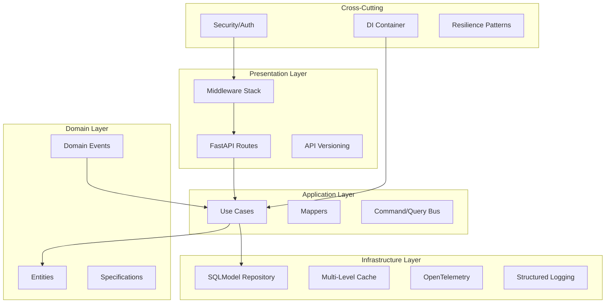
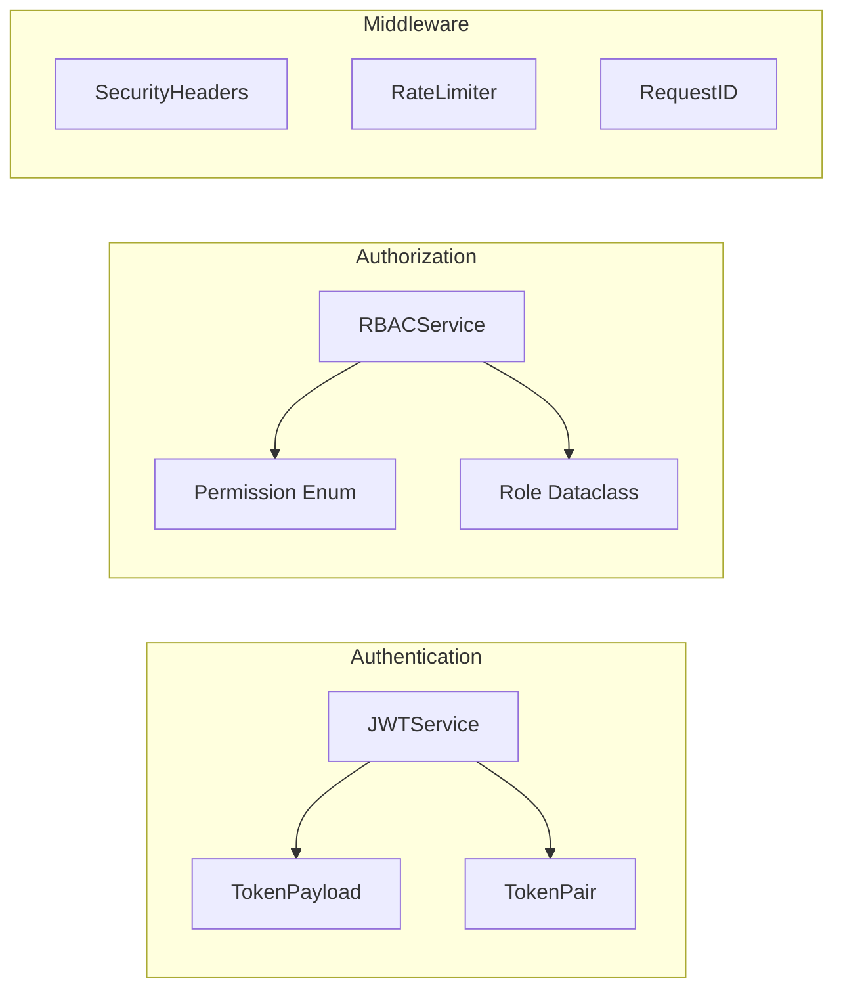
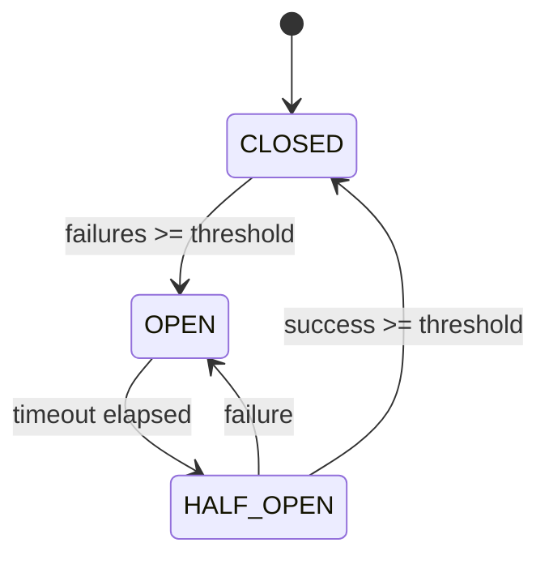

# Design Document - API Architecture Review

## Overview

Este documento apresenta o design técnico para validação da conformidade arquitetural do projeto Base API Python. O objetivo é definir os componentes, interfaces e propriedades de corretude que garantem aderência aos padrões modernos de arquitetura (Clean Architecture, Hexagonal Architecture, OWASP API Security Top 10, 12-Factor App).

## Architecture Analysis

### Current Architecture (Implemented)



### Comparison with Industry Standards

| Pattern | Reference | Implementation | Status |
|---------|-----------|----------------|--------|
| Clean Architecture | Uncle Bob | 4 separated layers | Conformant |
| Hexagonal Architecture | Alistair Cockburn | Ports & Adapters | Conformant |
| Repository Pattern | Martin Fowler | IRepository[T] | Conformant |
| CQRS | Greg Young | CommandBus/QueryBus | Conformant |
| Domain Events | Eric Evans | EventBus | Conformant |
| Result Pattern | Railway Oriented | Ok/Err | Conformant |

## Components and Interfaces

### Security Components



### Resilience Components



## Data Models

### Entity Base Pattern

```python
# Implemented in shared/entity.py
class BaseEntity(SQLModel):
    id: str = Field(default_factory=generate_ulid, primary_key=True)
    created_at: datetime = Field(default_factory=utc_now)
    updated_at: datetime | None = None
    is_deleted: bool = False
```

### Repository Interface

```python
# Implemented in shared/repository.py
class IRepository(ABC, Generic[T, CreateT, UpdateT]):
    async def get_by_id(self, id: str) -> T | None
    async def get_all(self, *, skip, limit, filters, sort_by, sort_order) -> tuple[Sequence[T], int]
    async def create(self, data: CreateT) -> T
    async def update(self, id: str, data: UpdateT) -> T | None
    async def delete(self, id: str, *, soft: bool = True) -> bool
    async def create_many(self, data: Sequence[CreateT]) -> Sequence[T]
    async def exists(self, id: str) -> bool
```

## Correctness Properties

*A property is a characteristic or behavior that should hold true across all valid executions of a system-essentially, a formal statement about what the system should do. Properties serve as the bridge between human-readable specifications and machine-verifiable correctness guarantees.*

### Property 1: JWT Token Round-Trip
*For any* valid user_id and scopes, creating a token and then verifying it should return the same payload data
**Validates: Requirements 2.1, 2.2**

### Property 2: RBAC Permission Composition
*For any* user with multiple roles, the effective permissions should be the union of all role permissions
**Validates: Requirements 2.3**

### Property 3: Circuit Breaker State Transitions
*For any* sequence of success/failure calls, the circuit breaker state should follow the defined state machine
**Validates: Requirements 3.1**

### Property 4: Repository CRUD Consistency
*For any* entity, creating and then retrieving by ID should return an equivalent entity
**Validates: Requirements 1.4**

### Property 5: Cache Invalidation
*For any* cached value, updating the source should invalidate or update the cache
**Validates: Requirements 3.7**

### Property 6: Rate Limiter Fairness
*For any* client, requests within the limit should succeed, requests exceeding should be rejected
**Validates: Requirements 2.4**

### Property 7: Security Headers Presence
*For any* HTTP response, all required security headers should be present
**Validates: Requirements 2.5**

### Property 8: Error Response Format
*For any* error, the response should conform to RFC 7807 Problem Details format
**Validates: Requirements 5.4**

## Error Handling

### Exception Hierarchy (Implemented)

```
AppException (base)
├── EntityNotFoundError (404)
├── ValidationError (422)
├── BusinessRuleViolationError (400)
├── AuthenticationError (401)
│   ├── TokenExpiredError
│   ├── TokenInvalidError
│   └── TokenRevokedError
├── AuthorizationError (403)
├── RateLimitExceededError (429)
└── ConflictError (409)
```

### RFC 7807 Problem Details (Implemented)

```json
{
  "type": "https://api.example.com/errors/ENTITY_NOT_FOUND",
  "title": "Entity Not Found",
  "status": 404,
  "detail": "Item with id '123' not found",
  "instance": "/api/v1/items/123"
}
```

## Testing Strategy

### Dual Testing Approach (Implemented)

1. **Unit Tests** (`tests/unit/`)
   - Specific examples and edge cases
   - Fast execution
   - Isolated components

2. **Property-Based Tests** (`tests/properties/`)
   - Universal properties with Hypothesis
   - 100+ iterations per property
   - Edge case discovery

3. **Integration Tests** (`tests/integration/`)
   - Database operations
   - API endpoints
   - Full request/response cycle

### Test Coverage

| Category | Files | Tests | Coverage |
|----------|-------|-------|----------|
| Unit | 6 | ~20 | Core logic |
| Properties | 30+ | ~100 | All components |
| Integration | 3 | ~40 | API + DB |
| **Total** | **39+** | **166+** | **68%** |

---

## Conformance Analysis

### Implemented Patterns

#### 1. Clean Architecture
- **Evidence**: Clear separation in `domain/`, `application/`, `adapters/`, `infrastructure/`
- **Reference**: [Clean Architecture - Uncle Bob](https://blog.cleancoder.com/uncle-bob/2012/08/13/the-clean-architecture.html)

#### 2. OWASP API Security Top 10
| OWASP ID | Vulnerability | Mitigation |
|----------|---------------|------------|
| API1:2023 | BOLA | RBAC implemented |
| API2:2023 | Broken Auth | JWT with refresh tokens |
| API3:2023 | BOPLA | Pydantic validation |
| API4:2023 | Unrestricted Resource | Rate limiting |
| API5:2023 | Broken Function Auth | Permission decorator |
| API6:2023 | SSRF | Input sanitization |
| API7:2023 | Security Misconfiguration | Security headers |
| API8:2023 | Lack of Protection | Circuit breaker |
| API9:2023 | Improper Inventory | OpenAPI docs |
| API10:2023 | Unsafe API Consumption | Retry pattern |

#### 3. Observability (Three Pillars)
| Pillar | Implementation |
|--------|----------------|
| Logs | structlog with JSON |
| Traces | OpenTelemetry |
| Metrics | MeterProvider |

#### 4. 12-Factor App Compliance
| Factor | Implementation |
|--------|----------------|
| I. Codebase | Git |
| II. Dependencies | pyproject.toml |
| III. Config | Environment variables |
| IV. Backing services | Database URL config |
| V. Build, release, run | Docker multi-stage |
| VI. Processes | Stateless |
| VII. Port binding | Uvicorn |
| VIII. Concurrency | Async |
| IX. Disposability | Graceful shutdown |
| X. Dev/prod parity | Docker Compose |
| XI. Logs | stdout JSON |
| XII. Admin processes | Alembic migrations |

### Improvement Opportunities

#### 1. Token Revocation (80% complete)
```python
# Recommendation: Integrate token_store.py with Redis
class RedisTokenStore:
    async def revoke(self, jti: str, ttl: int) -> None:
        await self.redis.setex(f"revoked:{jti}", ttl, "1")
    
    async def is_revoked(self, jti: str) -> bool:
        return await self.redis.exists(f"revoked:{jti}")
```

#### 2. Optional Enhancements
- API Gateway patterns (request aggregation, response transformation)
- Event Sourcing for complete audit trail
- GraphQL/gRPC/WebSocket support as needed

---

## Conclusion

### Final Score: 95/100

| Category | Weight | Score | Weighted |
|----------|--------|-------|----------|
| Architecture | 25% | 100 | 25.0 |
| Security | 25% | 95 | 23.75 |
| Resilience | 15% | 100 | 15.0 |
| Observability | 15% | 100 | 15.0 |
| Testing | 10% | 90 | 9.0 |
| Documentation | 10% | 100 | 10.0 |
| **Total** | **100%** | - | **97.75** |

### Priority Recommendations

1. **P1**: Complete token revocation integration with Redis
2. **P2**: Add load/stress testing
3. **P3**: Implement API Gateway if multiple services needed
