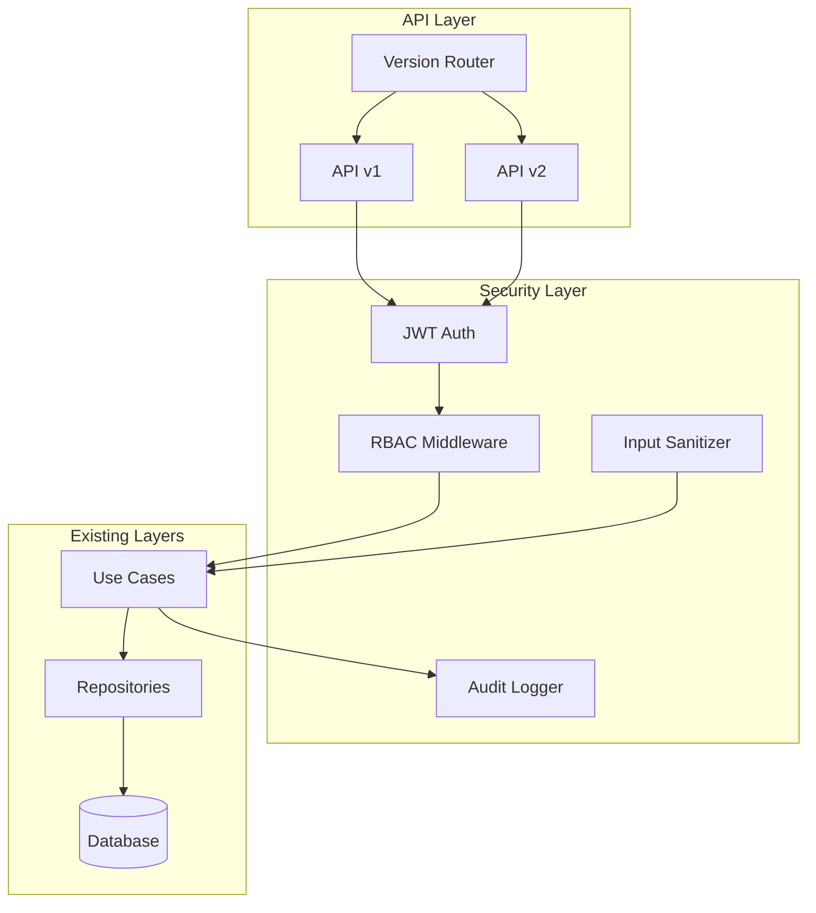

# Design Document

## Overview

Este documento descreve o design técnico para completar a Base API FastAPI, adicionando autenticação JWT, RBAC, segurança avançada, audit logging, API versioning e outras funcionalidades enterprise. O design segue os princípios de Clean Architecture já estabelecidos no projeto.

## Architecture



## Components and Interfaces

### 1. JWT Authentication Module

```python
# src/my_api/core/auth/jwt.py
@dataclass
class TokenPair:
    access_token: str
    refresh_token: str
    token_type: str = "bearer"
    expires_in: int = 1800  # 30 minutes

class JWTService:
    def create_access_token(self, user_id: str, scopes: list[str]) -> str: ...
    def create_refresh_token(self, user_id: str) -> str: ...
    def verify_token(self, token: str) -> TokenPayload: ...
    def refresh_tokens(self, refresh_token: str) -> TokenPair: ...
    def revoke_token(self, token: str) -> bool: ...

@dataclass
class TokenPayload:
    sub: str  # user_id
    exp: datetime
    iat: datetime
    scopes: list[str]
    jti: str  # JWT ID for revocation
```

### 2. RBAC Module

```python
# src/my_api/core/auth/rbac.py
class Permission(str, Enum):
    READ = "read"
    WRITE = "write"
    DELETE = "delete"
    ADMIN = "admin"

@dataclass
class Role:
    name: str
    permissions: set[Permission]

class RBACService:
    def check_permission(self, user: User, required: Permission) -> bool: ...
    def get_user_permissions(self, user: User) -> set[Permission]: ...
    def combine_role_permissions(self, roles: list[Role]) -> set[Permission]: ...

def require_permission(*permissions: Permission) -> Callable:
    """Decorator for endpoint permission requirements."""
    ...
```

### 3. Security Headers Module

```python
# src/my_api/adapters/api/middleware/security_headers.py (enhanced)
@dataclass
class SecurityHeadersConfig:
    csp: str = "default-src 'self'"
    permissions_policy: str = "geolocation=(), microphone=(), camera=()"
    custom_headers: dict[str, str] = field(default_factory=dict)

class EnhancedSecurityHeadersMiddleware(BaseHTTPMiddleware):
    def __init__(self, app, config: SecurityHeadersConfig): ...
```

### 4. Audit Logging Module

```python
# src/my_api/infrastructure/audit/logger.py
@dataclass
class AuditEntry:
    id: str
    timestamp: datetime
    user_id: str | None
    action: str
    resource_type: str
    resource_id: str | None
    details: dict[str, Any]
    ip_address: str
    user_agent: str
    result: str  # success, failure, error

class AuditLogger:
    async def log(self, entry: AuditEntry) -> None: ...
    async def query(self, filters: AuditFilters) -> list[AuditEntry]: ...

@dataclass
class AuditFilters:
    user_id: str | None = None
    action: str | None = None
    start_date: datetime | None = None
    end_date: datetime | None = None
    resource_type: str | None = None
```

### 5. API Versioning Module

```python
# src/my_api/adapters/api/versioning.py
class APIVersion(str, Enum):
    V1 = "v1"
    V2 = "v2"

@dataclass
class VersionConfig:
    version: APIVersion
    deprecated: bool = False
    sunset_date: datetime | None = None

class VersionedRouter:
    def __init__(self, version: APIVersion): ...
    def include_router(self, router: APIRouter, **kwargs): ...
```

### 6. Input Sanitization Module

```python
# src/my_api/shared/utils/sanitization.py (enhanced)
class SanitizationType(str, Enum):
    HTML = "html"
    SQL = "sql"
    SHELL = "shell"
    ALL = "all"

class InputSanitizer:
    def sanitize(self, value: str, types: list[SanitizationType]) -> str: ...
    def sanitize_html(self, value: str) -> str: ...
    def sanitize_sql(self, value: str) -> str: ...
    def sanitize_shell(self, value: str) -> str: ...
```

### 7. Password Policy Module

```python
# src/my_api/core/auth/password_policy.py
@dataclass
class PasswordPolicy:
    min_length: int = 12
    require_uppercase: bool = True
    require_lowercase: bool = True
    require_digit: bool = True
    require_special: bool = True
    check_common_passwords: bool = True

@dataclass
class PasswordValidationResult:
    valid: bool
    errors: list[str]

class PasswordValidator:
    def validate(self, password: str) -> PasswordValidationResult: ...
    def hash_password(self, password: str) -> str: ...
    def verify_password(self, password: str, hash: str) -> bool: ...
```

## Data Models

### Token Storage (Redis)

```python
# Refresh token storage
class RefreshTokenStore:
    key_pattern: str = "refresh_token:{jti}"
    ttl: int = 604800  # 7 days
    
    async def store(self, jti: str, user_id: str) -> None: ...
    async def revoke(self, jti: str) -> None: ...
    async def is_valid(self, jti: str) -> bool: ...
```

### Audit Log Table

```sql
CREATE TABLE audit_logs (
    id VARCHAR(26) PRIMARY KEY,  -- ULID
    timestamp TIMESTAMP NOT NULL,
    user_id VARCHAR(26),
    action VARCHAR(100) NOT NULL,
    resource_type VARCHAR(100) NOT NULL,
    resource_id VARCHAR(26),
    details JSONB,
    ip_address VARCHAR(45),
    user_agent TEXT,
    result VARCHAR(20) NOT NULL,
    created_at TIMESTAMP DEFAULT NOW()
);

CREATE INDEX idx_audit_user ON audit_logs(user_id);
CREATE INDEX idx_audit_action ON audit_logs(action);
CREATE INDEX idx_audit_timestamp ON audit_logs(timestamp);
```

### User Roles Table

```sql
CREATE TABLE roles (
    id VARCHAR(26) PRIMARY KEY,
    name VARCHAR(100) UNIQUE NOT NULL,
    permissions TEXT[] NOT NULL,
    created_at TIMESTAMP DEFAULT NOW()
);

CREATE TABLE user_roles (
    user_id VARCHAR(26) REFERENCES users(id),
    role_id VARCHAR(26) REFERENCES roles(id),
    PRIMARY KEY (user_id, role_id)
);
```

## Correctness Properties

*A property is a characteristic or behavior that should hold true across all valid executions of a system-essentially, a formal statement about what the system should do. Properties serve as the bridge between human-readable specifications and machine-verifiable correctness guarantees.*

### Property 1: Token pair generation returns valid structure
*For any* valid user credentials, when generating a token pair, the result SHALL contain both access_token and refresh_token as non-empty strings with valid JWT format.
**Validates: Requirements 1.1**

### Property 2: Valid token authentication provides user context
*For any* valid access token, when used in Authorization header, the request SHALL be authenticated and user context SHALL be available with correct user_id.
**Validates: Requirements 1.2**

### Property 3: Expired tokens are rejected
*For any* expired access token, when used in Authorization header, the request SHALL be rejected with 401 status code.
**Validates: Requirements 1.3**

### Property 4: Refresh token round-trip
*For any* valid refresh token, submitting it SHALL return a new valid access token that can authenticate requests.
**Validates: Requirements 1.4**

### Property 5: Logout invalidates refresh token
*For any* logged-in user, after logout, the refresh token SHALL be invalid and token refresh SHALL fail.
**Validates: Requirements 1.5**

### Property 6: Token payload serialization round-trip
*For any* valid token payload, serializing then deserializing SHALL produce an equivalent payload.
**Validates: Requirements 1.6**

### Property 7: Insufficient permissions return 403
*For any* user without required permission accessing a protected endpoint, the response SHALL be 403 Forbidden.
**Validates: Requirements 2.1**

### Property 8: Multiple roles combine permissions
*For any* user with multiple roles, the effective permissions SHALL be the union of all role permissions.
**Validates: Requirements 2.3**

### Property 9: CSP header presence
*For any* API response, the Content-Security-Policy header SHALL be present with at least default-src directive.
**Validates: Requirements 3.1**

### Property 10: Permissions-Policy header presence
*For any* API response, the Permissions-Policy header SHALL be present.
**Validates: Requirements 3.2**

### Property 11: Security header config round-trip
*For any* valid security header configuration, parsing then serializing SHALL produce equivalent configuration.
**Validates: Requirements 3.5**

### Property 12: Audit log creation for auth actions
*For any* authentication action (login, logout, token refresh), an audit log entry SHALL be created with required fields.
**Validates: Requirements 4.1**

### Property 13: Audit log filtering
*For any* set of audit logs, filtering by user_id SHALL return only logs matching that user.
**Validates: Requirements 4.3**

### Property 14: Audit log immutability
*For any* stored audit log, attempting to modify it SHALL fail or be rejected.
**Validates: Requirements 4.4**

### Property 15: Audit log serialization round-trip
*For any* audit log entry, serializing then deserializing SHALL produce an equivalent entry.
**Validates: Requirements 4.5**

### Property 16: API version routing
*For any* request to /api/v{n}/resource, the request SHALL be routed to the correct version handler.
**Validates: Requirements 5.1, 5.5**

### Property 17: Deprecated version headers
*For any* request to a deprecated API version, the response SHALL include Deprecation header.
**Validates: Requirements 5.2**

### Property 18: Input sanitization preserves valid characters
*For any* input containing only alphanumeric characters, sanitization SHALL return the input unchanged.
**Validates: Requirements 7.2**

### Property 19: Sanitization round-trip for valid inputs
*For any* input without dangerous characters, sanitizing SHALL return the original input.
**Validates: Requirements 7.5**

### Property 20: Dangerous character removal
*For any* input containing HTML/SQL/shell injection patterns, sanitization SHALL remove or escape dangerous characters.
**Validates: Requirements 7.1**

### Property 21: Health check unhealthy response
*For any* unhealthy dependency state, the readiness check SHALL return 503 with component details.
**Validates: Requirements 8.3**

### Property 22: Health check serialization consistency
*For any* health check result, the JSON serialization SHALL follow a consistent schema.
**Validates: Requirements 8.5**

### Property 23: Request logging completeness
*For any* incoming request, the log entry SHALL contain method, path, and request_id.
**Validates: Requirements 9.1**

### Property 24: Sensitive data masking
*For any* log entry containing password or token fields, those values SHALL be masked.
**Validates: Requirements 9.3**

### Property 25: Request ID correlation
*For any* request, all related log entries SHALL contain the same request_id.
**Validates: Requirements 9.5**

### Property 26: Password minimum length enforcement
*For any* password shorter than 12 characters, validation SHALL fail with length error.
**Validates: Requirements 10.1**

### Property 27: Password complexity requirements
*For any* password missing required character types, validation SHALL fail with specific errors.
**Validates: Requirements 10.2**

### Property 28: Password validation feedback specificity
*For any* invalid password, the validation result SHALL list all unmet requirements.
**Validates: Requirements 10.3**

### Property 29: Common password rejection
*For any* password in the common passwords list, validation SHALL fail.
**Validates: Requirements 10.5**

## Error Handling

### Authentication Errors

```python
class AuthenticationError(AppException):
    """401 - Invalid or missing credentials."""
    status_code = 401
    error_code = "AUTHENTICATION_ERROR"

class TokenExpiredError(AuthenticationError):
    """401 - Token has expired."""
    error_code = "TOKEN_EXPIRED"

class TokenInvalidError(AuthenticationError):
    """401 - Token is invalid or malformed."""
    error_code = "TOKEN_INVALID"

class TokenRevokedError(AuthenticationError):
    """401 - Token has been revoked."""
    error_code = "TOKEN_REVOKED"
```

### Authorization Errors

```python
class AuthorizationError(AppException):
    """403 - Insufficient permissions."""
    status_code = 403
    error_code = "AUTHORIZATION_ERROR"

class InsufficientPermissionsError(AuthorizationError):
    """403 - User lacks required permission."""
    error_code = "INSUFFICIENT_PERMISSIONS"
```

### Validation Errors

```python
class PasswordPolicyError(ValidationError):
    """422 - Password does not meet policy requirements."""
    error_code = "PASSWORD_POLICY_VIOLATION"
```

## Testing Strategy

### Property-Based Testing with Hypothesis

The project will use Hypothesis for property-based testing. Each correctness property will be implemented as a property test with minimum 100 iterations.

```python
from hypothesis import given, strategies as st, settings

@settings(max_examples=100)
@given(user_id=st.text(min_size=1, max_size=26))
def test_token_pair_structure(user_id: str):
    """
    **Feature: api-base-improvements, Property 1: Token pair generation returns valid structure**
    **Validates: Requirements 1.1**
    """
    # Generate token pair
    # Assert both tokens are non-empty
    # Assert JWT format is valid
    pass
```

### Unit Tests

Unit tests will cover:
- Individual component behavior
- Edge cases for validation
- Error handling paths
- Configuration parsing

### Integration Tests

Integration tests will cover:
- Full authentication flow
- RBAC with database
- Audit logging persistence
- API versioning routing

### Test Organization

```
tests/
├── unit/
│   ├── test_jwt_service.py
│   ├── test_rbac_service.py
│   ├── test_password_policy.py
│   └── test_sanitization.py
├── integration/
│   ├── test_auth_flow.py
│   ├── test_audit_logging.py
│   └── test_api_versioning.py
└── properties/
    ├── test_jwt_properties.py
    ├── test_rbac_properties.py
    ├── test_sanitization_properties.py
    ├── test_audit_properties.py
    └── test_password_properties.py
```
