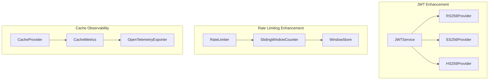

# Design Document - API Base Score 100

## Overview

Este documento detalha o design das melhorias para elevar a API Base de 96/100 para 100/100, focando em JWT asymmetric algorithms, sliding window rate limiting, cache OpenTelemetry metrics, e documentação completa.

## Architecture

### Component Diagram



## Components and Interfaces

### 1. JWT Asymmetric Algorithm Support

```python
class JWTAlgorithmProvider(Protocol):
    """Protocol for JWT algorithm providers."""
    
    def sign(self, payload: dict, key: str) -> str: ...
    def verify(self, token: str, key: str) -> dict: ...
    
class RS256Provider:
    """RS256 (RSA + SHA-256) provider for asymmetric JWT."""
    
    def sign(self, payload: dict, private_key: str) -> str: ...
    def verify(self, token: str, public_key: str) -> dict: ...
```

### 2. Sliding Window Rate Limiter

```python
@dataclass(frozen=True, slots=True)
class SlidingWindowConfig:
    """Sliding window rate limiter configuration."""
    
    requests_per_window: int
    window_size_seconds: int
    
class SlidingWindowRateLimiter:
    """Rate limiter using sliding window algorithm."""
    
    def is_allowed(self, key: str) -> tuple[bool, int]: ...
    def get_retry_after(self, key: str) -> int: ...
```

### 3. Cache OpenTelemetry Metrics

```python
@dataclass
class CacheMetrics:
    """Cache metrics for OpenTelemetry export."""
    
    hits: int = 0
    misses: int = 0
    evictions: int = 0
    
    @property
    def hit_rate(self) -> float: ...
    
class CacheMetricsExporter:
    """Export cache metrics to OpenTelemetry."""
    
    def export_metrics(self, metrics: CacheMetrics) -> None: ...
```

## Data Models

### JWT Key Configuration

```python
@dataclass(frozen=True, slots=True)
class JWTKeyConfig:
    """JWT key configuration for asymmetric algorithms."""
    
    algorithm: str  # RS256, ES256, HS256
    private_key: SecretStr | None  # For signing (RS256/ES256)
    public_key: str | None  # For verification (RS256/ES256)
    secret_key: SecretStr | None  # For HS256
```

### Rate Limit Window

```python
@dataclass(frozen=True, slots=True)
class WindowState:
    """State of a rate limit window."""
    
    window_start: datetime
    request_count: int
    previous_count: int
```

## Correctness Properties

*A property is a characteristic or behavior that should hold true across all valid executions of a system-essentially, a formal statement about what the system should do. Properties serve as the bridge between human-readable specifications and machine-verifiable correctness guarantees.*

### Property 1: RS256 Sign-Verify Round Trip
*For any* valid payload and RS256 key pair, signing with private key followed by verification with public key SHALL return the original payload.
**Validates: Requirements 1.2**

### Property 2: Algorithm Mismatch Rejection
*For any* token signed with algorithm A, verification with algorithm B (where A ≠ B) SHALL raise InvalidTokenError.
**Validates: Requirements 1.3**

### Property 3: Invalid Key Format Error
*For any* malformed key string, JWT operations SHALL raise a descriptive error.
**Validates: Requirements 1.5**

### Property 4: Sliding Window Weighted Count
*For any* timestamp within a window, the weighted count SHALL equal: previous_count * (1 - elapsed/window_size) + current_count.
**Validates: Requirements 2.2**

### Property 5: Rate Limit 429 Response
*For any* request that exceeds the sliding window limit, the response SHALL have status 429 and include Retry-After header.
**Validates: Requirements 2.3**

### Property 6: Rate Limit Format Parsing
*For any* valid rate limit string in format "N/unit", parsing SHALL extract requests and window size correctly.
**Validates: Requirements 2.4**

### Property 7: Cache Hit Counter Increment
*For any* cache get operation that returns a value, the hits counter SHALL increment by 1.
**Validates: Requirements 3.1**

### Property 8: Cache Miss Counter Increment
*For any* cache get operation that returns None, the misses counter SHALL increment by 1.
**Validates: Requirements 3.2**

### Property 9: Cache Hit Rate Calculation
*For any* sequence of cache operations, hit_rate SHALL equal hits / (hits + misses).
**Validates: Requirements 3.3**

### Property 10: Cache Eviction Counter
*For any* cache at max_size, adding a new entry SHALL increment evictions counter by 1.
**Validates: Requirements 3.5**

## Error Handling

### JWT Errors

| Error | Condition | HTTP Status |
|-------|-----------|-------------|
| InvalidKeyError | Malformed key | 500 |
| AlgorithmMismatchError | Token alg ≠ expected | 401 |
| TokenExpiredError | exp < now | 401 |

### Rate Limit Errors

| Error | Condition | HTTP Status |
|-------|-----------|-------------|
| RateLimitExceeded | count > limit | 429 |

## Testing Strategy

### Property-Based Testing Framework

- **Library**: Hypothesis 6.115.0+
- **Minimum Iterations**: 100 per property
- **Annotation Format**: `**Feature: api-base-score-100, Property {number}: {property_text}**`

### Test Coverage Matrix

| Component | Unit Tests | Property Tests |
|-----------|------------|----------------|
| RS256 Provider | ✅ | ✅ Property 1-3 |
| Sliding Window | ✅ | ✅ Property 4-6 |
| Cache Metrics | ✅ | ✅ Property 7-10 |
