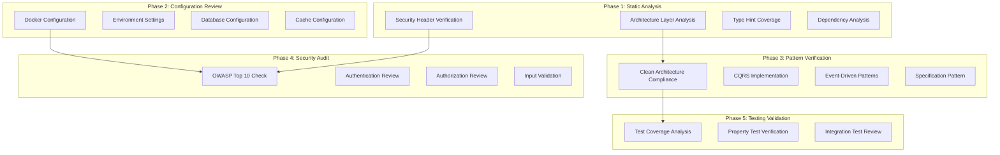

# Design Document

## Overview

This design document outlines the technical approach for conducting a comprehensive Code Review and Architecture Audit of the Base API Python project. The review will systematically evaluate the codebase against 23 requirement areas covering security, architecture, performance, observability, and modern best practices.

The audit will produce:
1. A detailed findings report with severity levels (Critical, High, Medium, Low, Info)
2. Actionable recommendations for each finding
3. A compliance checklist against all acceptance criteria
4. Property-based tests to validate key correctness properties

## Architecture

The Code Review process follows a structured approach:



## Components and Interfaces

### Review Components

| Component | Purpose | Files to Review |
|-----------|---------|-----------------|
| ArchitectureAnalyzer | Verify layer dependencies | All src/my_api/* modules |
| SecurityAuditor | OWASP compliance check | middleware/*, config.py |
| PerformanceReviewer | Database/cache optimization | session.py, caching.py |
| PatternValidator | Design pattern compliance | shared/*, domain/* |
| TestCoverageAnalyzer | Test completeness | tests/* |

### Review Checklist Interface

```python
@dataclass
class ReviewFinding:
    """Represents a single code review finding."""
    id: str
    requirement_id: str
    severity: Literal["critical", "high", "medium", "low", "info"]
    title: str
    description: str
    file_path: str | None
    line_number: int | None
    recommendation: str
    status: Literal["pass", "fail", "partial", "not_applicable"]

@dataclass
class ReviewReport:
    """Complete code review report."""
    project_name: str
    review_date: datetime
    findings: list[ReviewFinding]
    summary: dict[str, int]  # severity -> count
    compliance_score: float  # 0-100%
```

## Data Models

### Severity Classification

| Severity | Description | Action Required |
|----------|-------------|-----------------|
| Critical | Security vulnerability or data loss risk | Immediate fix required |
| High | Significant deviation from best practices | Fix before production |
| Medium | Improvement opportunity | Plan for next sprint |
| Low | Minor enhancement | Consider for backlog |
| Info | Observation or suggestion | Optional improvement |

### Compliance Scoring

```
Compliance Score = (Passed Criteria / Total Applicable Criteria) × 100

Categories:
- 90-100%: Excellent - Production ready
- 80-89%: Good - Minor improvements needed
- 70-79%: Acceptable - Several improvements needed
- 60-69%: Needs Work - Significant gaps
- <60%: Critical - Major refactoring required
```

## Correctness Properties

*A property is a characteristic or behavior that should hold true across all valid executions of a system-essentially, a formal statement about what the system should do. Properties serve as the bridge between human-readable specifications and machine-verifiable correctness guarantees.*

Based on the prework analysis, the following correctness properties will be validated:

### Property 1: Layer Dependency Isolation
*For any* module in the domain layer, its imports SHALL NOT include modules from adapters or infrastructure layers.
**Validates: Requirements 1.1, 1.2**

### Property 2: Security Headers Presence
*For any* HTTP response from the API, it SHALL contain all required security headers (HSTS, X-Frame-Options, X-Content-Type-Options, Referrer-Policy).
**Validates: Requirements 3.1, 3.2, 3.3, 3.4**

### Property 3: Error Response Format Compliance
*For any* error response (4xx or 5xx status), it SHALL conform to RFC 7807 Problem Details format with type, title, status, and detail fields.
**Validates: Requirements 8.3**

### Property 4: Type Annotation Completeness
*For any* public function in the codebase, it SHALL have complete type annotations for all parameters and return type.
**Validates: Requirements 7.1**

### Property 5: Cache Provider Interface Compliance
*For any* cache provider implementation, it SHALL implement all methods defined in the CacheProvider protocol (get, set, delete, exists).
**Validates: Requirements 15.1**

### Property 6: Specification SQL Generation Validity
*For any* Specification object, calling to_sql_condition() SHALL produce a valid SQLAlchemy filter expression that can be applied to a query.
**Validates: Requirements 17.4**

### Property 7: Hypothesis Test Presence
*For any* core domain logic module, there SHALL exist corresponding property-based tests using Hypothesis @given decorator.
**Validates: Requirements 6.2**

### Property 8: Pagination Response Consistency
*For any* paginated API response, it SHALL contain items, total, page, size, pages, has_next, and has_previous fields with consistent values.
**Validates: Requirements 8.6**

## Error Handling

### Review Process Errors

| Error Type | Handling Strategy |
|------------|-------------------|
| File not found | Log warning, mark as "not_applicable" |
| Parse error | Log error, continue with other files |
| Import error | Note as finding, continue review |
| Configuration missing | Mark as "fail" with recommendation |

### Finding Classification

```python
def classify_finding(finding: ReviewFinding) -> str:
    """Classify finding severity based on impact."""
    if finding.requirement_id.startswith("2."):  # OWASP Security
        return "critical" if "injection" in finding.title.lower() else "high"
    if finding.requirement_id.startswith("1."):  # Architecture
        return "medium"
    if finding.requirement_id.startswith("7."):  # Code Quality
        return "low"
    return "info"
```

## Testing Strategy

### Dual Testing Approach

The code review validation uses both unit tests and property-based tests:

#### Unit Tests
- Verify specific review scenarios work correctly
- Test edge cases in finding classification
- Validate report generation format

#### Property-Based Tests (Hypothesis)

Property-based tests will be implemented using **Hypothesis** library to validate the correctness properties defined above.

Configuration:
- Minimum 100 iterations per property test
- Custom strategies for domain objects
- Explicit requirement references in test comments

Example test structure:
```python
from hypothesis import given, strategies as st, settings

@settings(max_examples=100)
@given(st.text(min_size=1))
def test_error_response_format(error_message: str):
    """
    **Feature: api-code-review, Property 3: Error Response Format Compliance**
    **Validates: Requirements 8.3**
    
    For any error message, the generated response SHALL conform to RFC 7807.
    """
    response = create_error_response(error_message)
    assert "type" in response
    assert "title" in response
    assert "status" in response
    assert "detail" in response
```

### Test Categories

| Category | Purpose | Framework |
|----------|---------|-----------|
| Architecture Tests | Verify layer isolation | pytest + AST analysis |
| Security Tests | Validate headers/auth | pytest + httpx |
| Property Tests | Validate invariants | Hypothesis |
| Integration Tests | End-to-end review | pytest-asyncio |

## Review Execution Plan

### Phase 1: Static Analysis (Automated)
1. Parse all Python files using AST
2. Analyze import statements for layer violations
3. Check type hint coverage
4. Verify docstring presence

### Phase 2: Configuration Review (Semi-automated)
1. Validate pyproject.toml settings
2. Check Docker configuration
3. Verify environment variable handling
4. Review database connection settings

### Phase 3: Security Audit (Manual + Automated)
1. Run bandit security scanner
2. Review authentication implementation
3. Check authorization patterns
4. Validate input sanitization

### Phase 4: Pattern Verification (Manual)
1. Review Clean Architecture compliance
2. Verify CQRS implementation
3. Check event-driven patterns
4. Validate specification pattern usage

### Phase 5: Report Generation
1. Compile all findings
2. Calculate compliance score
3. Generate recommendations
4. Create action items

## Files to Review

### Critical Files (Security Focus)
- `src/my_api/core/config.py` - Configuration and secrets
- `src/my_api/adapters/api/middleware/security_headers.py` - Security headers
- `src/my_api/adapters/api/middleware/rate_limiter.py` - Rate limiting
- `src/my_api/adapters/api/middleware/error_handler.py` - Error handling
- `src/my_api/core/exceptions.py` - Exception hierarchy

### Architecture Files
- `src/my_api/shared/repository.py` - Repository pattern
- `src/my_api/shared/use_case.py` - Use case pattern
- `src/my_api/shared/entity.py` - Base entity
- `src/my_api/core/container.py` - DI container

### Pattern Implementation Files
- `src/my_api/shared/cqrs.py` - CQRS implementation
- `src/my_api/shared/events.py` - Domain events
- `src/my_api/shared/caching.py` - Caching system
- `src/my_api/shared/specification.py` - Specification pattern
- `src/my_api/shared/circuit_breaker.py` - Circuit breaker
- `src/my_api/shared/retry.py` - Retry pattern

### Infrastructure Files
- `src/my_api/infrastructure/database/session.py` - Database session
- `src/my_api/infrastructure/observability/telemetry.py` - OpenTelemetry
- `src/my_api/infrastructure/logging/config.py` - Logging configuration

### Deployment Files
- `Dockerfile` - Container build
- `docker-compose.yml` - Development compose
- `docker-compose.prod.yml` - Production compose
- `pyproject.toml` - Project configuration
- `.pre-commit-config.yaml` - Pre-commit hooks
