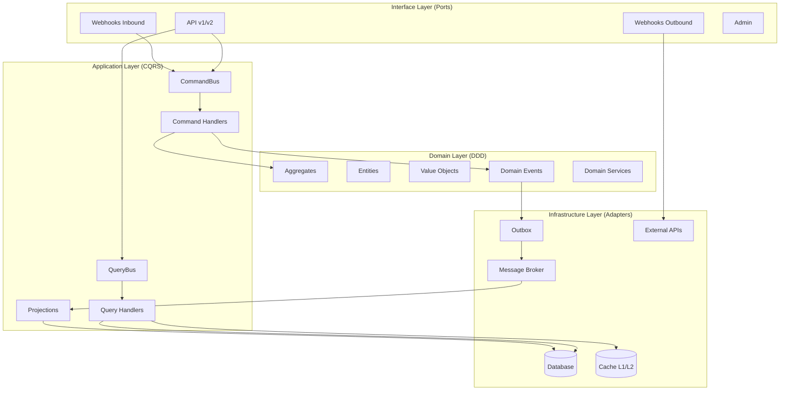

# Design Document: Architecture Restructuring 2025

## Overview

Este documento descreve o design para a reestruturação arquitetural completa do projeto Python API, migrando para uma arquitetura moderna que combina:

- **DDD (Domain-Driven Design)**: Domínio puro sem dependências de framework
- **CQRS Completo**: Separação de comandos e queries com read models dedicados
- **Clean/Hexagonal Architecture**: Ports & Adapters para inversão de dependência
- **Event-Driven + Outbox**: Consistência eventual com garantia de entrega
- **Cache Multicamada**: L1 (memória) + L2 (Redis)
- **Observability**: OpenTelemetry, métricas Prometheus, logs estruturados
- **Segurança**: JWT, RBAC, rate limiting, audit trail
- **Tasks Assíncronas**: Celery workers e scheduling
- **Deploy Moderno**: Docker, Kubernetes, CI/CD

## Architecture

### High-Level Architecture Diagram



### Directory Structure

```
project-root/
├── pyproject.toml
├── README.md
├── .env.example
│
├── docs/
│   ├── architecture/
│   │   ├── context-diagram.md
│   │   ├── container-diagram.md
│   │   ├── component-diagram.md
│   │   └── adr/
│   │       ├── ADR-0001-architecture-style.md
│   │       └── ADR-0002-cqrs-read-model.md
│   ├── api/
│   │   ├── openapi.yaml
│   │   ├── security.md
│   │   └── versioning.md
│   └── ops/
│       ├── observability.md
│       └── scaling-strategy.md
│
├── deployments/
│   ├── docker/
│   │   ├── api.Dockerfile
│   │   ├── worker.Dockerfile
│   │   ├── scheduler.Dockerfile
│   │   ├── docker-compose.local.yml
│   │   └── docker-compose.dev.yml
│   ├── k8s/
│   │   ├── base/
│   │   ├── api/
│   │   ├── worker/
│   │   ├── jobs/
│   │   ├── monitoring/
│   │   └── tracing/
│   └── ci-cd/
│       ├── github-actions/
│       └── gitlab-ci/
│
├── scripts/
│   ├── migrate_db.sh
│   ├── seed_db.sh
│   ├── run_local_api.sh
│   ├── run_local_worker.sh
│   └── load_test.sh
│
├── src/
│   └── my_app/
│       ├── __init__.py
│       │
│       ├── core/                    # Kernel da aplicação
│       │   ├── config/
│       │   │   ├── settings.py      # Pydantic Settings v2
│       │   │   └── logging.py       # Logging estruturado JSON
│       │   ├── types/
│       │   │   ├── ids.py           # UUID, Snowflake
│       │   │   └── dtos.py          # DTO base, PaginatedResponse
│       │   ├── base/
│       │   │   ├── entity.py        # BaseEntity
│       │   │   ├── value_object.py  # BaseValueObject
│       │   │   ├── aggregate_root.py
│       │   │   ├── domain_event.py
│       │   │   ├── integration_event.py
│       │   │   ├── repository.py    # GenericRepository[T]
│       │   │   ├── use_case.py
│       │   │   ├── command.py
│       │   │   ├── query.py
│       │   │   ├── result.py        # Result/Either
│       │   │   └── uow.py           # UnitOfWork interface
│       │   └── errors/
│       │       ├── domain_errors.py
│       │       ├── application_errors.py
│       │       └── infrastructure_errors.py
│       │
│       ├── domain/                  # DDD puro
│       │   ├── common/
│       │   │   └── services.py
│       │   ├── users/
│       │   │   ├── entities.py
│       │   │   ├── value_objects.py
│       │   │   ├── aggregates.py
│       │   │   ├── services.py
│       │   │   ├── events.py
│       │   │   └── repositories.py  # Port (interface)
│       │   ├── orders/
│       │   │   └── ...
│       │   └── billing/
│       │       └── ...
│       │
│       ├── application/             # CQRS
│       │   ├── common/
│       │   │   ├── bus.py           # CommandBus, QueryBus
│       │   │   ├── handlers.py
│       │   │   ├── dto.py
│       │   │   └── pagination.py
│       │   ├── users/
│       │   │   ├── commands/
│       │   │   ├── queries/
│       │   │   ├── handlers/
│       │   │   ├── dto.py
│       │   │   └── mappers.py
│       │   ├── orders/
│       │   │   └── ...
│       │   ├── read_model/
│       │   │   ├── users_read/
│       │   │   └── orders_read/
│       │   └── projections/
│       │       ├── users_projections.py
│       │       └── orders_projections.py
│       │
│       ├── interface/               # Ports (HTTP, Webhooks)
│       │   ├── api/
│       │   │   ├── dependencies.py
│       │   │   ├── security.py
│       │   │   ├── versioning.py
│       │   │   ├── v1/
│       │   │   │   ├── users_router.py
│       │   │   │   ├── orders_router.py
│       │   │   │   └── health_router.py
│       │   │   └── v2/
│       │   ├── webhooks/
│       │   │   ├── inbound/
│       │   │   └── outbound/
│       │   ├── admin/
│       │   └── main.py              # FastAPI app
│       │
│       ├── infrastructure/          # Adapters
│       │   ├── db/
│       │   │   ├── base.py
│       │   │   ├── models/
│       │   │   │   ├── users_models.py
│       │   │   │   ├── orders_models.py
│       │   │   │   └── read_models.py
│       │   │   ├── repositories/
│       │   │   ├── uow/
│       │   │   └── migrations/
│       │   ├── outbox/
│       │   │   ├── models.py
│       │   │   ├── repository.py
│       │   │   └── dispatcher.py
│       │   ├── messaging/
│       │   │   ├── brokers/
│       │   │   ├── event_bus/
│       │   │   ├── consumers/
│       │   │   └── dlq/
│       │   ├── cache/
│       │   │   ├── local_cache.py
│       │   │   ├── redis_cache.py
│       │   │   ├── policies.py
│       │   │   └── decorators.py
│       │   ├── tasks/
│       │   │   ├── celery_app.py
│       │   │   ├── workers/
│       │   │   └── schedules/
│       │   ├── security/
│       │   │   ├── password_hashers.py
│       │   │   ├── token_service.py
│       │   │   ├── rbac.py
│       │   │   ├── rate_limiter.py
│       │   │   ├── csrf.py
│       │   │   └── audit_log.py
│       │   ├── observability/
│       │   │   ├── logging_config.py
│       │   │   ├── metrics.py
│       │   │   ├── tracing.py
│       │   │   └── correlation_id.py
│       │   ├── http_clients/
│       │   │   ├── base_client.py
│       │   │   ├── payment_provider_client.py
│       │   │   └── external_api_client.py
│       │   └── storage/
│       │       ├── s3_client.py
│       │       └── local_storage.py
│       │
│       └── shared/                  # Utilitários
│           ├── utils/
│           │   ├── time.py
│           │   ├── ids.py
│           │   └── serialization.py
│           ├── validation/
│           │   └── validators.py
│           └── localization/
│               └── i18n.py
│
└── tests/
    ├── unit/
    │   ├── domain/
    │   └── application/
    ├── integration/
    │   ├── db/
    │   ├── messaging/
    │   └── cache/
    ├── e2e/
    │   ├── api/
    │   └── webhooks/
    ├── contract/
    │   ├── openapi/
    │   └── pact/
    └── performance/
        ├── locust/
        └── k6/
```

## Components and Interfaces

### Core Layer Components

#### Settings (Pydantic v2)

```python
from pydantic_settings import BaseSettings

class Settings(BaseSettings):
    app_name: str = "my_app"
    debug: bool = False
    database_url: str
    redis_url: str
    jwt_secret: str
    jwt_algorithm: str = "RS256"
    
    model_config = ConfigDict(
        env_file=".env",
        env_file_encoding="utf-8",
    )
```

#### Base Entity

```python
from abc import ABC
from datetime import datetime
from uuid import UUID, uuid4

class BaseEntity(ABC):
    id: UUID
    created_at: datetime
    updated_at: datetime | None = None
```

#### Domain Event

```python
from dataclasses import dataclass, field
from datetime import datetime
from uuid import UUID, uuid4

@dataclass(frozen=True)
class DomainEvent:
    event_id: UUID = field(default_factory=uuid4)
    occurred_at: datetime = field(default_factory=datetime.utcnow)
    aggregate_id: UUID | None = None
```

#### Result Pattern

```python
from typing import Generic, TypeVar
from dataclasses import dataclass

T = TypeVar("T")
E = TypeVar("E")

@dataclass
class Ok(Generic[T]):
    value: T

@dataclass
class Err(Generic[E]):
    error: E

Result = Ok[T] | Err[E]
```

### Application Layer Components

#### Command Bus

```python
from abc import ABC, abstractmethod
from typing import Generic, TypeVar

TCommand = TypeVar("TCommand", bound="BaseCommand")
TResult = TypeVar("TResult")

class CommandBus(ABC):
    @abstractmethod
    async def dispatch(self, command: TCommand) -> Result[TResult, Error]:
        ...
    
    @abstractmethod
    def register(self, command_type: type[TCommand], handler: CommandHandler) -> None:
        ...
    
    @abstractmethod
    def add_middleware(self, middleware: Middleware) -> None:
        ...
```

#### Query Bus

```python
class QueryBus(ABC):
    @abstractmethod
    async def dispatch(self, query: TQuery) -> Result[TResult, Error]:
        ...
    
    @abstractmethod
    def register(self, query_type: type[TQuery], handler: QueryHandler) -> None:
        ...
    
    @abstractmethod
    def enable_caching(self, ttl: int = 300) -> None:
        ...
```

### Infrastructure Layer Components

#### Outbox Pattern

```python
@dataclass
class OutboxMessage:
    id: UUID
    aggregate_type: str
    aggregate_id: UUID
    event_type: str
    payload: dict
    created_at: datetime
    processed_at: datetime | None = None

class OutboxRepository(ABC):
    @abstractmethod
    async def save(self, message: OutboxMessage) -> None: ...
    
    @abstractmethod
    async def get_pending(self, limit: int = 100) -> list[OutboxMessage]: ...
    
    @abstractmethod
    async def mark_processed(self, message_id: UUID) -> None: ...

class OutboxDispatcher:
    async def dispatch_pending(self) -> int:
        """Lê mensagens pendentes e publica no broker."""
        ...
```

#### Multi-Level Cache

```python
class CachePolicy:
    ttl: int
    key_prefix: str
    key_builder: Callable[[...], str]

class LocalCache:
    """LRU cache em memória."""
    def __init__(self, max_size: int = 1000): ...
    def get(self, key: str) -> T | None: ...
    def set(self, key: str, value: T, ttl: int | None = None) -> None: ...
    def delete(self, key: str) -> None: ...

class RedisCache:
    """Cache distribuído Redis."""
    async def get(self, key: str) -> T | None: ...
    async def set(self, key: str, value: T, ttl: int | None = None) -> None: ...
    async def delete(self, key: str) -> None: ...

def cached_query(policy: CachePolicy):
    """Decorator para cache de queries."""
    def decorator(func): ...
    return decorator
```

## Data Models

### Domain Models

```python
# domain/users/entities.py
@dataclass
class User:
    id: UUID
    email: Email  # Value Object
    password_hash: PasswordHash  # Value Object
    profile: UserProfile
    created_at: datetime
    updated_at: datetime | None = None

# domain/users/value_objects.py
@dataclass(frozen=True)
class Email:
    value: str
    
    def __post_init__(self):
        if not self._is_valid(self.value):
            raise ValueError(f"Invalid email: {self.value}")

@dataclass(frozen=True)
class PasswordHash:
    value: str
    algorithm: str = "argon2id"

# domain/users/events.py
@dataclass(frozen=True)
class UserRegistered(DomainEvent):
    user_id: UUID
    email: str

@dataclass(frozen=True)
class UserDeactivated(DomainEvent):
    user_id: UUID
    reason: str
```

### Read Models

```python
# application/read_model/users_read/dto.py
@dataclass
class UserReadDTO:
    id: UUID
    email: str
    display_name: str
    created_at: datetime
    last_login_at: datetime | None

# infrastructure/db/models/read_models.py
class UserReadModel(Base):
    __tablename__ = "users_read"
    
    id: Mapped[UUID] = mapped_column(primary_key=True)
    email: Mapped[str] = mapped_column(index=True)
    display_name: Mapped[str]
    created_at: Mapped[datetime]
    last_login_at: Mapped[datetime | None]
```

### Outbox Model

```python
# infrastructure/db/models/outbox_models.py
class OutboxEntry(Base):
    __tablename__ = "outbox"
    
    id: Mapped[UUID] = mapped_column(primary_key=True)
    aggregate_type: Mapped[str] = mapped_column(String(100))
    aggregate_id: Mapped[UUID]
    event_type: Mapped[str] = mapped_column(String(100))
    payload: Mapped[dict] = mapped_column(JSON)
    created_at: Mapped[datetime] = mapped_column(default=datetime.utcnow)
    processed_at: Mapped[datetime | None] = mapped_column(nullable=True)
```

## Correctness Properties

*A property is a characteristic or behavior that should hold true across all valid executions of a system-essentially, a formal statement about what the system should do. Properties serve as the bridge between human-readable specifications and machine-verifiable correctness guarantees.*

### Property 1: Configuration Loading from Environment

*For any* set of environment variables with valid values, loading the Settings class SHALL produce a configuration object with those values correctly mapped to their corresponding fields.

**Validates: Requirements 1.1**

### Property 2: Structured JSON Logging with Correlation ID

*For any* log message with a correlation ID, the structured log output SHALL be valid JSON containing the correlation_id field with the exact value provided.

**Validates: Requirements 1.2**

### Property 3: Domain Events Have Timestamp and Unique ID

*For any* domain event created, the event SHALL have a non-null event_id (UUID) and occurred_at timestamp, and two events created separately SHALL have different event_ids.

**Validates: Requirements 1.4**

### Property 4: CommandBus Dispatches with Middleware

*For any* command dispatched through the CommandBus with registered middleware, all middleware SHALL be executed in registration order before the handler is invoked, and the command SHALL reach its registered handler.

**Validates: Requirements 3.1, 3.3**

### Property 5: QueryBus Dispatches with Caching

*For any* query dispatched through the QueryBus with caching enabled, a second dispatch of an equivalent query within the TTL SHALL return the cached result without invoking the handler again.

**Validates: Requirements 3.2, 3.4**

### Property 6: Domain-DTO Mapper Round-Trip

*For any* valid domain entity, mapping to DTO and back to domain SHALL produce an entity equivalent to the original (preserving all significant fields).

**Validates: Requirements 3.5**

### Property 7: Projections Update Read Models from Events

*For any* domain event processed by a projection handler, the corresponding read model SHALL be updated to reflect the event's data.

**Validates: Requirements 4.2**

### Property 8: LRU Cache Eviction Behavior

*For any* LRU cache with max_size N, when N+1 items are inserted, the least recently used item SHALL be evicted and no longer retrievable.

**Validates: Requirements 7.1**

### Property 9: Cache Get/Set Round-Trip

*For any* serializable value stored in the cache with a key, retrieving that key before TTL expiration SHALL return a value equal to the original.

**Validates: Requirements 7.2**

### Property 10: Cached Decorator Returns Cached Results

*For any* function decorated with @cached_query, calling the function twice with the same arguments within TTL SHALL return the same result, and the underlying function SHALL be called only once.

**Validates: Requirements 7.4**

### Property 11: Password Hash Verification

*For any* password string, hashing it and then verifying the original password against the hash SHALL return True, and verifying a different password SHALL return False.

**Validates: Requirements 9.1**

### Property 12: JWT Encode/Decode Round-Trip

*For any* valid claims dictionary, encoding to JWT and decoding back SHALL produce claims equivalent to the original (excluding standard JWT fields added during encoding).

**Validates: Requirements 9.2**

### Property 13: RBAC Permission Composition

*For any* role with a set of permissions, checking if the role has a specific permission SHALL return True if and only if that permission is in the role's permission set or inherited from parent roles.

**Validates: Requirements 9.3**

### Property 14: Rate Limiter Request Counting

*For any* rate limit of N requests per window, making N requests SHALL succeed, and the (N+1)th request within the same window SHALL be rejected with appropriate retry information.

**Validates: Requirements 9.4**

### Property 15: Audit Log Entry Persistence

*For any* auditable action performed, an audit log entry SHALL be created containing the action type, actor, timestamp, and relevant context, and SHALL be retrievable by query.

**Validates: Requirements 9.5**

### Property 16: Environment Variable Backward Compatibility

*For any* environment variable that was valid in the previous configuration schema, the new Settings class SHALL accept and correctly interpret that variable.

**Validates: Requirements 17.4**

### Property 17: Serialization Round-Trip for All Types

*For any* domain event, DTO, command, or query object, serializing to JSON and deserializing back SHALL produce an object equivalent to the original.

**Validates: Requirements 18.1, 18.2, 18.3**

## Error Handling

### Error Categories

```python
# core/errors/domain_errors.py
class DomainError(Exception):
    """Base class for domain errors."""
    pass

class EntityNotFoundError(DomainError):
    """Entity not found in repository."""
    pass

class BusinessRuleViolationError(DomainError):
    """Business rule was violated."""
    pass

# core/errors/application_errors.py
class ApplicationError(Exception):
    """Base class for application errors."""
    pass

class ValidationError(ApplicationError):
    """Input validation failed."""
    pass

class AuthorizationError(ApplicationError):
    """User not authorized for action."""
    pass

# core/errors/infrastructure_errors.py
class InfrastructureError(Exception):
    """Base class for infrastructure errors."""
    pass

class DatabaseError(InfrastructureError):
    """Database operation failed."""
    pass

class ExternalServiceError(InfrastructureError):
    """External service call failed."""
    pass
```

### Error Handling Strategy

1. **Domain Errors**: Returned via Result pattern, never thrown
2. **Application Errors**: Caught at handler level, converted to appropriate HTTP responses
3. **Infrastructure Errors**: Logged with full context, wrapped in generic error for client

## Testing Strategy

### Dual Testing Approach

This project uses both unit tests and property-based tests:

- **Unit Tests**: Verify specific examples, edge cases, and integration points
- **Property-Based Tests**: Verify universal properties that should hold across all inputs

### Property-Based Testing Framework

**Framework**: Hypothesis (Python)

**Configuration**:
```python
from hypothesis import settings, Phase

settings.register_profile(
    "ci",
    max_examples=100,
    phases=[Phase.generate, Phase.target, Phase.shrink],
)
```

### Test Organization

```
tests/
├── unit/
│   ├── domain/
│   │   ├── test_user_entity.py
│   │   ├── test_email_value_object.py
│   │   └── test_user_aggregate.py
│   └── application/
│       ├── test_create_user_handler.py
│       └── test_command_bus.py
├── integration/
│   ├── db/
│   │   └── test_user_repository.py
│   ├── messaging/
│   │   └── test_outbox_dispatcher.py
│   └── cache/
│       └── test_redis_cache.py
├── properties/
│   ├── test_config_properties.py
│   ├── test_logging_properties.py
│   ├── test_domain_event_properties.py
│   ├── test_command_bus_properties.py
│   ├── test_query_bus_properties.py
│   ├── test_mapper_properties.py
│   ├── test_projection_properties.py
│   ├── test_lru_cache_properties.py
│   ├── test_cache_roundtrip_properties.py
│   ├── test_cached_decorator_properties.py
│   ├── test_password_properties.py
│   ├── test_jwt_properties.py
│   ├── test_rbac_properties.py
│   ├── test_rate_limiter_properties.py
│   ├── test_audit_log_properties.py
│   ├── test_env_compatibility_properties.py
│   └── test_serialization_properties.py
├── e2e/
│   ├── api/
│   │   └── test_users_api.py
│   └── webhooks/
│       └── test_payment_webhook.py
└── contract/
    └── test_openapi_contract.py
```

### Property Test Annotation Format

Each property-based test MUST be annotated with:
```python
# **Feature: architecture-restructuring-2025, Property 1: Configuration Loading from Environment**
# **Validates: Requirements 1.1**
```

## Migration Strategy

### Phase 1: Core Infrastructure
1. Create new directory structure
2. Implement core/base classes
3. Implement core/errors
4. Implement core/config

### Phase 2: Domain Layer
1. Migrate existing entities to domain/
2. Create value objects
3. Define domain events
4. Define repository interfaces (ports)

### Phase 3: Application Layer
1. Implement CommandBus and QueryBus
2. Create command/query handlers
3. Implement mappers
4. Set up read models and projections

### Phase 4: Infrastructure Layer
1. Implement repository adapters
2. Set up Outbox pattern
3. Configure messaging (Kafka/RabbitMQ)
4. Implement cache layers

### Phase 5: Interface Layer
1. Reorganize API routers by version
2. Implement webhook handlers
3. Set up admin endpoints

### Phase 6: Testing & Validation
1. Migrate existing tests
2. Add property-based tests
3. Validate all functionality preserved
