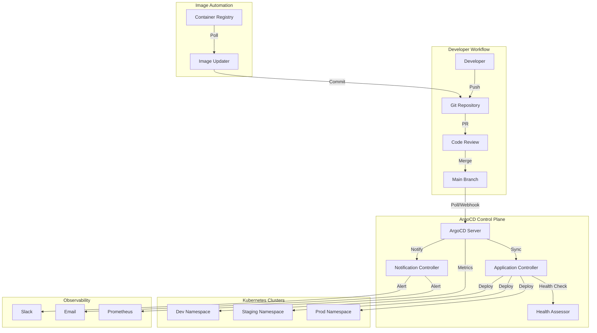

# Design Document: ArgoCD GitOps Integration

## Overview

Este documento descreve o design para integração de ArgoCD e práticas GitOps ao projeto Python API Base. A solução implementa um fluxo de continuous delivery declarativo onde Git é a única fonte de verdade para o estado desejado da infraestrutura.

A integração adiciona uma camada de automação sobre a infraestrutura existente (Helm charts, K8s manifests, Terraform), permitindo:
- Deployments automatizados baseados em commits
- Sincronização declarativa entre Git e clusters
- Rollbacks instantâneos via Git revert
- Auditoria completa de todas as mudanças
- Multi-environment management centralizado

## Architecture

### GitOps Flow



### Directory Structure

```
deployments/
├── argocd/
│   ├── base/                          # ArgoCD installation
│   │   ├── kustomization.yaml
│   │   ├── namespace.yaml
│   │   ├── argocd-cm.yaml            # ArgoCD ConfigMap
│   │   ├── argocd-rbac-cm.yaml       # RBAC ConfigMap
│   │   ├── argocd-secret.yaml        # Secrets template
│   │   └── ingress.yaml              # UI Ingress
│   │
│   ├── projects/                      # AppProjects
│   │   ├── kustomization.yaml
│   │   ├── python-api-base.yaml      # Main project
│   │   └── infrastructure.yaml       # Infra project
│   │
│   ├── applications/                  # Application definitions
│   │   ├── kustomization.yaml
│   │   ├── dev/
│   │   │   └── python-api-base.yaml
│   │   ├── staging/
│   │   │   └── python-api-base.yaml
│   │   └── prod/
│   │       └── python-api-base.yaml
│   │
│   ├── applicationsets/               # ApplicationSets
│   │   ├── kustomization.yaml
│   │   └── python-api-base-set.yaml
│   │
│   ├── notifications/                 # Notification config
│   │   ├── kustomization.yaml
│   │   ├── argocd-notifications-cm.yaml
│   │   └── argocd-notifications-secret.yaml
│   │
│   ├── image-updater/                 # Image Updater config
│   │   ├── kustomization.yaml
│   │   └── argocd-image-updater-config.yaml
│   │
│   └── overlays/                      # Environment overlays
│       ├── dev/
│       │   └── kustomization.yaml
│       ├── staging/
│       │   └── kustomization.yaml
│       └── prod/
│           └── kustomization.yaml
```

## Components and Interfaces

### 1. ArgoCD Base Installation

Componentes core do ArgoCD instalados via Kustomize:

| Component | Purpose | Resource Limits |
|-----------|---------|-----------------|
| argocd-server | API/UI server | 256Mi-512Mi |
| argocd-repo-server | Git operations | 512Mi-1Gi |
| argocd-application-controller | Sync controller | 512Mi-1Gi |
| argocd-redis | Cache | 128Mi-256Mi |
| argocd-dex-server | SSO (optional) | 128Mi-256Mi |

### 2. AppProject Interface

```yaml
apiVersion: argoproj.io/v1alpha1
kind: AppProject
metadata:
  name: python-api-base
  namespace: argocd
spec:
  description: Python API Base application project
  
  # Allowed source repositories
  sourceRepos:
    - 'https://github.com/org/python-api-base.git'
    - 'https://charts.bitnami.com/bitnami'
  
  # Allowed destination clusters/namespaces
  destinations:
    - namespace: 'python-api-*'
      server: 'https://kubernetes.default.svc'
  
  # Restricted cluster resources
  clusterResourceWhitelist:
    - group: ''
      kind: Namespace
  
  # Namespace resources (allow all)
  namespaceResourceWhitelist:
    - group: '*'
      kind: '*'
  
  # RBAC roles
  roles:
    - name: developer
      policies:
        - p, proj:python-api-base:developer, applications, get, python-api-base/*, allow
        - p, proj:python-api-base:developer, applications, sync, python-api-base/*, allow
      groups:
        - developers
```

### 3. Application Interface

```yaml
apiVersion: argoproj.io/v1alpha1
kind: Application
metadata:
  name: python-api-base-dev
  namespace: argocd
  annotations:
    argocd-image-updater.argoproj.io/image-list: api=ghcr.io/org/python-api-base
    argocd-image-updater.argoproj.io/api.update-strategy: semver
  finalizers:
    - resources-finalizer.argocd.argoproj.io
spec:
  project: python-api-base
  
  source:
    repoURL: 'https://github.com/org/python-api-base.git'
    targetRevision: HEAD
    path: deployments/helm/api
    helm:
      valueFiles:
        - values.yaml
        - values-dev.yaml
  
  destination:
    server: 'https://kubernetes.default.svc'
    namespace: python-api-dev
  
  syncPolicy:
    automated:
      prune: true
      selfHeal: true
    syncOptions:
      - CreateNamespace=true
      - PruneLast=true
    retry:
      limit: 5
      backoff:
        duration: 5s
        factor: 2
        maxDuration: 3m
```

### 4. ApplicationSet Interface

```yaml
apiVersion: argoproj.io/v1alpha1
kind: ApplicationSet
metadata:
  name: python-api-base
  namespace: argocd
spec:
  generators:
    - list:
        elements:
          - env: dev
            namespace: python-api-dev
            autoSync: true
            selfHeal: true
          - env: staging
            namespace: python-api-staging
            autoSync: true
            selfHeal: false
          - env: prod
            namespace: python-api-prod
            autoSync: false
            selfHeal: false
  
  template:
    metadata:
      name: 'python-api-base-{{env}}'
      annotations:
        argocd-image-updater.argoproj.io/image-list: api=ghcr.io/org/python-api-base
    spec:
      project: python-api-base
      source:
        repoURL: 'https://github.com/org/python-api-base.git'
        targetRevision: HEAD
        path: deployments/helm/api
        helm:
          valueFiles:
            - values.yaml
            - 'values-{{env}}.yaml'
      destination:
        server: 'https://kubernetes.default.svc'
        namespace: '{{namespace}}'
      syncPolicy:
        automated:
          prune: '{{autoSync}}'
          selfHeal: '{{selfHeal}}'
```

### 5. Notification Service Interface

```yaml
apiVersion: v1
kind: ConfigMap
metadata:
  name: argocd-notifications-cm
  namespace: argocd
data:
  service.slack: |
    token: $slack-token
    
  template.app-sync-succeeded: |
    message: |
      ✅ Application {{.app.metadata.name}} synced successfully
      Revision: {{.app.status.sync.revision}}
      Environment: {{.app.spec.destination.namespace}}
      
  template.app-sync-failed: |
    message: |
      ❌ Application {{.app.metadata.name}} sync failed
      Error: {{.app.status.operationState.message}}
      
  trigger.on-sync-succeeded: |
    - when: app.status.operationState.phase in ['Succeeded']
      send: [app-sync-succeeded]
      
  trigger.on-sync-failed: |
    - when: app.status.operationState.phase in ['Error', 'Failed']
      send: [app-sync-failed]
```

## Data Models

### Application State Model

```python
from dataclasses import dataclass
from enum import Enum
from typing import Optional
from datetime import datetime

class SyncStatus(Enum):
    SYNCED = "Synced"
    OUT_OF_SYNC = "OutOfSync"
    UNKNOWN = "Unknown"

class HealthStatus(Enum):
    HEALTHY = "Healthy"
    PROGRESSING = "Progressing"
    DEGRADED = "Degraded"
    SUSPENDED = "Suspended"
    MISSING = "Missing"
    UNKNOWN = "Unknown"

class OperationPhase(Enum):
    RUNNING = "Running"
    SUCCEEDED = "Succeeded"
    FAILED = "Failed"
    ERROR = "Error"

@dataclass
class ApplicationState:
    """Represents ArgoCD Application state."""
    name: str
    namespace: str
    project: str
    sync_status: SyncStatus
    health_status: HealthStatus
    revision: str
    target_revision: str
    operation_phase: Optional[OperationPhase]
    last_sync_time: Optional[datetime]
    
@dataclass
class SyncResult:
    """Result of a sync operation."""
    phase: OperationPhase
    message: str
    resources_synced: int
    resources_failed: int
    started_at: datetime
    finished_at: Optional[datetime]
```

### Environment Configuration Model

```python
@dataclass
class EnvironmentConfig:
    """Configuration for an environment."""
    name: str
    namespace: str
    auto_sync: bool
    self_heal: bool
    prune: bool
    values_file: str
    target_revision: str = "HEAD"
    
    @classmethod
    def development(cls) -> "EnvironmentConfig":
        return cls(
            name="dev",
            namespace="python-api-dev",
            auto_sync=True,
            self_heal=True,
            prune=True,
            values_file="values-dev.yaml"
        )
    
    @classmethod
    def staging(cls) -> "EnvironmentConfig":
        return cls(
            name="staging",
            namespace="python-api-staging",
            auto_sync=True,
            self_heal=False,
            prune=True,
            values_file="values-staging.yaml"
        )
    
    @classmethod
    def production(cls) -> "EnvironmentConfig":
        return cls(
            name="prod",
            namespace="python-api-prod",
            auto_sync=False,
            self_heal=False,
            prune=False,
            values_file="values-prod.yaml"
        )
```

## Correctness Properties

*A property is a characteristic or behavior that should hold true across all valid executions of a system-essentially, a formal statement about what the system should do. Properties serve as the bridge between human-readable specifications and machine-verifiable correctness guarantees.*

Based on the prework analysis, the following properties can be verified through property-based testing:

### Property 1: Application manifest environment correctness

*For any* Application manifest targeting a specific environment, the manifest SHALL contain the correct Helm values file path, and if targeting development environment SHALL have auto-sync and self-heal enabled, while production environment SHALL have auto-sync disabled.

**Validates: Requirements 2.1, 2.2, 2.3**

### Property 2: ApplicationSet generates correct number of Applications

*For any* ApplicationSet with a list generator containing N environment entries, the generator configuration SHALL produce exactly N distinct Application configurations with unique names and namespaces.

**Validates: Requirements 3.1**

### Property 3: AppProject security constraints

*For any* AppProject manifest, it SHALL define non-empty sourceRepos and destinations lists, and SHALL NOT include dangerous cluster-scoped resources (ClusterRole, ClusterRoleBinding with admin privileges) in clusterResourceWhitelist unless explicitly required.

**Validates: Requirements 4.1, 4.2**

### Property 4: Image Updater annotation validity

*For any* Application with image updater annotations, the update-strategy annotation SHALL contain a valid strategy value from the set {semver, latest, digest, name}.

**Validates: Requirements 5.4**

### Property 5: Notification configuration completeness

*For any* notification ConfigMap, it SHALL define at least one service configuration, and all referenced templates in triggers SHALL exist in the template definitions.

**Validates: Requirements 6.4, 6.5**

### Property 6: Custom health check Lua script validity

*For any* custom health check configuration, the Lua script SHALL be syntactically valid and SHALL return a table with 'status' and 'message' fields.

**Validates: Requirements 7.1**

### Property 7: Sync wave annotation validity

*For any* resource with sync wave annotation, the annotation value SHALL be a valid integer string that can be parsed without error.

**Validates: Requirements 8.1**

## Error Handling

### Sync Failure Handling

```yaml
# Retry configuration in Application
syncPolicy:
  retry:
    limit: 5
    backoff:
      duration: 5s
      factor: 2
      maxDuration: 3m
```

### Error Categories

| Error Type | Handling Strategy | Notification |
|------------|-------------------|--------------|
| Git connection failure | Retry with backoff | Warning after 3 failures |
| Manifest validation error | Block sync, notify | Immediate alert |
| Resource conflict | Retry, then manual | Alert on persistent failure |
| Health check failure | Mark degraded | Warning notification |
| Image pull failure | Retry, rollback option | Alert with image details |

### Rollback Strategy

```bash
# Manual rollback via ArgoCD CLI
argocd app rollback python-api-base-prod <revision>

# Or via Git revert (preferred GitOps approach)
git revert <commit-sha>
git push origin main
# ArgoCD auto-syncs to previous state
```

## Testing Strategy

### Dual Testing Approach

A estratégia de testes combina:
1. **Unit tests**: Validação de manifests YAML e configurações
2. **Property-based tests**: Verificação de propriedades universais usando Hypothesis

### Property-Based Testing Framework

- **Library**: Hypothesis (Python)
- **Minimum iterations**: 100 per property
- **Test location**: `tests/properties/test_argocd_manifests.py`

### Test Categories

| Category | Description | Tools |
|----------|-------------|-------|
| Manifest validation | YAML syntax, schema compliance | yamllint, kubeval |
| Property tests | Universal properties | Hypothesis |
| Integration tests | ArgoCD API interaction | pytest + ArgoCD SDK |
| E2E tests | Full sync workflow | Kind cluster + ArgoCD |

### Example Property Test Structure

```python
from hypothesis import given, strategies as st, settings
import yaml

# **Feature: argocd-gitops-integration, Property 1: Application manifest environment correctness**
@settings(max_examples=100)
@given(env=st.sampled_from(["dev", "staging", "prod"]))
def test_application_manifest_environment_correctness(env: str):
    """
    **Validates: Requirements 2.1, 2.2, 2.3**
    
    For any Application manifest targeting a specific environment,
    the manifest SHALL contain the correct Helm values file path,
    and environment-appropriate sync settings.
    """
    manifest = generate_application_manifest(env)
    app = yaml.safe_load(manifest)
    
    # Verify values file path
    values_files = app["spec"]["source"]["helm"]["valueFiles"]
    assert f"values-{env}.yaml" in values_files
    
    # Verify sync policy based on environment
    sync_policy = app["spec"].get("syncPolicy", {})
    automated = sync_policy.get("automated", {})
    
    if env == "dev":
        assert automated.get("selfHeal") is True
        assert automated.get("prune") is True
    elif env == "prod":
        assert "automated" not in sync_policy or automated == {}
```

### Validation Scripts

```bash
# Validate all ArgoCD manifests
make validate-argocd

# Run property tests
pytest tests/properties/test_argocd_manifests.py -v

# Dry-run sync
argocd app sync python-api-base-dev --dry-run
```

