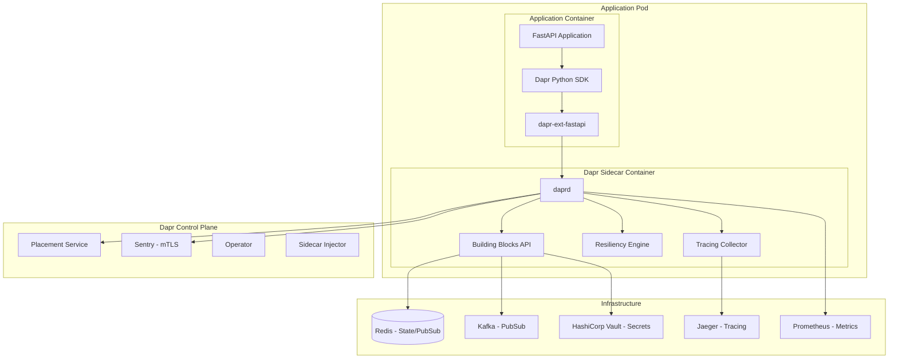
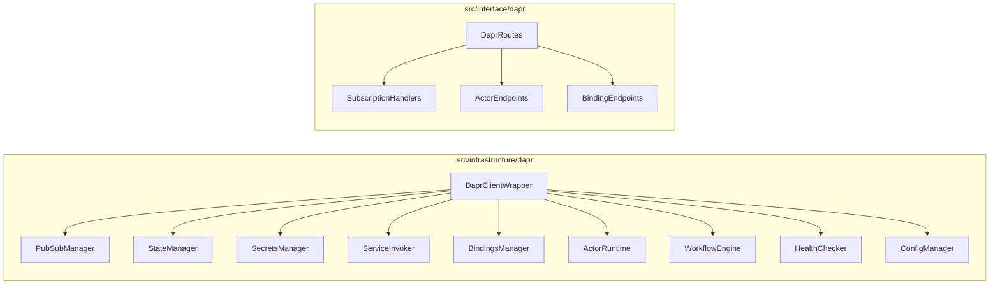

# Design Document: Dapr 1.14 Sidecar Integration

## Overview

This design document describes the architecture and implementation approach for integrating Dapr 1.14 (Distributed Application Runtime) as a sidecar pattern into the Python API Base project. The integration follows enterprise patterns and state-of-the-art practices for cloud-native microservices.

### Goals

- Provide a production-ready Dapr integration with FastAPI
- Implement all major Dapr building blocks (service invocation, pub/sub, state, secrets, bindings, actors, workflows)
- Enable resiliency patterns (retry, timeout, circuit breaker) through configuration
- Support distributed tracing with OpenTelemetry
- Provide comprehensive health checks and observability
- Support both Kubernetes and local development environments

### Non-Goals

- Replacing existing infrastructure components (Redis, Kafka, etc.) - Dapr will abstract them
- Implementing custom Dapr components from scratch
- Supporting Dapr versions prior to 1.14

## Architecture

### High-Level Architecture



### Component Architecture



## Components and Interfaces

### 1. DaprClientWrapper

Central client for all Dapr operations with connection management and error handling.

```python
from dataclasses import dataclass
from typing import Protocol, TypeVar, Generic
from dapr.clients import DaprClient

T = TypeVar('T')

@dataclass
class DaprConfig:
    """Dapr client configuration."""
    dapr_http_endpoint: str = "http://localhost:3500"
    dapr_grpc_endpoint: str = "localhost:50001"
    dapr_api_token: str | None = None
    timeout_seconds: int = 60

class DaprClientProtocol(Protocol):
    """Protocol for Dapr client operations."""
    async def invoke_method(
        self, 
        app_id: str, 
        method_name: str, 
        data: bytes | None = None,
        http_verb: str = "POST",
        headers: dict[str, str] | None = None
    ) -> bytes: ...
    
    async def publish_event(
        self,
        pubsub_name: str,
        topic_name: str,
        data: bytes,
        data_content_type: str = "application/json",
        metadata: dict[str, str] | None = None
    ) -> None: ...
    
    async def save_state(
        self,
        store_name: str,
        key: str,
        value: bytes,
        etag: str | None = None,
        metadata: dict[str, str] | None = None
    ) -> None: ...
    
    async def get_state(
        self,
        store_name: str,
        key: str,
        metadata: dict[str, str] | None = None
    ) -> tuple[bytes | None, str | None]: ...
    
    async def get_secret(
        self,
        store_name: str,
        key: str,
        metadata: dict[str, str] | None = None
    ) -> dict[str, str]: ...

class DaprClientWrapper:
    """Wrapper around Dapr client with lifecycle management."""
    
    def __init__(self, config: DaprConfig) -> None:
        self._config = config
        self._client: DaprClient | None = None
    
    async def initialize(self) -> None:
        """Initialize the Dapr client."""
        self._client = DaprClient(
            address=self._config.dapr_grpc_endpoint,
            headers_callback=self._get_headers
        )
    
    async def close(self) -> None:
        """Close the Dapr client."""
        if self._client:
            await self._client.close()
            self._client = None
    
    def _get_headers(self) -> dict[str, str]:
        """Get headers for Dapr API calls."""
        headers = {}
        if self._config.dapr_api_token:
            headers["dapr-api-token"] = self._config.dapr_api_token
        return headers
```

### 2. PubSubManager

Manages publish/subscribe messaging with CloudEvents support.

```python
from dataclasses import dataclass
from typing import Callable, Awaitable, Any
from pydantic import BaseModel

class CloudEvent(BaseModel):
    """CloudEvents 1.0 specification model."""
    specversion: str = "1.0"
    type: str
    source: str
    id: str
    time: str | None = None
    datacontenttype: str = "application/json"
    data: Any
    traceparent: str | None = None
    tracestate: str | None = None

@dataclass
class Subscription:
    """Pub/sub subscription configuration."""
    pubsub_name: str
    topic: str
    route: str
    dead_letter_topic: str | None = None
    metadata: dict[str, str] | None = None

class PubSubManager:
    """Manages pub/sub operations."""
    
    def __init__(self, client: DaprClientWrapper) -> None:
        self._client = client
        self._subscriptions: list[Subscription] = []
        self._handlers: dict[str, Callable[[CloudEvent], Awaitable[None]]] = {}
    
    async def publish(
        self,
        pubsub_name: str,
        topic: str,
        data: Any,
        metadata: dict[str, str] | None = None
    ) -> None:
        """Publish a message to a topic."""
        ...
    
    async def publish_bulk(
        self,
        pubsub_name: str,
        topic: str,
        messages: list[Any],
        metadata: dict[str, str] | None = None
    ) -> None:
        """Publish multiple messages in a batch."""
        ...
    
    def subscribe(
        self,
        pubsub_name: str,
        topic: str,
        handler: Callable[[CloudEvent], Awaitable[None]],
        dead_letter_topic: str | None = None
    ) -> None:
        """Register a subscription handler."""
        ...
    
    def get_subscriptions(self) -> list[dict[str, Any]]:
        """Get all registered subscriptions for Dapr."""
        ...
```

### 3. StateManager

Manages state operations with transactional support.

```python
from dataclasses import dataclass
from enum import Enum
from typing import Generic, TypeVar

T = TypeVar('T')

class Consistency(Enum):
    """State consistency levels."""
    EVENTUAL = "eventual"
    STRONG = "strong"

class Concurrency(Enum):
    """State concurrency modes."""
    FIRST_WRITE = "first-write"
    LAST_WRITE = "last-write"

@dataclass
class StateOptions:
    """Options for state operations."""
    consistency: Consistency = Consistency.STRONG
    concurrency: Concurrency = Concurrency.LAST_WRITE

@dataclass
class StateItem(Generic[T]):
    """State item with metadata."""
    key: str
    value: T
    etag: str | None = None
    metadata: dict[str, str] | None = None

class StateManager:
    """Manages state store operations."""
    
    def __init__(self, client: DaprClientWrapper, store_name: str) -> None:
        self._client = client
        self._store_name = store_name
    
    async def get(self, key: str) -> StateItem[bytes] | None:
        """Get state by key."""
        ...
    
    async def get_bulk(self, keys: list[str]) -> list[StateItem[bytes]]:
        """Get multiple states by keys."""
        ...
    
    async def save(
        self,
        key: str,
        value: bytes,
        etag: str | None = None,
        options: StateOptions | None = None,
        ttl_seconds: int | None = None
    ) -> None:
        """Save state."""
        ...
    
    async def save_bulk(self, items: list[StateItem[bytes]]) -> None:
        """Save multiple states."""
        ...
    
    async def delete(self, key: str, etag: str | None = None) -> bool:
        """Delete state by key."""
        ...
    
    async def transaction(
        self,
        operations: list[dict[str, Any]]
    ) -> None:
        """Execute transactional state operations."""
        ...
    
    async def query(
        self,
        query: dict[str, Any]
    ) -> list[StateItem[bytes]]:
        """Query state store (if supported)."""
        ...
```

### 4. SecretsManager

Manages secrets retrieval from configured secret stores.

```python
class SecretNotFoundError(Exception):
    """Raised when a secret is not found."""
    def __init__(self, store_name: str, key: str) -> None:
        self.store_name = store_name
        self.key = key
        super().__init__(f"Secret '{key}' not found in store '{store_name}'")

class SecretsManager:
    """Manages secrets operations."""
    
    def __init__(self, client: DaprClientWrapper) -> None:
        self._client = client
        self._cache: dict[str, dict[str, str]] = {}
    
    async def get_secret(
        self,
        store_name: str,
        key: str,
        metadata: dict[str, str] | None = None
    ) -> str:
        """Get a single secret value."""
        ...
    
    async def get_bulk_secrets(
        self,
        store_name: str,
        metadata: dict[str, str] | None = None
    ) -> dict[str, dict[str, str]]:
        """Get all secrets from a store."""
        ...
```

### 5. ServiceInvoker

Handles service-to-service invocation with resiliency.

```python
from dataclasses import dataclass
from enum import Enum

class HttpMethod(Enum):
    """HTTP methods for service invocation."""
    GET = "GET"
    POST = "POST"
    PUT = "PUT"
    DELETE = "DELETE"
    PATCH = "PATCH"

@dataclass
class InvocationResponse:
    """Response from service invocation."""
    data: bytes
    status_code: int
    headers: dict[str, str]
    content_type: str

class ServiceInvoker:
    """Handles service-to-service invocation."""
    
    def __init__(self, client: DaprClientWrapper) -> None:
        self._client = client
    
    async def invoke(
        self,
        app_id: str,
        method_name: str,
        data: bytes | None = None,
        http_verb: HttpMethod = HttpMethod.POST,
        headers: dict[str, str] | None = None,
        metadata: dict[str, str] | None = None
    ) -> InvocationResponse:
        """Invoke a method on a remote service."""
        ...
    
    async def invoke_grpc(
        self,
        app_id: str,
        method_name: str,
        data: bytes,
        metadata: dict[str, str] | None = None
    ) -> bytes:
        """Invoke a gRPC method on a remote service."""
        ...
```

### 6. ActorRuntime

Manages virtual actors with state and timers.

```python
from abc import ABC, abstractmethod
from dataclasses import dataclass
from typing import Any

@dataclass
class ActorConfig:
    """Actor configuration."""
    idle_timeout: str = "1h"
    actor_scan_interval: str = "30s"
    drain_ongoing_call_timeout: str = "60s"
    drain_rebalanced_actors: bool = True

class Actor(ABC):
    """Base class for Dapr actors."""
    
    def __init__(self, actor_id: str) -> None:
        self._actor_id = actor_id
        self._state_manager: Any = None
    
    @property
    def id(self) -> str:
        return self._actor_id
    
    @abstractmethod
    async def on_activate(self) -> None:
        """Called when actor is activated."""
        ...
    
    @abstractmethod
    async def on_deactivate(self) -> None:
        """Called when actor is deactivated."""
        ...
    
    async def get_state(self, key: str) -> Any:
        """Get actor state."""
        ...
    
    async def set_state(self, key: str, value: Any) -> None:
        """Set actor state."""
        ...
    
    async def register_timer(
        self,
        name: str,
        callback: str,
        due_time: str,
        period: str,
        data: Any = None
    ) -> None:
        """Register a timer."""
        ...
    
    async def register_reminder(
        self,
        name: str,
        due_time: str,
        period: str,
        data: Any = None
    ) -> None:
        """Register a reminder."""
        ...

class ActorRuntime:
    """Manages actor registration and lifecycle."""
    
    def __init__(self, config: ActorConfig | None = None) -> None:
        self._config = config or ActorConfig()
        self._actor_types: dict[str, type[Actor]] = {}
    
    def register_actor(self, actor_type: type[Actor]) -> None:
        """Register an actor type."""
        ...
    
    def get_registered_actors(self) -> list[str]:
        """Get list of registered actor types."""
        ...
```

### 7. WorkflowEngine

Orchestrates long-running workflows with activities.

```python
from abc import ABC, abstractmethod
from dataclasses import dataclass
from enum import Enum
from typing import Any, Callable, Awaitable

class WorkflowStatus(Enum):
    """Workflow execution status."""
    PENDING = "PENDING"
    RUNNING = "RUNNING"
    COMPLETED = "COMPLETED"
    FAILED = "FAILED"
    TERMINATED = "TERMINATED"
    SUSPENDED = "SUSPENDED"

@dataclass
class WorkflowState:
    """Workflow instance state."""
    instance_id: str
    workflow_name: str
    status: WorkflowStatus
    created_at: str
    last_updated_at: str
    input: Any | None = None
    output: Any | None = None
    error: str | None = None

class WorkflowActivity(ABC):
    """Base class for workflow activities."""
    
    @abstractmethod
    async def run(self, input: Any) -> Any:
        """Execute the activity."""
        ...

class Workflow(ABC):
    """Base class for workflows."""
    
    @abstractmethod
    async def run(self, ctx: "WorkflowContext", input: Any) -> Any:
        """Execute the workflow."""
        ...

class WorkflowContext:
    """Context for workflow execution."""
    
    async def call_activity(
        self,
        activity: type[WorkflowActivity],
        input: Any = None,
        retry_policy: dict[str, Any] | None = None
    ) -> Any:
        """Call an activity."""
        ...
    
    async def call_child_workflow(
        self,
        workflow: type[Workflow],
        input: Any = None,
        instance_id: str | None = None
    ) -> Any:
        """Call a child workflow."""
        ...
    
    async def create_timer(self, fire_at: str) -> None:
        """Create a durable timer."""
        ...
    
    async def wait_for_external_event(
        self,
        event_name: str,
        timeout: str | None = None
    ) -> Any:
        """Wait for an external event."""
        ...

class WorkflowEngine:
    """Manages workflow execution."""
    
    def __init__(self, client: DaprClientWrapper) -> None:
        self._client = client
        self._workflows: dict[str, type[Workflow]] = {}
        self._activities: dict[str, type[WorkflowActivity]] = {}
    
    def register_workflow(self, workflow: type[Workflow]) -> None:
        """Register a workflow."""
        ...
    
    def register_activity(self, activity: type[WorkflowActivity]) -> None:
        """Register an activity."""
        ...
    
    async def start_workflow(
        self,
        workflow_name: str,
        input: Any = None,
        instance_id: str | None = None
    ) -> str:
        """Start a workflow instance."""
        ...
    
    async def get_workflow_state(
        self,
        instance_id: str
    ) -> WorkflowState:
        """Get workflow state."""
        ...
    
    async def terminate_workflow(
        self,
        instance_id: str,
        reason: str | None = None
    ) -> None:
        """Terminate a workflow."""
        ...
    
    async def raise_event(
        self,
        instance_id: str,
        event_name: str,
        data: Any = None
    ) -> None:
        """Raise an event to a workflow."""
        ...
```

### 8. HealthChecker

Provides health check capabilities for Dapr sidecar and components.

```python
from dataclasses import dataclass
from enum import Enum

class HealthStatus(Enum):
    """Health check status."""
    HEALTHY = "healthy"
    DEGRADED = "degraded"
    UNHEALTHY = "unhealthy"

@dataclass
class ComponentHealth:
    """Health status of a Dapr component."""
    name: str
    type: str
    status: HealthStatus
    message: str | None = None

@dataclass
class DaprHealth:
    """Overall Dapr health status."""
    sidecar_status: HealthStatus
    components: list[ComponentHealth]
    version: str | None = None

class HealthChecker:
    """Checks Dapr sidecar and component health."""
    
    def __init__(self, dapr_http_endpoint: str = "http://localhost:3500") -> None:
        self._endpoint = dapr_http_endpoint
    
    async def check_sidecar_health(self) -> HealthStatus:
        """Check Dapr sidecar health via /healthz endpoint."""
        ...
    
    async def check_component_health(
        self,
        component_name: str
    ) -> ComponentHealth:
        """Check health of a specific component."""
        ...
    
    async def get_full_health(self) -> DaprHealth:
        """Get full health status including all components."""
        ...
    
    async def wait_for_sidecar(
        self,
        timeout_seconds: int = 60,
        poll_interval_seconds: float = 0.5
    ) -> bool:
        """Wait for Dapr sidecar to be ready."""
        ...
```

## Data Models

### Resiliency Configuration

```yaml
# resiliency.yaml
apiVersion: dapr.io/v1alpha1
kind: Resiliency
metadata:
  name: python-api-resiliency
scopes:
  - python-api
spec:
  policies:
    timeouts:
      general: 5s
      important: 60s
      largeResponse: 30s
    
    retries:
      defaultRetry:
        policy: constant
        duration: 1s
        maxRetries: 3
      
      importantRetry:
        policy: exponential
        maxInterval: 15s
        maxRetries: 10
      
      pubsubRetry:
        policy: constant
        duration: 5s
        maxRetries: 5
    
    circuitBreakers:
      defaultCB:
        maxRequests: 1
        timeout: 30s
        trip: consecutiveFailures >= 5
      
      pubsubCB:
        maxRequests: 1
        interval: 8s
        timeout: 45s
        trip: consecutiveFailures > 8
  
  targets:
    apps:
      order-service:
        timeout: general
        retry: defaultRetry
        circuitBreaker: defaultCB
    
    components:
      statestore:
        outbound:
          timeout: general
          retry: importantRetry
          circuitBreaker: defaultCB
      
      pubsub:
        outbound:
          retry: pubsubRetry
          circuitBreaker: pubsubCB
        inbound:
          timeout: general
          retry: pubsubRetry
```

### Component Configuration

```yaml
# statestore.yaml
apiVersion: dapr.io/v1alpha1
kind: Component
metadata:
  name: statestore
spec:
  type: state.redis
  version: v1
  metadata:
    - name: redisHost
      value: redis:6379
    - name: redisPassword
      secretKeyRef:
        name: redis-secret
        key: password
    - name: actorStateStore
      value: "true"
---
# pubsub.yaml
apiVersion: dapr.io/v1alpha1
kind: Component
metadata:
  name: pubsub
spec:
  type: pubsub.kafka
  version: v1
  metadata:
    - name: brokers
      value: kafka:9092
    - name: consumerGroup
      value: python-api-group
    - name: authType
      value: none
---
# secretstore.yaml
apiVersion: dapr.io/v1alpha1
kind: Component
metadata:
  name: vault
spec:
  type: secretstores.hashicorp.vault
  version: v1
  metadata:
    - name: vaultAddr
      value: http://vault:8200
    - name: vaultToken
      secretKeyRef:
        name: vault-token
        key: token
```


## Correctness Properties

*A property is a characteristic or behavior that should hold true across all valid executions of a system-essentially, a formal statement about what the system should do. Properties serve as the bridge between human-readable specifications and machine-verifiable correctness guarantees.*

Based on the prework analysis, the following correctness properties have been identified. Redundant properties have been consolidated to provide unique validation value.

### Property 1: CloudEvents Serialization Round-Trip

*For any* valid payload data, serializing to CloudEvents format and then deserializing should produce an equivalent payload.

**Validates: Requirements 1.3, 3.1, 3.3**

### Property 2: State Management Round-Trip

*For any* valid key-value pair, saving state and then retrieving it should return the same value with a valid ETag.

**Validates: Requirements 4.1, 4.2**

### Property 3: State Deletion Consistency

*For any* existing state key, after deletion, retrieving that key should return None.

**Validates: Requirements 4.3**

### Property 4: Bulk State Operations Completeness

*For any* batch of state items, bulk save should persist all items, and bulk get should retrieve all items.

**Validates: Requirements 4.4**

### Property 5: Transactional State Atomicity

*For any* set of transactional state operations, either all operations succeed or none are applied.

**Validates: Requirements 4.5**

### Property 6: State Query Result Correctness

*For any* query filter, all returned state items should match the filter criteria.

**Validates: Requirements 4.6**

### Property 7: Secret Retrieval Consistency

*For any* existing secret key, retrieval should return the correct value; for non-existent keys, SecretNotFoundError should be raised.

**Validates: Requirements 5.1, 5.3**

### Property 8: Service Invocation HTTP Method Support

*For any* HTTP method (GET, POST, PUT, DELETE, PATCH), service invocation should correctly send the request with the specified method and headers.

**Validates: Requirements 2.3**

### Property 9: Trace Context Propagation

*For any* service invocation with tracing enabled, the traceparent and tracestate headers should be present in the outgoing request.

**Validates: Requirements 2.5, 10.1**

### Property 10: Pub/Sub Message Status Codes

*For any* message processing result (success, failure, retry), the subscriber should return the appropriate Dapr status code.

**Validates: Requirements 3.4**

### Property 11: Bulk Publish Completeness

*For any* batch of messages, bulk publish should send all messages to the topic.

**Validates: Requirements 3.5**

### Property 12: Dead Letter Queue Routing

*For any* message that fails processing after retries, the message should be routed to the configured dead-letter topic.

**Validates: Requirements 3.6**

### Property 13: Actor Single-Threaded Execution

*For any* actor instance, concurrent method invocations should be serialized (no parallel execution within the same actor).

**Validates: Requirements 7.2**

### Property 14: Actor State Persistence Round-Trip

*For any* actor state change, the state should be persisted and retrievable after actor reactivation.

**Validates: Requirements 7.4**

### Property 15: Actor Deactivation on Idle

*For any* actor that has been idle longer than the configured timeout, the actor should be deactivated.

**Validates: Requirements 7.3**

### Property 16: Actor Reminder Persistence

*For any* registered reminder, the reminder should survive actor deactivation and execute after reactivation.

**Validates: Requirements 7.6**

### Property 17: Workflow Instance ID Uniqueness

*For any* workflow start operation, the returned instance ID should be unique across all workflow instances.

**Validates: Requirements 8.2**

### Property 18: Workflow Status Accuracy

*For any* workflow instance, querying status should return the correct current state (PENDING, RUNNING, COMPLETED, FAILED, TERMINATED).

**Validates: Requirements 8.4**

### Property 19: Timeout Policy Enforcement

*For any* operation with a configured timeout, the operation should fail with a timeout error if it exceeds the configured duration.

**Validates: Requirements 9.1**

### Property 20: Retry Policy Backoff

*For any* retry policy with exponential backoff, the delay between retries should follow the configured backoff strategy.

**Validates: Requirements 9.2**

### Property 21: Circuit Breaker State Transitions

*For any* circuit breaker, consecutive failures exceeding the threshold should trip the breaker to open state, and after the timeout, it should transition to half-open.

**Validates: Requirements 9.3, 9.4**

### Property 22: Prometheus Metrics Format Compliance

*For any* exposed metric, the format should be Prometheus-compatible (valid metric names, labels, and values).

**Validates: Requirements 10.3**

### Property 23: Log Correlation ID Presence

*For any* log entry generated during a traced request, the correlation ID and trace context should be present.

**Validates: Requirements 10.4**

### Property 24: Health Check Status Accuracy

*For any* health check, the reported status should accurately reflect the actual health of the sidecar and components.

**Validates: Requirements 15.1, 15.2, 15.4**

### Property 25: Startup Sidecar Wait

*For any* application startup, the application should wait for the Dapr sidecar to be ready before accepting traffic.

**Validates: Requirements 15.5**

### Property 26: Middleware Execution Order

*For any* configured middleware chain, middleware should execute in the configured order for both inbound and outbound requests.

**Validates: Requirements 16.1, 16.2**

### Property 27: Middleware Error Propagation

*For any* middleware that throws an error, the error should be propagated with appropriate context.

**Validates: Requirements 16.5**

### Property 28: mTLS Enforcement

*For any* service-to-service communication, mTLS encryption should be enforced between sidecars.

**Validates: Requirements 13.1**

### Property 29: Secret Value Protection

*For any* secret operation, secret values should never appear in logs or error messages.

**Validates: Requirements 13.4**

### Property 30: Configuration Priority Resolution

*For any* configuration key present in multiple stores, the value from the highest-priority store should be returned.

**Validates: Requirements 12.4**

## Error Handling

### Error Categories

| Error Type | Description | Handling Strategy |
|------------|-------------|-------------------|
| `DaprConnectionError` | Sidecar unavailable | Retry with backoff, fail after max retries |
| `DaprTimeoutError` | Operation timed out | Return timeout error, log context |
| `StateNotFoundError` | State key not found | Return None, no retry |
| `SecretNotFoundError` | Secret not found | Raise exception with key name |
| `ActorInvocationError` | Actor method failed | Propagate error, log actor ID |
| `WorkflowFailedError` | Workflow execution failed | Return failure state, preserve error |
| `CircuitBreakerOpenError` | Circuit breaker tripped | Fail fast, return error immediately |
| `ValidationError` | Invalid input data | Return 400 with validation details |

### Error Response Format

```python
@dataclass
class DaprError:
    """Standard Dapr error response."""
    error_code: str
    message: str
    details: dict[str, Any] | None = None
    trace_id: str | None = None
    timestamp: str = field(default_factory=lambda: datetime.utcnow().isoformat())
```

## Testing Strategy

### Dual Testing Approach

This implementation uses both unit tests and property-based tests for comprehensive coverage:

- **Unit Tests**: Verify specific examples, edge cases, and integration points
- **Property-Based Tests**: Verify universal properties that should hold across all valid inputs

### Property-Based Testing Framework

The implementation will use **Hypothesis** for Python property-based testing, configured with:

```python
from hypothesis import settings, given, strategies as st

# Configure minimum 100 iterations per property
settings.register_profile("ci", max_examples=100, deadline=5000)
settings.load_profile("ci")
```

### Test Categories

1. **Unit Tests** (`tests/unit/infrastructure/dapr/`)
   - Client initialization and configuration
   - Error handling and exception types
   - Mock component interactions

2. **Property Tests** (`tests/properties/dapr/`)
   - Serialization round-trips
   - State management invariants
   - Resiliency policy behavior
   - Actor concurrency guarantees

3. **Integration Tests** (`tests/integration/dapr/`)
   - End-to-end Dapr API calls
   - Component connectivity
   - Multi-service scenarios

### Test Annotations

Each property-based test must be annotated with the property it validates:

```python
@given(st.binary(min_size=1, max_size=10000))
def test_state_round_trip(data: bytes) -> None:
    """
    **Feature: dapr-sidecar-integration, Property 2: State Management Round-Trip**
    **Validates: Requirements 4.1, 4.2**
    """
    # Test implementation
```

## Deployment Architecture

### Kubernetes Deployment

```yaml
apiVersion: apps/v1
kind: Deployment
metadata:
  name: python-api
  labels:
    app: python-api
spec:
  replicas: 3
  selector:
    matchLabels:
      app: python-api
  template:
    metadata:
      labels:
        app: python-api
      annotations:
        dapr.io/enabled: "true"
        dapr.io/app-id: "python-api"
        dapr.io/app-port: "8000"
        dapr.io/app-protocol: "http"
        dapr.io/enable-metrics: "true"
        dapr.io/metrics-port: "9090"
        dapr.io/log-level: "info"
        dapr.io/config: "python-api-config"
        dapr.io/sidecar-cpu-limit: "500m"
        dapr.io/sidecar-memory-limit: "512Mi"
    spec:
      containers:
        - name: python-api
          image: python-api:latest
          ports:
            - containerPort: 8000
          env:
            - name: DAPR_HTTP_ENDPOINT
              value: "http://localhost:3500"
            - name: DAPR_GRPC_ENDPOINT
              value: "localhost:50001"
          livenessProbe:
            httpGet:
              path: /health/live
              port: 8000
            initialDelaySeconds: 10
            periodSeconds: 10
          readinessProbe:
            httpGet:
              path: /health/ready
              port: 8000
            initialDelaySeconds: 5
            periodSeconds: 5
```

### Docker Compose (Local Development)

```yaml
version: '3.8'
services:
  python-api:
    build: .
    ports:
      - "8000:8000"
    environment:
      - DAPR_HTTP_ENDPOINT=http://python-api-dapr:3500
      - DAPR_GRPC_ENDPOINT=python-api-dapr:50001
    depends_on:
      - python-api-dapr
    networks:
      - dapr-network

  python-api-dapr:
    image: daprio/daprd:1.14.0
    command: [
      "./daprd",
      "-app-id", "python-api",
      "-app-port", "8000",
      "-dapr-http-port", "3500",
      "-dapr-grpc-port", "50001",
      "-components-path", "/components",
      "-config", "/config/config.yaml"
    ]
    volumes:
      - ./dapr/components:/components
      - ./dapr/config:/config
    networks:
      - dapr-network

  redis:
    image: redis:7-alpine
    ports:
      - "6379:6379"
    networks:
      - dapr-network

  kafka:
    image: confluentinc/cp-kafka:7.5.0
    ports:
      - "9092:9092"
    environment:
      KAFKA_BROKER_ID: 1
      KAFKA_ZOOKEEPER_CONNECT: zookeeper:2181
      KAFKA_ADVERTISED_LISTENERS: PLAINTEXT://kafka:9092
    depends_on:
      - zookeeper
    networks:
      - dapr-network

  zookeeper:
    image: confluentinc/cp-zookeeper:7.5.0
    environment:
      ZOOKEEPER_CLIENT_PORT: 2181
    networks:
      - dapr-network

  jaeger:
    image: jaegertracing/all-in-one:1.50
    ports:
      - "16686:16686"
      - "4317:4317"
    networks:
      - dapr-network

networks:
  dapr-network:
    driver: bridge
```

## Directory Structure

```
src/
├── infrastructure/
│   └── dapr/
│       ├── __init__.py
│       ├── client.py           # DaprClientWrapper
│       ├── pubsub.py           # PubSubManager
│       ├── state.py            # StateManager
│       ├── secrets.py          # SecretsManager
│       ├── invoke.py           # ServiceInvoker
│       ├── bindings.py         # BindingsManager
│       ├── actors.py           # ActorRuntime
│       ├── workflow.py         # WorkflowEngine
│       ├── health.py           # HealthChecker
│       ├── config.py           # ConfigManager
│       ├── middleware.py       # MiddlewarePipeline
│       └── errors.py           # Dapr-specific errors
├── interface/
│   └── dapr/
│       ├── __init__.py
│       ├── routes.py           # Dapr route registration
│       ├── subscriptions.py    # Pub/sub subscription handlers
│       ├── actors.py           # Actor endpoints
│       └── bindings.py         # Binding endpoints
└── core/
    └── config/
        └── dapr.py             # Dapr configuration settings

deployments/
├── dapr/
│   ├── components/
│   │   ├── statestore.yaml
│   │   ├── pubsub.yaml
│   │   ├── secretstore.yaml
│   │   └── bindings.yaml
│   ├── config/
│   │   ├── config.yaml
│   │   └── resiliency.yaml
│   └── docker-compose.dapr.yaml
└── k8s/
    └── dapr/
        ├── components/
        └── config/

tests/
├── unit/
│   └── infrastructure/
│       └── dapr/
├── properties/
│   └── dapr/
│       ├── test_state_properties.py
│       ├── test_pubsub_properties.py
│       ├── test_actor_properties.py
│       └── test_resiliency_properties.py
└── integration/
    └── dapr/
```

