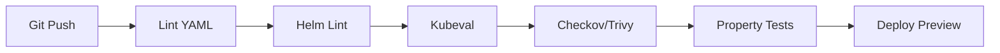

# Design Document: Deployments State of Art Review

## Overview

Este documento descreve o design técnico para o code review e melhorias da pasta `deployments/` do projeto Python API Base. O objetivo é garantir que todas as configurações de infraestrutura sigam as melhores práticas de 2024/2025 para Kubernetes, Helm, Terraform, ArgoCD, Istio, Knative e Docker.

### Current State Analysis

Baseado na análise do código existente e no ADR-020, o projeto já possui:

**Pontos Fortes:**
- Security contexts completos em deployments K8s
- Network policies restritivas
- mTLS configurado no Istio
- External Secrets integration
- Multi-stage Docker builds
- HPA e PDB configurados
- Prometheus/Grafana monitoring

**Gaps Identificados:**
- Algumas versões de dependências desatualizadas
- Falta de validação automatizada de manifests
- Inconsistências entre Helm templates e K8s base
- Documentação de troubleshooting incompleta
- Falta de testes de propriedade para validação de manifests

## Architecture

```
deployments/
├── argocd/           # GitOps - ArgoCD 2.13+
├── dapr/             # Distributed Application Runtime
├── docker/           # Docker Compose (dev/prod)
├── helm/             # Helm Charts (API)
├── istio/            # Service Mesh
├── k8s/              # Raw Kubernetes manifests
├── kepler/           # Energy monitoring
├── knative/          # Serverless
├── monitoring/       # Prometheus/Grafana
├── serverless/       # AWS Lambda/Vercel
└── terraform/        # Multi-cloud IaC
```

### Validation Pipeline



## Components and Interfaces

### 1. Kubernetes Manifests Validator

Componente para validação de manifests K8s contra Pod Security Standards.

```python
class K8sManifestValidator:
    """Validates Kubernetes manifests against security standards."""
    
    def validate_security_context(self, manifest: dict) -> ValidationResult:
        """Check seccompProfile, runAsNonRoot, capabilities."""
        
    def validate_network_policy(self, manifest: dict) -> ValidationResult:
        """Check deny-all default and explicit allow rules."""
        
    def validate_resources(self, manifest: dict) -> ValidationResult:
        """Check requests and limits are defined."""
```

### 2. Helm Chart Validator

Componente para validação de Helm charts.

```python
class HelmChartValidator:
    """Validates Helm charts against best practices."""
    
    def validate_values(self, values: dict, env: str) -> ValidationResult:
        """Check required values and no 'latest' tags."""
        
    def validate_templates(self, chart_path: str) -> ValidationResult:
        """Render and validate all templates."""
```

### 3. Terraform Config Validator

Componente para validação de configurações Terraform.

```python
class TerraformValidator:
    """Validates Terraform configurations."""
    
    def validate_backend(self, config: dict) -> ValidationResult:
        """Check encrypted backend with state locking."""
        
    def validate_variables(self, variables: dict) -> ValidationResult:
        """Check sensitive marking and validations."""
```

## Data Models

### ValidationResult

```python
@dataclass
class ValidationResult:
    """Result of a validation check."""
    passed: bool
    rule_id: str
    message: str
    severity: Severity  # ERROR, WARNING, INFO
    file_path: str
    line_number: Optional[int] = None
    suggestion: Optional[str] = None

class Severity(Enum):
    ERROR = "error"
    WARNING = "warning"
    INFO = "info"
```

### ManifestMetadata

```python
@dataclass
class ManifestMetadata:
    """Metadata extracted from K8s manifest."""
    api_version: str
    kind: str
    name: str
    namespace: Optional[str]
    labels: Dict[str, str]
    annotations: Dict[str, str]
```

## Correctness Properties

*A property is a characteristic or behavior that should hold true across all valid executions of a system-essentially, a formal statement about what the system should do. Properties serve as the bridge between human-readable specifications and machine-verifiable correctness guarantees.*

Based on the prework analysis, the following properties will be validated:

### Property 1: Security Context Completeness
*For any* Kubernetes Deployment or Pod manifest, the security context SHALL contain seccompProfile: RuntimeDefault, runAsNonRoot: true, and capabilities.drop: [ALL]
**Validates: Requirements 1.1, 1.2, 1.3, 1.5**

### Property 2: Network Policy Existence
*For any* namespace with workloads, there SHALL exist NetworkPolicy manifests with both Ingress and Egress policyTypes
**Validates: Requirements 1.4**

### Property 3: Resource Limits Defined
*For any* container specification, resources.requests and resources.limits SHALL both be defined with cpu and memory values
**Validates: Requirements 2.4**

### Property 4: No Latest Tags
*For any* container image reference in production manifests, the tag SHALL NOT be empty or 'latest'
**Validates: Requirements 2.2**

### Property 5: External Secrets Enabled
*For any* production Helm values, externalSecrets.enabled SHALL be true and no inline secrets SHALL exist
**Validates: Requirements 2.3**

### Property 6: Terraform Backend Encryption
*For any* Terraform backend configuration, encrypt SHALL be true and dynamodb_table SHALL be defined for state locking
**Validates: Requirements 3.1**

### Property 7: Sensitive Variables Marked
*For any* Terraform variable containing credentials or secrets, sensitive SHALL be true
**Validates: Requirements 3.2**

### Property 8: Common Tags Applied
*For any* Terraform resource, tags SHALL include Environment, Application, and ManagedBy keys
**Validates: Requirements 3.3**

### Property 9: ArgoCD Sync Waves
*For any* ArgoCD Application with dependencies, sync-wave annotations SHALL be present to order resource creation
**Validates: Requirements 4.1**

### Property 10: Production Manual Sync
*For any* ArgoCD Application targeting production, syncPolicy.automated SHALL be disabled or absent
**Validates: Requirements 4.2**

### Property 11: Istio mTLS Strict
*For any* Istio PeerAuthentication in production overlay, mtls.mode SHALL be STRICT
**Validates: Requirements 5.1**

### Property 12: Authorization Deny-All
*For any* namespace with Istio, AuthorizationPolicy SHALL exist with deny-all default
**Validates: Requirements 5.2**

### Property 13: Rate Limiting Configured
*For any* API workload, EnvoyFilter with local_ratelimit SHALL be configured
**Validates: Requirements 5.4**

### Property 14: Knative Scale-to-Zero
*For any* Knative Service, autoscaling.knative.dev/min-scale annotation SHALL allow value "0"
**Validates: Requirements 6.1**

### Property 15: Knative Security Context
*For any* Knative Service template, securityContext SHALL match Pod Security Standards Restricted profile
**Validates: Requirements 6.3**

### Property 16: Docker Multi-Stage Build
*For any* production Dockerfile, there SHALL be multiple FROM statements indicating multi-stage build
**Validates: Requirements 7.1**

### Property 17: Docker Non-Root
*For any* production docker-compose service, read_only SHALL be true and security_opt SHALL include no-new-privileges
**Validates: Requirements 7.2**

### Property 18: ServiceMonitor Exists
*For any* workload exposing metrics, ServiceMonitor manifest SHALL exist with correct selector
**Validates: Requirements 8.1**

### Property 19: Alert Severity Labels
*For any* PrometheusRule alert, labels.severity SHALL be defined
**Validates: Requirements 8.2**

### Property 20: Topology Spread Constraints
*For any* Deployment with replicas > 1, topologySpreadConstraints SHALL include zone distribution
**Validates: Requirements 9.1**

### Property 21: PDB Configured
*For any* production Deployment, PodDisruptionBudget SHALL exist with minAvailable >= 1
**Validates: Requirements 9.2**

### Property 22: HPA Behavior Policies
*For any* HPA, behavior.scaleUp and behavior.scaleDown SHALL be configured for gradual scaling
**Validates: Requirements 9.5**

### Property 23: Resource Quota Exists
*For any* namespace, ResourceQuota SHALL be defined to prevent over-provisioning
**Validates: Requirements 10.5**

### Property 24: Terraform Provider Versions Constrained
*For any* Terraform provider in versions.tf, version constraint SHALL use ~> or >= operators to prevent breaking changes
**Validates: Requirements 3.4**

### Property 25: ArgoCD Image Updater Configured
*For any* ArgoCD Application with automated image updates, argocd-image-updater.argoproj.io annotations SHALL be present
**Validates: Requirements 4.5**

### Property 26: Istio JWT Validation
*For any* Istio RequestAuthentication, jwtRules SHALL be configured with issuer and jwksUri
**Validates: Requirements 5.3**

### Property 27: Istio Egress Restricted
*For any* production Istio configuration, outboundTrafficPolicy.mode SHALL be REGISTRY_ONLY
**Validates: Requirements 5.5**

### Property 28: Knative Autoscaling Metrics
*For any* Knative Service, autoscaling.knative.dev/metric and autoscaling.knative.dev/target annotations SHALL be defined
**Validates: Requirements 6.2**

### Property 29: Docker Resource Limits
*For any* production docker-compose service, deploy.resources.limits SHALL be defined with cpus and memory
**Validates: Requirements 7.3**

### Property 30: Docker Health Checks
*For any* production docker-compose service, healthcheck SHALL be defined with test, interval, and timeout
**Validates: Requirements 7.4**

### Property 31: Structured Logging Enabled
*For any* production configuration, LOG_FORMAT or equivalent SHALL be set to 'json'
**Validates: Requirements 7.5**

### Property 32: Tracing Sampling Configured
*For any* Istio tracing configuration, sampling rate SHALL be environment-specific (1% prod, 5% staging, 10% dev)
**Validates: Requirements 8.4**

### Property 33: Liveness Probe Configured
*For any* container in Deployment, livenessProbe SHALL be defined with appropriate failureThreshold
**Validates: Requirements 9.3**

### Property 34: Readiness Probe Configured
*For any* container in Deployment, readinessProbe SHALL be defined to control traffic routing
**Validates: Requirements 9.4**

### Property 35: Single NAT Gateway Option
*For any* Terraform VPC configuration, single_nat_gateway variable SHALL exist for cost optimization
**Validates: Requirements 10.1**

### Property 36: Helm Values Validation
*For any* Helm chart, values.yaml SHALL have validation comments or schema for required fields
**Validates: Requirements 2.1**

### Property 37: Sealed Secrets Usage
*For any* secret in ArgoCD-managed namespace, SealedSecret or ExternalSecret SHALL be used instead of plain Secret
**Validates: Requirements 4.3**

### Property 38: Labels Convention
*For any* Kubernetes resource, labels SHALL follow kubernetes.io convention (name, instance, version, component, part-of, managed-by)
**Validates: Requirements 1.1 (implicit)**

### Property 39: Annotations for Prometheus
*For any* workload exposing metrics, prometheus.io/scrape, prometheus.io/port, and prometheus.io/path annotations SHALL be present
**Validates: Requirements 8.1**

### Property 40: Graceful Shutdown
*For any* Deployment, terminationGracePeriodSeconds SHALL be >= 30 and preStop hook SHALL be configured
**Validates: Requirements 9.3 (implicit)**

### Property 41: DNS Config Optimized
*For any* Deployment, dnsConfig.options SHALL include ndots, timeout, and attempts for performance
**Validates: Requirements 9.4 (implicit)**

### Property 42: EmptyDir Size Limits
*For any* emptyDir volume, sizeLimit SHALL be defined to prevent disk exhaustion
**Validates: Requirements 1.3 (implicit)**

### Property 43: Service Account Token Disabled
*For any* Deployment not requiring API access, automountServiceAccountToken SHALL be false
**Validates: Requirements 1.5 (implicit)**

### Property 44: Revision History Limit
*For any* Deployment, revisionHistoryLimit SHALL be defined (recommended: 10) to manage storage
**Validates: Requirements 10.5 (implicit)**

### Property 45: Rolling Update Strategy
*For any* Deployment, strategy.type SHALL be RollingUpdate with maxSurge and maxUnavailable configured
**Validates: Requirements 9.2 (implicit)**

## Error Handling

### Validation Errors

```python
class ManifestValidationError(Exception):
    """Raised when manifest validation fails."""
    def __init__(self, results: List[ValidationResult]):
        self.results = results
        failed = [r for r in results if not r.passed]
        super().__init__(f"{len(failed)} validation(s) failed")

class HelmRenderError(Exception):
    """Raised when Helm template rendering fails."""
    pass

class TerraformValidationError(Exception):
    """Raised when Terraform validation fails."""
    pass
```

## Testing Strategy

### Dual Testing Approach

1. **Unit Tests**: Validate individual validation functions with specific examples
2. **Property-Based Tests**: Validate properties hold across all manifests using Hypothesis

### Property-Based Testing Framework

Using **Hypothesis** for Python property-based testing:

```python
from hypothesis import given, strategies as st
import yaml

@given(st.sampled_from(get_all_deployment_manifests()))
def test_security_context_completeness(manifest_path: str):
    """
    **Feature: deployments-state-of-art-review, Property 1: Security Context Completeness**
    **Validates: Requirements 1.1, 1.2, 1.3, 1.5**
    """
    manifest = load_yaml(manifest_path)
    result = validator.validate_security_context(manifest)
    assert result.passed, f"Security context validation failed: {result.message}"
```

### Test Configuration

- Minimum 100 iterations per property test
- Tests run on CI for every PR
- Coverage target: 100% of manifests validated

## Implementation Notes

### Version Updates Required

| Component | Current | Target | Notes |
|-----------|---------|--------|-------|
| ArgoCD | 2.13.2 | 2.13.2 | ✅ Current |
| Istio | 1.20.0 | 1.24.0 | Update recommended |
| Knative | 1.15+ | 1.16+ | Minor update |
| Helm | 3.14+ | 3.16+ | Helm 4 prep |
| Terraform | 1.5+ | 1.9+ | New features |
| Dapr | 1.14.0 | 1.14.0 | ✅ Current |

### Files to Modify

1. **deployments/helm/api/values.yaml** - Add missing security defaults
2. **deployments/k8s/base/deployment.yaml** - Verify all security contexts
3. **deployments/terraform/versions.tf** - Update provider versions
4. **deployments/istio/base/kustomization.yaml** - Add missing resources
5. **deployments/monitoring/prometheus-alerts-*.yml** - Add runbook URLs

### New Files to Create

1. **tests/properties/test_deployment_manifests.py** - Property tests
2. **scripts/validate-manifests.sh** - CI validation script
3. **docs/architecture/adr/ADR-021-deployments-validation.md** - ADR for validation

## References

- [Kubernetes Pod Security Standards](https://kubernetes.io/docs/concepts/security/pod-security-standards/)
- [Helm Best Practices](https://helm.sh/docs/chart_best_practices/)
- [Terraform Best Practices](https://developer.hashicorp.com/terraform/cloud-docs/recommended-practices)
- [ArgoCD Best Practices](https://argo-cd.readthedocs.io/en/stable/user-guide/best_practices/)
- [Istio Security Best Practices](https://istio.io/latest/docs/ops/best-practices/security/)
- [CIS Kubernetes Benchmark](https://www.cisecurity.org/benchmark/kubernetes)
