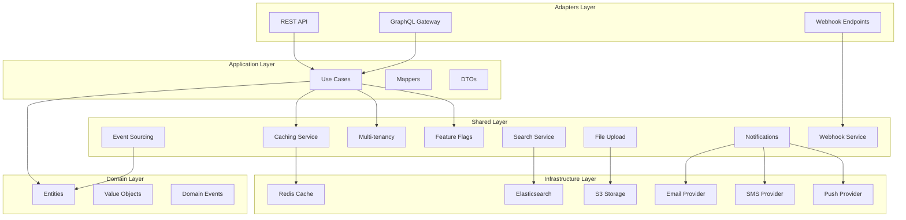

# Design Document: Enterprise Features 2025

## Overview

Este documento define a arquitetura e design para implementação das 9 features enterprise no projeto my-api. Todas as features seguem Clean Architecture, PEP 695 generics, e padrões OWASP de segurança.

## Architecture



## Components and Interfaces

### 1. Caching Layer

```python
# PEP 695 Generic Protocol
class CacheProvider[T](Protocol):
    async def get(self, key: str) -> T | None: ...
    async def set(self, key: str, value: T, ttl: int | None = None) -> None: ...
    async def delete(self, key: str) -> bool: ...
    async def exists(self, key: str) -> bool: ...
    async def clear_pattern(self, pattern: str) -> int: ...

@dataclass(frozen=True, slots=True)
class CacheEntry[T]:
    key: str
    value: T
    ttl: int | None
    created_at: datetime
    expires_at: datetime | None

@dataclass(frozen=True, slots=True)
class CacheStats:
    hits: int
    misses: int
    hit_rate: float
    memory_usage_bytes: int
```

### 2. Event Sourcing

```python
class SourcedEvent[TData](Protocol):
    event_id: str
    aggregate_id: str
    event_type: str
    data: TData
    version: int
    timestamp: datetime
    metadata: dict[str, Any]

class Aggregate[TEvent](ABC):
    @abstractmethod
    def apply(self, event: TEvent) -> None: ...
    @abstractmethod
    def get_uncommitted_events(self) -> list[TEvent]: ...

class EventStore[TEvent, TAggregate](Protocol):
    async def save(self, aggregate: TAggregate) -> None: ...
    async def load(self, aggregate_id: str) -> TAggregate | None: ...
    async def get_events(self, aggregate_id: str, from_version: int = 0) -> list[TEvent]: ...

class Projection[TEvent, TState](Protocol):
    async def apply(self, event: TEvent) -> None: ...
    async def get_state(self) -> TState: ...
    async def rebuild(self) -> None: ...
```

### 3. GraphQL Gateway

```python
class DataLoader[TKey, TValue](Protocol):
    async def load(self, key: TKey) -> TValue: ...
    async def load_many(self, keys: list[TKey]) -> list[TValue]: ...
    def clear(self, key: TKey) -> None: ...

class Resolver[TParent, TResult](Protocol):
    async def resolve(self, parent: TParent, info: ResolveInfo) -> TResult: ...

class EntityResolver[TEntity](Protocol):
    async def resolve_reference(self, reference: dict[str, Any]) -> TEntity | None: ...

@dataclass(frozen=True, slots=True)
class GraphQLContext:
    user_id: str | None
    tenant_id: str | None
    request_id: str
    dataloaders: dict[str, DataLoader[Any, Any]]
```

### 4. Multi-tenancy

```python
class TenantAware(Protocol):
    tenant_id: str

class TenantRepository[T: TenantAware](Protocol):
    async def find_by_id(self, id: str) -> T | None: ...
    async def find_all(self) -> list[T]: ...
    async def save(self, entity: T) -> T: ...
    async def delete(self, id: str) -> bool: ...

class TenantConfig[TSettings](Protocol):
    async def get_settings(self, tenant_id: str) -> TSettings: ...
    async def update_settings(self, tenant_id: str, settings: TSettings) -> None: ...

@dataclass(frozen=True, slots=True)
class TenantContext:
    tenant_id: str
    tenant_name: str
    settings: dict[str, Any]
```

### 5. Webhook System

```python
class WebhookPayload[TEvent](Protocol):
    event_type: str
    event_id: str
    timestamp: datetime
    data: TEvent

class WebhookHandler[TEvent](Protocol):
    async def handle(self, payload: WebhookPayload[TEvent]) -> Result[None, WebhookError]: ...

@dataclass(frozen=True, slots=True)
class WebhookSubscription:
    id: str
    url: str
    secret: SecretStr
    events: frozenset[str]
    is_active: bool
    created_at: datetime

@dataclass(frozen=True, slots=True)
class DeliveryResult:
    webhook_id: str
    status_code: int
    response_time_ms: int
    delivered_at: datetime

class DeliveryError(Enum):
    TIMEOUT = "timeout"
    CONNECTION_ERROR = "connection_error"
    INVALID_RESPONSE = "invalid_response"
    MAX_RETRIES_EXCEEDED = "max_retries_exceeded"
```

### 6. File Upload Service

```python
class StorageProvider[TMetadata](Protocol):
    async def upload(self, file: UploadFile, metadata: TMetadata) -> Result[str, UploadError]: ...
    async def download(self, key: str) -> AsyncIterator[bytes]: ...
    async def delete(self, key: str) -> bool: ...
    async def get_presigned_url(self, key: str, expires_in: int) -> str: ...

@dataclass(frozen=True, slots=True)
class FileMetadata:
    id: str
    filename: str
    content_type: str
    size_bytes: int
    checksum: str
    uploaded_by: str
    uploaded_at: datetime
    tenant_id: str

class UploadError(Enum):
    FILE_TOO_LARGE = "file_too_large"
    INVALID_TYPE = "invalid_type"
    QUOTA_EXCEEDED = "quota_exceeded"
    VIRUS_DETECTED = "virus_detected"
    STORAGE_ERROR = "storage_error"
```

### 7. Search Service

```python
class SearchProvider[TDocument](Protocol):
    async def index(self, doc_id: str, document: TDocument) -> None: ...
    async def search(self, query: SearchQuery) -> SearchResult[TDocument]: ...
    async def delete(self, doc_id: str) -> bool: ...
    async def suggest(self, prefix: str, field: str) -> list[str]: ...

class Indexer[TEntity, TDocument](Protocol):
    def to_document(self, entity: TEntity) -> TDocument: ...
    def from_document(self, document: TDocument) -> TEntity: ...

@dataclass(frozen=True, slots=True)
class SearchResult[T]:
    items: tuple[T, ...]
    total: int
    page: int
    page_size: int
    facets: dict[str, dict[str, int]]
    highlights: dict[str, list[str]]

@dataclass(frozen=True, slots=True)
class SearchQuery:
    query: str
    filters: dict[str, Any]
    sort: list[tuple[str, str]]
    page: int
    page_size: int
    highlight_fields: list[str]
```

### 8. Notification Service

```python
class NotificationChannel[TPayload](Protocol):
    async def send(self, recipient: str, payload: TPayload) -> Result[DeliveryStatus, NotificationError]: ...
    async def send_batch(self, messages: list[tuple[str, TPayload]]) -> list[Result[DeliveryStatus, NotificationError]]: ...

class Template[TContext](Protocol):
    def render(self, context: TContext, locale: str = "en") -> str: ...

@dataclass(frozen=True, slots=True)
class Notification:
    id: str
    recipient_id: str
    channel: str
    template_id: str
    context: dict[str, Any]
    status: NotificationStatus
    created_at: datetime
    sent_at: datetime | None

class NotificationStatus(Enum):
    PENDING = "pending"
    SENT = "sent"
    DELIVERED = "delivered"
    READ = "read"
    FAILED = "failed"

class NotificationError(Enum):
    INVALID_RECIPIENT = "invalid_recipient"
    TEMPLATE_ERROR = "template_error"
    CHANNEL_ERROR = "channel_error"
    RATE_LIMITED = "rate_limited"
```

### 9. Feature Flags

```python
class FlagEvaluator[TContext](Protocol):
    def evaluate(self, flag_key: str, context: TContext, default: bool = False) -> bool: ...
    def get_variant(self, flag_key: str, context: TContext, default: str = "control") -> str: ...

class Rule[TContext](Protocol):
    def matches(self, context: TContext) -> bool: ...

class Variant[TValue](Protocol):
    name: str
    value: TValue
    weight: int

@dataclass(frozen=True, slots=True)
class FeatureFlag:
    key: str
    name: str
    description: str
    is_enabled: bool
    rollout_percentage: int
    rules: tuple[Rule[Any], ...]
    variants: tuple[Variant[Any], ...]
    created_at: datetime
    updated_at: datetime

@dataclass(frozen=True, slots=True)
class EvaluationContext:
    user_id: str | None
    tenant_id: str | None
    attributes: dict[str, Any]
```

## Data Models

### Cache Entry Schema
```python
@dataclass(frozen=True, slots=True)
class CacheEntry[T]:
    key: str
    value: T
    ttl: int | None
    created_at: datetime
    expires_at: datetime | None
```

### Event Schema
```python
@dataclass(frozen=True, slots=True)
class StoredEvent:
    event_id: str
    aggregate_id: str
    aggregate_type: str
    event_type: str
    event_data: dict[str, Any]
    metadata: dict[str, Any]
    version: int
    timestamp: datetime
```

### Webhook Delivery Schema
```python
@dataclass(frozen=True, slots=True)
class WebhookDelivery:
    id: str
    webhook_id: str
    event_id: str
    payload: dict[str, Any]
    status: DeliveryStatus
    attempts: int
    last_attempt_at: datetime | None
    next_retry_at: datetime | None
    response_code: int | None
    response_body: str | None
```


## Correctness Properties

*A property is a characteristic or behavior that should hold true across all valid executions of a system-essentially, a formal statement about what the system should do. Properties serve as the bridge between human-readable specifications and machine-verifiable correctness guarantees.*

### Property 1: Cache TTL Expiration
*For any* cache key set with a TTL, after the TTL has elapsed, retrieving that key SHALL return None.
**Validates: Requirements 1.1, 1.2**

### Property 2: Cache Round-Trip Consistency
*For any* value stored in cache, retrieving it before expiration SHALL return an equivalent value.
**Validates: Requirements 1.1, 1.2**

### Property 3: Cache Invalidation Completeness
*For any* cache key that is deleted, subsequent retrieval SHALL return None.
**Validates: Requirements 1.3**

### Property 4: Cached Decorator Idempotence
*For any* function decorated with @cached, calling it multiple times with the same arguments SHALL return the same result without re-executing the function.
**Validates: Requirements 1.4**

### Property 5: Event Sourcing Round-Trip
*For any* aggregate, saving events and then replaying them SHALL reconstruct the same state.
**Validates: Requirements 2.1, 2.2**

### Property 6: Event Ordering Preservation
*For any* sequence of events saved to an aggregate, replaying SHALL apply them in the same order.
**Validates: Requirements 2.2**

### Property 7: Optimistic Locking Conflict Detection
*For any* concurrent modifications to the same aggregate version, the Event_Store SHALL detect and reject the second modification.
**Validates: Requirements 2.3**

### Property 8: Snapshot Consistency
*For any* aggregate with a snapshot, replaying from snapshot SHALL produce the same state as full replay.
**Validates: Requirements 2.4**

### Property 9: DataLoader Batching
*For any* set of field resolutions in a single GraphQL query, the DataLoader SHALL batch them into a single database query.
**Validates: Requirements 3.3**

### Property 10: Tenant Isolation - Query Filtering
*For any* query executed in a tenant context, results SHALL only contain data belonging to that tenant.
**Validates: Requirements 4.2**

### Property 11: Tenant Isolation - Insert Tagging
*For any* entity inserted in a tenant context, the tenant_id SHALL be automatically set to the current tenant.
**Validates: Requirements 4.3**

### Property 12: Tenant Isolation - Cross-Tenant Block
*For any* attempt to access data from a different tenant, the System SHALL block the request and log a security event.
**Validates: Requirements 4.5, 4.7**

### Property 13: Webhook Signature Verification
*For any* webhook payload signed with HMAC-SHA256, the signature SHALL be verifiable with the shared secret.
**Validates: Requirements 5.4**

### Property 14: Webhook Retry Exponential Backoff
*For any* failed webhook delivery, retry intervals SHALL follow exponential backoff pattern.
**Validates: Requirements 5.3**

### Property 15: File Upload Validation
*For any* file upload, the service SHALL reject files exceeding size limit or with invalid content type.
**Validates: Requirements 6.1**

### Property 16: Presigned URL Expiration
*For any* presigned URL generated with expiration time, the URL SHALL become invalid after expiration.
**Validates: Requirements 6.2**

### Property 17: Search Indexing Round-Trip
*For any* document indexed, searching for its content SHALL return that document in results.
**Validates: Requirements 7.1, 7.2**

### Property 18: Notification Preference Respect
*For any* user with opt-out preferences, notifications to opted-out channels SHALL NOT be sent.
**Validates: Requirements 8.4**

### Property 19: Feature Flag Percentage Rollout
*For any* feature flag with percentage rollout, the percentage of enabled users SHALL be within statistical tolerance of the configured percentage.
**Validates: Requirements 9.2**

### Property 20: Feature Flag Variant Consistency
*For any* user evaluating a feature flag with variants, the same user SHALL always receive the same variant.
**Validates: Requirements 9.7**

### Property 21: PEP 695 Syntax Compliance
*For any* generic class or function in the codebase, it SHALL use PEP 695 syntax (class Foo[T]:) instead of legacy Generic[T].
**Validates: Requirements 10.2**

### Property 22: SecretStr Non-Disclosure
*For any* SecretStr value, converting to string or logging SHALL NOT reveal the actual secret value.
**Validates: Requirements 11.1**

### Property 23: Tenant Context Propagation
*For any* async operation within a tenant context, the tenant_id SHALL be correctly propagated via contextvars.
**Validates: Requirements 4.9**

## Error Handling

All features use the Result pattern for expected failures:

```python
class Result[T, E]:
    """Result type for operations that can fail."""
    
    @staticmethod
    def ok(value: T) -> Result[T, E]: ...
    
    @staticmethod
    def err(error: E) -> Result[T, E]: ...
    
    def is_ok(self) -> bool: ...
    def is_err(self) -> bool: ...
    def unwrap(self) -> T: ...
    def unwrap_or(self, default: T) -> T: ...
    def map[U](self, func: Callable[[T], U]) -> Result[U, E]: ...
```

### Error Categories

| Feature | Error Type | Examples |
|---------|-----------|----------|
| Caching | CacheError | ConnectionError, SerializationError |
| Event Sourcing | EventStoreError | ConcurrencyError, SerializationError |
| GraphQL | GraphQLError | ValidationError, AuthenticationError |
| Multi-tenancy | TenantError | TenantNotFoundError, CrossTenantAccessError |
| Webhooks | WebhookError | DeliveryError, SignatureError |
| File Upload | UploadError | FileTooLargeError, InvalidTypeError |
| Search | SearchError | IndexError, QueryError |
| Notifications | NotificationError | ChannelError, TemplateError |
| Feature Flags | FlagError | FlagNotFoundError, EvaluationError |

## Testing Strategy

### Property-Based Testing
- **Library**: Hypothesis
- **Minimum iterations**: 100
- **Focus**: Invariants, round-trips, isolation

### Unit Testing
- Test specific examples and edge cases
- Test error conditions
- Test integration points

### Test Organization
```
tests/
├── properties/
│   ├── test_caching_properties.py
│   ├── test_event_sourcing_properties.py
│   ├── test_graphql_properties.py
│   ├── test_multitenancy_properties.py
│   ├── test_webhook_properties.py
│   ├── test_file_upload_properties.py
│   ├── test_search_properties.py
│   ├── test_notification_properties.py
│   └── test_feature_flags_properties.py
├── unit/
│   └── ... (unit tests per module)
└── integration/
    └── ... (integration tests)
```

### Property Test Annotations
Each property test MUST include:
```python
# **Feature: enterprise-features-2025, Property {number}: {property_text}**
# **Validates: Requirements X.Y**
```

## Security Considerations

### OWASP Compliance
- Input validation on all endpoints
- Output encoding for all responses
- Parameterized queries for database access
- HMAC-SHA256 for webhook signatures
- SecretStr for all secrets
- Tenant isolation at all layers

### Audit Trail
- All state changes logged via event sourcing
- Feature flag changes audited
- Cross-tenant access attempts logged
- Webhook deliveries tracked

