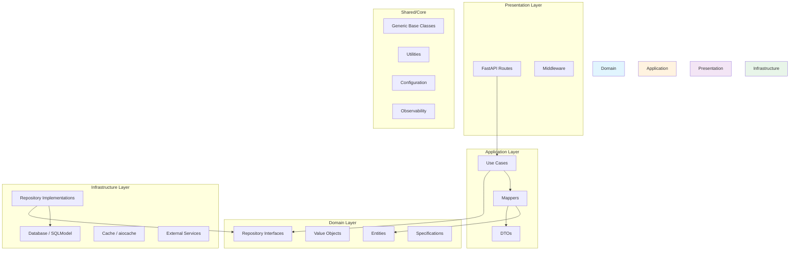

# Design Document

## Overview

This design document describes a modern, production-ready, reusable REST API framework built with Python 3.12+ and FastAPI. The framework follows Clean Architecture/Hexagonal Architecture principles, leveraging Python Generics for maximum code reuse and type safety. It serves as a starting point for any Python API project with built-in observability, security, and developer experience features.

### Key Design Principles

1. **Generic-First**: All core components use Python Generics for type-safe reusability
2. **Async-Native**: Full async/await support throughout the stack
3. **Clean Architecture**: Strict layer separation with dependency inversion
4. **Zero Boilerplate**: Automatic mapping, validation, and CRUD generation
5. **Production-Ready**: Built-in observability, security, and error handling
6. **Developer Experience**: Type hints, IDE support, and fast tooling

### Technology Stack

| Category | Technology | Purpose |
|----------|------------|---------|
| Framework | FastAPI 0.115+ | Web framework with OpenAPI |
| Validation | Pydantic v2 | Data validation and serialization |
| ORM | SQLModel + SQLAlchemy 2.0 | Unified ORM and validation |
| Database | asyncpg | Async PostgreSQL driver |
| DI | dependency-injector | Dependency injection container |
| Logging | structlog | Structured JSON logging |
| Tracing | OpenTelemetry | Distributed tracing |
| Testing | pytest + hypothesis | Unit and property-based testing |
| Tooling | Ruff + uv | Linting and package management |

## Architecture



### Project Structure

```
my_api/
├── src/
│   └── my_api/
│       ├── __init__.py
│       ├── main.py                    # FastAPI application entry
│       │
│       ├── core/                      # Shared/Core module
│       │   ├── __init__.py
│       │   ├── config.py              # Pydantic Settings
│       │   ├── container.py           # DI Container
│       │   ├── exceptions.py          # Base exceptions
│       │   ├── logging.py             # Structlog configuration
│       │   ├── tracing.py             # OpenTelemetry setup
│       │   └── security.py            # Security utilities
│       │
│       ├── shared/                    # Generic base classes
│       │   ├── __init__.py
│       │   ├── entity.py              # Base entity with ID, timestamps
│       │   ├── repository.py          # Generic repository interface
│       │   ├── use_case.py            # Generic use case base
│       │   ├── router.py              # Generic CRUD router
│       │   ├── mapper.py              # Generic mapper
│       │   ├── dto.py                 # Generic DTOs (Response, Paginated)
│       │   ├── pagination.py          # Pagination utilities
│       │   ├── specification.py       # Specification pattern
│       │   └── utils/
│       │       ├── datetime.py        # Pendulum utilities
│       │       ├── ids.py             # UUID7/ULID generators
│       │       ├── password.py        # Argon2 hashing
│       │       ├── cache.py           # Cache decorators
│       │       └── retry.py           # Tenacity wrappers
│       │
│       ├── domain/                    # Domain layer
│       │   ├── __init__.py
│       │   ├── entities/
│       │   │   └── item.py            # Example: Item entity
│       │   ├── value_objects/
│       │   │   └── money.py           # Example: Money VO
│       │   └── repositories/
│       │       └── item_repository.py # Item repository interface
│       │
│       ├── application/               # Application layer
│       │   ├── __init__.py
│       │   ├── use_cases/
│       │   │   └── item_use_case.py   # Item use case
│       │   ├── dtos/
│       │   │   └── item_dto.py        # Item DTOs
│       │   └── mappers/
│       │       └── item_mapper.py     # Item mapper
│       │
│       ├── adapters/                  # Adapters layer
│       │   ├── __init__.py
│       │   ├── api/
│       │   │   ├── __init__.py
│       │   │   ├── routes/
│       │   │   │   ├── __init__.py
│       │   │   │   ├── health.py      # Health check routes
│       │   │   │   └── items.py       # Item routes
│       │   │   ├── middleware/
│       │   │   │   ├── error_handler.py
│       │   │   │   ├── logging.py
│       │   │   │   └── security.py
│       │   │   └── dependencies.py    # FastAPI dependencies
│       │   └── repositories/
│       │       └── sqlmodel_item_repository.py
│       │
│       └── infrastructure/            # Infrastructure layer
│           ├── __init__.py
│           ├── database/
│           │   ├── __init__.py
│           │   ├── session.py         # Async session factory
│           │   ├── models/
│           │   │   └── item_model.py  # SQLModel Item
│           │   └── migrations/        # Alembic migrations
│           └── external/
│               └── redis_cache.py     # Redis client
│
├── tests/
│   ├── conftest.py                    # Pytest fixtures
│   ├── factories/                     # Polyfactory factories
│   ├── unit/
│   ├── integration/
│   └── properties/                    # Hypothesis property tests
│
├── pyproject.toml                     # Project configuration
├── .env.example                       # Environment template
├── .pre-commit-config.yaml            # Pre-commit hooks
└── ruff.toml                          # Ruff configuration
```

## Components and Interfaces

### 1. Generic Base Entity

```python
from datetime import datetime
from typing import Generic, TypeVar
from pydantic import BaseModel, Field
from ulid import ULID

IdType = TypeVar("IdType", bound=str | int)

class BaseEntity(BaseModel, Generic[IdType]):
    """Base entity with common fields for all domain entities."""
    
    id: IdType | None = None
    created_at: datetime = Field(default_factory=lambda: datetime.now(tz=UTC))
    updated_at: datetime = Field(default_factory=lambda: datetime.now(tz=UTC))
    is_deleted: bool = False
    
    class Config:
        from_attributes = True
```

### 2. Generic Repository Interface

```python
from abc import ABC, abstractmethod
from typing import Generic, TypeVar, Sequence

T = TypeVar("T", bound=BaseEntity)
CreateT = TypeVar("CreateT")
UpdateT = TypeVar("UpdateT")

class IRepository(ABC, Generic[T, CreateT, UpdateT]):
    """Generic repository interface for CRUD operations."""
    
    @abstractmethod
    async def get_by_id(self, id: str) -> T | None:
        """Get entity by ID."""
        ...
    
    @abstractmethod
    async def get_all(
        self,
        *,
        skip: int = 0,
        limit: int = 100,
        filters: dict | None = None,
        sort_by: str | None = None,
        sort_order: str = "asc",
    ) -> tuple[Sequence[T], int]:
        """Get paginated list of entities with total count."""
        ...
    
    @abstractmethod
    async def create(self, data: CreateT) -> T:
        """Create new entity."""
        ...
    
    @abstractmethod
    async def update(self, id: str, data: UpdateT) -> T | None:
        """Update existing entity."""
        ...
    
    @abstractmethod
    async def delete(self, id: str, *, soft: bool = True) -> bool:
        """Delete entity (soft delete by default)."""
        ...
    
    @abstractmethod
    async def create_many(self, data: Sequence[CreateT]) -> Sequence[T]:
        """Bulk create entities."""
        ...
    
    @abstractmethod
    async def exists(self, id: str) -> bool:
        """Check if entity exists."""
        ...
```

### 3. Generic Use Case

```python
from typing import Generic, TypeVar

T = TypeVar("T", bound=BaseEntity)
CreateDTO = TypeVar("CreateDTO")
UpdateDTO = TypeVar("UpdateDTO")
ResponseDTO = TypeVar("ResponseDTO")

class BaseUseCase(Generic[T, CreateDTO, UpdateDTO, ResponseDTO]):
    """Generic use case with CRUD operations."""
    
    def __init__(
        self,
        repository: IRepository[T, CreateDTO, UpdateDTO],
        mapper: IMapper[T, ResponseDTO],
    ):
        self._repository = repository
        self._mapper = mapper
    
    async def get(self, id: str) -> ResponseDTO | None:
        entity = await self._repository.get_by_id(id)
        return self._mapper.to_dto(entity) if entity else None
    
    async def list(
        self,
        *,
        page: int = 1,
        size: int = 20,
        filters: dict | None = None,
        sort_by: str | None = None,
    ) -> PaginatedResponse[ResponseDTO]:
        skip = (page - 1) * size
        entities, total = await self._repository.get_all(
            skip=skip, limit=size, filters=filters, sort_by=sort_by
        )
        items = [self._mapper.to_dto(e) for e in entities]
        return PaginatedResponse(
            items=items,
            total=total,
            page=page,
            size=size,
        )
    
    async def create(self, data: CreateDTO) -> ResponseDTO:
        entity = await self._repository.create(data)
        return self._mapper.to_dto(entity)
    
    async def update(self, id: str, data: UpdateDTO) -> ResponseDTO | None:
        entity = await self._repository.update(id, data)
        return self._mapper.to_dto(entity) if entity else None
    
    async def delete(self, id: str) -> bool:
        return await self._repository.delete(id)
```

### 4. Generic Mapper Interface

```python
from abc import ABC, abstractmethod
from typing import Generic, TypeVar

Source = TypeVar("Source")
Target = TypeVar("Target")

class IMapper(ABC, Generic[Source, Target]):
    """Generic mapper interface for object conversion."""
    
    @abstractmethod
    def to_dto(self, entity: Source) -> Target:
        """Convert entity to DTO."""
        ...
    
    @abstractmethod
    def to_entity(self, dto: Target) -> Source:
        """Convert DTO to entity."""
        ...
    
    def to_dto_list(self, entities: Sequence[Source]) -> list[Target]:
        """Convert list of entities to DTOs."""
        return [self.to_dto(e) for e in entities]
    
    def to_entity_list(self, dtos: Sequence[Target]) -> list[Source]:
        """Convert list of DTOs to entities."""
        return [self.to_entity(d) for d in dtos]
```

### 5. Generic Response DTOs

```python
from datetime import datetime
from typing import Generic, TypeVar
from pydantic import BaseModel, Field, computed_field

T = TypeVar("T")

class ApiResponse(BaseModel, Generic[T]):
    """Generic API response wrapper."""
    
    data: T
    message: str = "Success"
    status_code: int = 200
    timestamp: datetime = Field(default_factory=lambda: datetime.now(tz=UTC))
    request_id: str | None = None

class PaginatedResponse(BaseModel, Generic[T]):
    """Generic paginated response."""
    
    items: list[T]
    total: int
    page: int
    size: int
    
    @computed_field
    @property
    def pages(self) -> int:
        return (self.total + self.size - 1) // self.size
    
    @computed_field
    @property
    def has_next(self) -> bool:
        return self.page < self.pages
    
    @computed_field
    @property
    def has_previous(self) -> bool:
        return self.page > 1

class ProblemDetail(BaseModel):
    """RFC 7807 Problem Details response."""
    
    type: str = "about:blank"
    title: str
    status: int
    detail: str | None = None
    instance: str | None = None
    errors: list[dict] | None = None
```

### 6. Generic CRUD Router

```python
from typing import Generic, TypeVar, Type
from fastapi import APIRouter, Depends, HTTPException, status

T = TypeVar("T")
CreateDTO = TypeVar("CreateDTO")
UpdateDTO = TypeVar("UpdateDTO")
ResponseDTO = TypeVar("ResponseDTO")

class GenericCRUDRouter(Generic[T, CreateDTO, UpdateDTO, ResponseDTO]):
    """Generic router that generates CRUD endpoints."""
    
    def __init__(
        self,
        *,
        prefix: str,
        tags: list[str],
        response_model: Type[ResponseDTO],
        create_model: Type[CreateDTO],
        update_model: Type[UpdateDTO],
        use_case_dependency: Callable,
    ):
        self.router = APIRouter(prefix=prefix, tags=tags)
        self._setup_routes(response_model, create_model, update_model, use_case_dependency)
    
    def _setup_routes(self, response_model, create_model, update_model, use_case_dep):
        @self.router.get("", response_model=PaginatedResponse[response_model])
        async def list_items(
            page: int = 1,
            size: int = 20,
            use_case = Depends(use_case_dep),
        ):
            return await use_case.list(page=page, size=size)
        
        @self.router.get("/{id}", response_model=ApiResponse[response_model])
        async def get_item(id: str, use_case = Depends(use_case_dep)):
            item = await use_case.get(id)
            if not item:
                raise HTTPException(status_code=404, detail="Item not found")
            return ApiResponse(data=item)
        
        @self.router.post("", response_model=ApiResponse[response_model], status_code=201)
        async def create_item(data: create_model, use_case = Depends(use_case_dep)):
            item = await use_case.create(data)
            return ApiResponse(data=item, status_code=201)
        
        @self.router.put("/{id}", response_model=ApiResponse[response_model])
        async def update_item(id: str, data: update_model, use_case = Depends(use_case_dep)):
            item = await use_case.update(id, data)
            if not item:
                raise HTTPException(status_code=404, detail="Item not found")
            return ApiResponse(data=item)
        
        @self.router.delete("/{id}", status_code=204)
        async def delete_item(id: str, use_case = Depends(use_case_dep)):
            deleted = await use_case.delete(id)
            if not deleted:
                raise HTTPException(status_code=404, detail="Item not found")
```

### 7. Dependency Injection Container

```python
from dependency_injector import containers, providers
from dependency_injector.wiring import Provide, inject

class Container(containers.DeclarativeContainer):
    """Application DI container."""
    
    wiring_config = containers.WiringConfiguration(
        modules=["my_api.adapters.api.routes.items"]
    )
    
    # Configuration
    config = providers.Configuration()
    
    # Database
    db_session = providers.Resource(
        get_async_session,
        database_url=config.database.url,
    )
    
    # Repositories
    item_repository = providers.Factory(
        SQLModelItemRepository,
        session=db_session,
    )
    
    # Mappers
    item_mapper = providers.Singleton(ItemMapper)
    
    # Use Cases
    item_use_case = providers.Factory(
        ItemUseCase,
        repository=item_repository,
        mapper=item_mapper,
    )
```

### 8. Configuration with Pydantic Settings

```python
from pydantic import Field, SecretStr
from pydantic_settings import BaseSettings, SettingsConfigDict

class DatabaseSettings(BaseSettings):
    url: str = Field(default="postgresql+asyncpg://localhost/mydb")
    pool_size: int = Field(default=5)
    max_overflow: int = Field(default=10)

class SecuritySettings(BaseSettings):
    cors_origins: list[str] = Field(default=["*"])
    rate_limit: str = Field(default="100/minute")
    secret_key: SecretStr = Field(...)

class ObservabilitySettings(BaseSettings):
    log_level: str = Field(default="INFO")
    otlp_endpoint: str | None = Field(default=None)
    service_name: str = Field(default="my-api")

class Settings(BaseSettings):
    model_config = SettingsConfigDict(
        env_file=".env",
        env_nested_delimiter="__",
        extra="ignore",
    )
    
    app_name: str = Field(default="My API")
    debug: bool = Field(default=False)
    
    database: DatabaseSettings = Field(default_factory=DatabaseSettings)
    security: SecuritySettings = Field(default_factory=SecuritySettings)
    observability: ObservabilitySettings = Field(default_factory=ObservabilitySettings)
```

## Data Models

### SQLModel Entity Example

```python
from datetime import datetime
from sqlmodel import SQLModel, Field
from ulid import ULID

class ItemBase(SQLModel):
    """Base item fields shared between create/update/response."""
    name: str = Field(min_length=1, max_length=255)
    description: str | None = Field(default=None, max_length=1000)
    price: float = Field(gt=0)
    tax: float | None = Field(default=None, ge=0)

class Item(ItemBase, table=True):
    """Item database model."""
    __tablename__ = "items"
    
    id: str = Field(default_factory=lambda: str(ULID()), primary_key=True)
    created_at: datetime = Field(default_factory=lambda: datetime.now(tz=UTC))
    updated_at: datetime = Field(default_factory=lambda: datetime.now(tz=UTC))
    is_deleted: bool = Field(default=False)

class ItemCreate(ItemBase):
    """DTO for creating items."""
    pass

class ItemUpdate(SQLModel):
    """DTO for updating items (all fields optional)."""
    name: str | None = None
    description: str | None = None
    price: float | None = Field(default=None, gt=0)
    tax: float | None = Field(default=None, ge=0)

class ItemResponse(ItemBase):
    """DTO for item responses."""
    id: str
    created_at: datetime
    updated_at: datetime
    
    @computed_field
    @property
    def price_with_tax(self) -> float:
        return self.price + (self.tax or 0)
```


## Correctness Properties

*A property is a characteristic or behavior that should hold true across all valid executions of a system-essentially, a formal statement about what the system should do. Properties serve as the bridge between human-readable specifications and machine-verifiable correctness guarantees.*

### Property 1: Generic Response Serialization Completeness

*For any* valid Pydantic model instance wrapped in `ApiResponse[T]`, serializing to JSON SHALL produce an object containing `data`, `message`, `status_code`, `timestamp`, and `request_id` fields with correct types.

**Validates: Requirements 1.2, 8.3**

### Property 2: Validation Error Format Compliance

*For any* invalid input data that fails Pydantic validation, the error response SHALL be a valid RFC 7807 Problem Details object with `type`, `title`, `status` (422), `detail`, and `errors` array containing field-level details.

**Validates: Requirements 1.3, 8.2, 9.2**

### Property 3: Pagination Computed Fields Consistency

*For any* `PaginatedResponse` with `total`, `page`, and `size` values, the computed fields SHALL satisfy:
- `pages` equals `ceil(total / size)`
- `has_next` equals `page < pages`
- `has_previous` equals `page > 1`

**Validates: Requirements 1.5**

### Property 4: Mapper Round-Trip Preservation

*For any* entity instance, mapping to DTO and back to entity SHALL preserve all field values for fields with matching names. For nested objects and collections, the mapping SHALL recursively preserve structure and values.

**Validates: Requirements 2.1, 2.3, 2.4**

### Property 5: Mapper Error Descriptiveness

*For any* mapping operation where required target fields cannot be populated from source, the raised exception SHALL include the field name and context about the mapping failure.

**Validates: Requirements 2.6**

### Property 6: Repository Create-Get Round-Trip

*For any* valid entity creation data, calling `create()` followed by `get_by_id()` with the returned ID SHALL return an entity with all original field values preserved plus a valid generated ID.

**Validates: Requirements 3.3, 3.4**

### Property 7: Repository Update Persistence

*For any* existing entity and valid update data, calling `update()` followed by `get_by_id()` SHALL return an entity reflecting all updated field values.

**Validates: Requirements 3.5**

### Property 8: Repository Soft Delete Behavior

*For any* existing entity, calling `delete()` SHALL return `True`, and subsequent `get_by_id()` SHALL return `None` (or entity with `is_deleted=True` depending on implementation).

**Validates: Requirements 3.6**

### Property 9: Repository Pagination Bounds

*For any* repository with N entities and pagination parameters `skip` and `limit`, `get_all()` SHALL return at most `limit` entities, and the total count SHALL equal N (or filtered count if filters applied).

**Validates: Requirements 3.2**

### Property 10: Bulk Create Atomicity

*For any* list of N valid entity creation data, `create_many()` SHALL return exactly N entities, each with a unique generated ID.

**Validates: Requirements 3.7**

### Property 11: Endpoint POST Returns 201 with Entity

*For any* valid POST request to a CRUD endpoint, the response SHALL have status 201 and body containing the created entity with a generated ID.

**Validates: Requirements 5.2**

### Property 12: Endpoint GET List Returns Paginated Response

*For any* GET request to a list endpoint, the response SHALL be a valid `PaginatedResponse` with `items`, `total`, `page`, `size`, `pages`, `has_next`, and `has_previous` fields.

**Validates: Requirements 5.3**

### Property 13: Endpoint GET Detail Returns Entity or 404

*For any* GET request to a detail endpoint, the response SHALL be 200 with the entity if it exists, or 404 with Problem Details if not found.

**Validates: Requirements 5.4**

### Property 14: Endpoint DELETE Returns 204 or 404

*For any* DELETE request, the response SHALL be 204 (no content) if the entity existed, or 404 with Problem Details if not found.

**Validates: Requirements 5.6**

### Property 15: Not Found Error Format

*For any* request for a non-existent resource, the response SHALL be 404 with a valid RFC 7807 Problem Details body.

**Validates: Requirements 9.1**

### Property 16: Internal Error Concealment

*For any* unexpected server error, the response SHALL be 500 with a generic message that does NOT expose stack traces, internal paths, or implementation details.

**Validates: Requirements 9.3**

### Property 17: Business Rule Violation Format

*For any* business rule violation, the response SHALL be 400 with RFC 7807 Problem Details including error code and violation description.

**Validates: Requirements 9.4**

### Property 18: Missing Config Fails Fast

*For any* required configuration field that is not set, application startup SHALL raise a descriptive `ValidationError` before the server accepts requests.

**Validates: Requirements 12.2**

### Property 19: DateTime ISO 8601 Formatting

*For any* timezone-aware datetime, the formatting utility SHALL produce a valid ISO 8601 string that can be parsed back to the original datetime (within timezone equivalence).

**Validates: Requirements 16.1**

### Property 20: ID Generation Uniqueness and Sortability

*For any* sequence of generated IDs (ULID or UUID7), each ID SHALL be unique, and IDs generated later SHALL sort lexicographically after IDs generated earlier.

**Validates: Requirements 16.2**

### Property 21: Password Hash Verification

*For any* password string, hashing followed by verification with the same password SHALL return `True`, and verification with a different password SHALL return `False`.

**Validates: Requirements 16.3**

### Property 22: Pagination Utility Correctness

*For any* list of N items and offset pagination with `page` and `size`, the utility SHALL return items from index `(page-1)*size` to `min(page*size, N)`.

**Validates: Requirements 16.4**

### Property 23: Specification Pattern Composition

*For any* two specifications A and B, `A.and(B)` SHALL be satisfied only when both A and B are satisfied, and `A.or(B)` SHALL be satisfied when either A or B is satisfied.

**Validates: Requirements 16.7**

## Error Handling

### Exception Hierarchy

```python
class AppException(Exception):
    """Base application exception."""
    def __init__(
        self,
        message: str,
        error_code: str,
        status_code: int = 400,
        details: dict | None = None,
    ):
        self.message = message
        self.error_code = error_code
        self.status_code = status_code
        self.details = details or {}
        super().__init__(message)

class EntityNotFoundError(AppException):
    """Raised when an entity is not found."""
    def __init__(self, entity_type: str, entity_id: str):
        super().__init__(
            message=f"{entity_type} with id '{entity_id}' not found",
            error_code="ENTITY_NOT_FOUND",
            status_code=404,
            details={"entity_type": entity_type, "entity_id": entity_id},
        )

class ValidationError(AppException):
    """Raised when validation fails."""
    def __init__(self, errors: list[dict]):
        super().__init__(
            message="Validation failed",
            error_code="VALIDATION_ERROR",
            status_code=422,
            details={"errors": errors},
        )

class BusinessRuleViolationError(AppException):
    """Raised when a business rule is violated."""
    def __init__(self, rule: str, message: str):
        super().__init__(
            message=message,
            error_code=f"BUSINESS_RULE_{rule}",
            status_code=400,
            details={"rule": rule},
        )
```

### Global Exception Handler

```python
from fastapi import Request
from fastapi.responses import JSONResponse

async def app_exception_handler(request: Request, exc: AppException) -> JSONResponse:
    """Convert application exceptions to RFC 7807 Problem Details."""
    return JSONResponse(
        status_code=exc.status_code,
        content={
            "type": f"https://api.example.com/errors/{exc.error_code}",
            "title": exc.error_code.replace("_", " ").title(),
            "status": exc.status_code,
            "detail": exc.message,
            "instance": str(request.url),
            **exc.details,
        },
    )

async def unhandled_exception_handler(request: Request, exc: Exception) -> JSONResponse:
    """Handle unexpected errors without exposing internals."""
    logger.exception("Unhandled exception", exc_info=exc, request_id=request.state.request_id)
    return JSONResponse(
        status_code=500,
        content={
            "type": "https://api.example.com/errors/INTERNAL_ERROR",
            "title": "Internal Server Error",
            "status": 500,
            "detail": "An unexpected error occurred. Please try again later.",
            "instance": str(request.url),
        },
    )
```

## Testing Strategy

### Dual Testing Approach

This framework uses both unit tests and property-based tests for comprehensive coverage:

- **Unit Tests**: Verify specific examples, edge cases, and integration points
- **Property-Based Tests**: Verify universal properties that should hold across all valid inputs

### Testing Libraries

| Library | Purpose |
|---------|---------|
| pytest | Test framework |
| pytest-asyncio | Async test support |
| hypothesis | Property-based testing |
| polyfactory | Test data factories |
| httpx | Async HTTP client for integration tests |

### Property-Based Testing with Hypothesis

Each correctness property from the design document will be implemented as a property-based test using Hypothesis. Tests will be configured to run a minimum of 100 iterations.

```python
from hypothesis import given, settings, strategies as st

# Example: Property 3 - Pagination Computed Fields
@settings(max_examples=100)
@given(
    total=st.integers(min_value=0, max_value=10000),
    page=st.integers(min_value=1, max_value=100),
    size=st.integers(min_value=1, max_value=100),
)
def test_pagination_computed_fields(total: int, page: int, size: int):
    """
    **Feature: generic-fastapi-crud, Property 3: Pagination Computed Fields Consistency**
    """
    response = PaginatedResponse(items=[], total=total, page=page, size=size)
    
    expected_pages = (total + size - 1) // size if total > 0 else 0
    assert response.pages == expected_pages
    assert response.has_next == (page < response.pages)
    assert response.has_previous == (page > 1)
```

### Test Organization

```
tests/
├── conftest.py                    # Shared fixtures
├── factories/
│   └── item_factory.py            # Polyfactory factories
├── unit/
│   ├── test_entities.py
│   ├── test_mappers.py
│   └── test_use_cases.py
├── integration/
│   ├── test_repositories.py
│   └── test_endpoints.py
└── properties/
    ├── test_response_properties.py
    ├── test_mapper_properties.py
    ├── test_repository_properties.py
    ├── test_pagination_properties.py
    └── test_error_properties.py
```

### Test Fixtures

```python
import pytest
from polyfactory.factories.pydantic_factory import ModelFactory

class ItemFactory(ModelFactory):
    __model__ = Item

@pytest.fixture
def item_factory():
    return ItemFactory

@pytest.fixture
async def async_client(app):
    async with AsyncClient(app=app, base_url="http://test") as client:
        yield client

@pytest.fixture
async def db_session():
    async with async_session() as session:
        yield session
        await session.rollback()
```

### Hypothesis Strategies

```python
from hypothesis import strategies as st

# Strategy for valid item creation data
item_create_strategy = st.builds(
    ItemCreate,
    name=st.text(min_size=1, max_size=255),
    description=st.text(max_size=1000) | st.none(),
    price=st.floats(min_value=0.01, max_value=1000000, allow_nan=False),
    tax=st.floats(min_value=0, max_value=100, allow_nan=False) | st.none(),
)

# Strategy for pagination parameters
pagination_strategy = st.fixed_dictionaries({
    "page": st.integers(min_value=1, max_value=100),
    "size": st.integers(min_value=1, max_value=100),
})
```