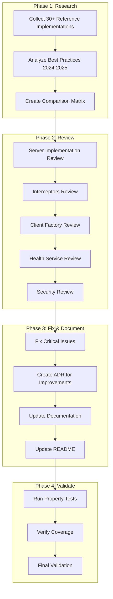

# Design Document: gRPC Code Review 2025

## Overview

Este documento descreve o design para realizar um code review intensivo da implementação gRPC existente, comparando com 30+ implementações state-of-the-art, documentando melhorias e atualizando a documentação do projeto.

### Goals

- Validar que a implementação gRPC segue as melhores práticas de 2024-2025
- Identificar gaps comparando com implementações de referência
- Documentar e corrigir issues encontrados
- Atualizar documentação e README
- Garantir que property-based tests cobrem todas as propriedades de corretude

### Non-Goals

- Reimplementar a infraestrutura gRPC do zero
- Adicionar novos recursos não planejados
- Migrar para outras tecnologias

## Architecture

### Code Review Process Flow



## Components and Interfaces

### 1. Reference Implementation Analysis

Análise de 30+ implementações de referência para gRPC em Python:

#### Official gRPC Examples
1. grpc/grpc - Official gRPC repository examples
2. grpc/grpc-python - Python-specific examples
3. grpc-ecosystem/awesome-grpc - Curated list of gRPC resources
4. grpc-ecosystem/grpc-health-probe - Health check implementation
5. grpc-ecosystem/go-grpc-middleware - Middleware patterns (Go, applicable concepts)

#### Production Implementations
6. googleapis/google-cloud-python - Google Cloud client libraries
7. opentelemetry-python - OpenTelemetry gRPC instrumentation
8. envoyproxy/envoy - Envoy proxy gRPC handling
9. istio/istio - Service mesh gRPC routing
10. kubernetes/kubernetes - K8s API server gRPC

#### Framework Integrations
11. tiangolo/fastapi - FastAPI patterns (REST comparison)
12. encode/starlette - ASGI patterns
13. pallets/flask - Flask patterns (comparison)
14. django/django - Django patterns (comparison)
15. aio-libs/aiohttp - Async HTTP patterns

#### Microservices Patterns
16. Netflix/conductor - Workflow orchestration
17. uber/cadence - Workflow engine
18. temporalio/sdk-python - Temporal Python SDK
19. apache/airflow - Workflow scheduling
20. prefecthq/prefect - Data workflow

#### Resilience Patterns
21. resilience4j/resilience4j - Circuit breaker patterns (Java, concepts)
22. App-vNext/Polly - Resilience patterns (.NET, concepts)
23. slok/goresilience - Go resilience patterns
24. pybreaker - Python circuit breaker
25. tenacity - Python retry library

#### Observability
26. jaegertracing/jaeger - Distributed tracing
27. prometheus/client_python - Prometheus metrics
28. open-telemetry/opentelemetry-python - OTel Python
29. grafana/grafana - Monitoring dashboards
30. elastic/apm-agent-python - Elastic APM

#### Security
31. auth0/python-jwt - JWT handling
32. jpadilla/pyjwt - PyJWT library
33. mpdavis/python-jose - JOSE implementation
34. certifi/python-certifi - Certificate handling
35. pyca/cryptography - Cryptographic operations

### 2. Review Checklist

#### Server Implementation
- [ ] Async/await patterns correctly implemented
- [ ] Graceful shutdown handling
- [ ] Max concurrent RPCs configuration
- [ ] Reflection service enabled
- [ ] Compression support

#### Interceptors
- [ ] Chain-of-responsibility pattern
- [ ] Error propagation
- [ ] Context preservation
- [ ] Async interceptor support
- [ ] Interceptor ordering

#### Client Factory
- [ ] Connection pooling
- [ ] Channel reuse
- [ ] Deadline propagation
- [ ] Retry configuration
- [ ] Circuit breaker integration

#### Health Service
- [ ] Standard protocol compliance
- [ ] Watch streaming support
- [ ] Dependency health aggregation
- [ ] Graceful degradation

#### Security
- [ ] JWT validation completeness
- [ ] Token expiration handling
- [ ] Method exclusion list
- [ ] mTLS support
- [ ] Input validation

## Data Models

### Issue Tracking Model

```python
from enum import Enum
from pydantic import BaseModel
from datetime import datetime

class Severity(str, Enum):
    CRITICAL = "critical"
    HIGH = "high"
    MEDIUM = "medium"
    LOW = "low"

class IssueStatus(str, Enum):
    OPEN = "open"
    IN_PROGRESS = "in_progress"
    RESOLVED = "resolved"
    WONT_FIX = "wont_fix"

class CodeReviewIssue(BaseModel):
    id: str
    title: str
    description: str
    severity: Severity
    status: IssueStatus
    file_path: str
    line_number: int | None
    recommendation: str
    created_at: datetime
    resolved_at: datetime | None
```

### Comparison Matrix Model

```python
class FeatureComparison(BaseModel):
    feature: str
    our_implementation: str
    best_practice: str
    gap: str | None
    recommendation: str | None
    priority: Severity
```

## Correctness Properties

*A property is a characteristic or behavior that should hold true across all valid executions of a system-essentially, a formal statement about what the system should do. Properties serve as the bridge between human-readable specifications and machine-verifiable correctness guarantees.*

Based on the prework analysis, the following properties have been identified:

### Property 1: Async Operation Completion

*For any* gRPC server operation, async/await patterns SHALL complete without deadlocks and properly propagate exceptions.

**Validates: Requirements 1.1**

### Property 2: Interceptor Chain Execution Order

*For any* configured interceptor chain, interceptors SHALL execute in the defined order with each receiving the result of the previous one.

**Validates: Requirements 1.2**

### Property 3: Error Status Mapping Completeness

*For any* domain exception type, the error-to-status mapper SHALL produce a valid gRPC StatusCode that correctly represents the error category.

**Validates: Requirements 1.3**

### Property 4: Health Check Protocol Compliance

*For any* health check request, the health service SHALL respond with a valid HealthCheckResponse conforming to the gRPC health check protocol.

**Validates: Requirements 1.4**

### Property 5: Channel Reuse Consistency

*For any* sequence of client calls to the same target, the client factory SHALL reuse channels efficiently without connection leaks.

**Validates: Requirements 1.5**

### Property 6: Circuit Breaker State Transitions

*For any* sequence of call results, the circuit breaker SHALL transition correctly between CLOSED, OPEN, and HALF_OPEN states based on failure thresholds.

**Validates: Requirements 2.3**

### Property 7: Trace Context Propagation

*For any* gRPC call with tracing enabled, the trace context (trace_id, span_id) SHALL be propagated via metadata and preserved across service boundaries.

**Validates: Requirements 2.4**

### Property 8: JWT Validation Security

*For any* JWT token, the authentication interceptor SHALL accept valid tokens and reject invalid/expired/malformed tokens with UNAUTHENTICATED status.

**Validates: Requirements 2.5, 7.1**

### Property 9: Method-Level Authorization

*For any* protected gRPC method, the authorization check SHALL be applied and reject unauthorized requests with PERMISSION_DENIED status.

**Validates: Requirements 7.2**

### Property 10: Protobuf Message Validation

*For any* incoming Protobuf message, the system SHALL validate required fields and reject malformed messages with INVALID_ARGUMENT status.

**Validates: Requirements 7.4**

### Property 11: Helm Chart Validity

*For any* Helm chart template, the generated YAML SHALL be valid Kubernetes manifests with correct gRPC service configurations.

**Validates: Requirements 8.1**

### Property 12: Istio Manifest Validity

*For any* Istio configuration, the VirtualService and DestinationRule SHALL be valid and correctly route gRPC traffic.

**Validates: Requirements 8.2**

## Error Handling

### Review Issue Categories

| Category | Description | Action |
|----------|-------------|--------|
| Security Vulnerability | Potential security issue | Immediate fix required |
| Performance Issue | Suboptimal performance | High priority fix |
| Code Quality | Style/pattern violation | Medium priority fix |
| Documentation Gap | Missing/outdated docs | Update documentation |
| Test Coverage | Missing tests | Add tests |

## Testing Strategy

### Dual Testing Approach

#### Property-Based Tests (Hypothesis)

```python
# tests/properties/test_grpc_code_review.py
from hypothesis import given, strategies as st, settings

@settings(max_examples=100)
@given(st.lists(st.sampled_from(["success", "failure"]), min_size=1, max_size=20))
def test_circuit_breaker_state_transitions(call_results: list[str]):
    """
    **Feature: grpc-code-review-2025, Property 6: Circuit Breaker State Transitions**
    **Validates: Requirements 2.3**
    """
    # Test circuit breaker transitions based on call results
    ...
```

#### Unit Tests

- Specific interceptor behavior tests
- Edge case handling tests
- Configuration validation tests

### Test Configuration

- Minimum 100 iterations per property test
- Each property test tagged with design document reference
- Tests run in CI/CD pipeline

