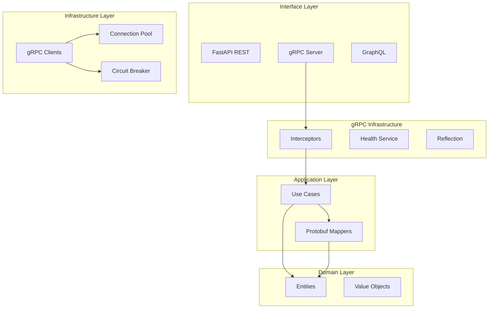

# Design Document: gRPC Microservices Support

## Overview

Este documento descreve o design para adicionar suporte gRPC ao Python API Base, habilitando comunicação eficiente entre microsserviços. A implementação segue os princípios de Clean Architecture existentes, integrando-se com o DI container, observabilidade e padrões de resiliência já estabelecidos.

### Goals

- Comunicação service-to-service de alta performance via HTTP/2
- Type safety através de Protocol Buffers
- Integração transparente com a arquitetura existente
- Suporte a streaming bidirecional
- Observabilidade completa (tracing, metrics, logging)
- Resiliência (retry, circuit breaker, deadline)

### Non-Goals

- Substituir a API REST existente
- Expor gRPC diretamente para clientes externos (browsers)
- Implementar gRPC-Web (pode ser adicionado futuramente)

## Architecture

### High-Level Architecture



### Directory Structure

```
src/
├── infrastructure/
│   └── grpc/
│       ├── __init__.py
│       ├── server.py              # gRPC server setup
│       ├── interceptors/
│       │   ├── __init__.py
│       │   ├── auth.py            # JWT authentication
│       │   ├── logging.py         # Request/response logging
│       │   ├── tracing.py         # OpenTelemetry tracing
│       │   ├── metrics.py         # Prometheus metrics
│       │   ├── error.py           # Error handling
│       │   └── retry.py           # Client retry logic
│       ├── health/
│       │   ├── __init__.py
│       │   └── service.py         # Health check service
│       ├── client/
│       │   ├── __init__.py
│       │   ├── factory.py         # Client factory
│       │   ├── pool.py            # Connection pooling
│       │   └── resilience.py      # Circuit breaker integration
│       └── utils/
│           ├── __init__.py
│           ├── mappers.py         # Entity <-> Protobuf mappers
│           ├── status.py          # Error to gRPC status mapping
│           └── metadata.py        # Metadata utilities
│
├── interface/
│   └── grpc/
│       ├── __init__.py
│       ├── servicers/
│       │   ├── __init__.py
│       │   ├── base.py            # Base servicer class
│       │   └── examples.py        # Example servicer
│       └── router.py              # Service registration
│
protos/
├── common/
│   ├── health.proto               # Health check protocol
│   └── errors.proto               # Error details
├── examples/
│   └── items.proto                # Example service
└── buf.yaml                       # Buf configuration

deployments/
├── helm/
│   └── templates/
│       └── grpc-service.yaml      # gRPC K8s service
└── istio/
    └── grpc/
        └── virtualservice.yaml    # gRPC routing
```

## Components and Interfaces

### 1. gRPC Server

```python
# src/infrastructure/grpc/server.py
from grpc import aio
from typing import Sequence

class GRPCServer:
    """gRPC server with interceptor support."""
    
    def __init__(
        self,
        host: str = "0.0.0.0",
        port: int = 50051,
        interceptors: Sequence[aio.ServerInterceptor] | None = None,
        max_workers: int = 10,
        max_concurrent_rpcs: int = 100,
    ) -> None: ...
    
    async def start(self) -> None:
        """Start the gRPC server."""
        ...
    
    async def stop(self, grace: float = 5.0) -> None:
        """Gracefully stop the server."""
        ...
    
    def add_servicer(
        self,
        servicer: Any,
        add_func: Callable[[Any, aio.Server], None],
    ) -> None:
        """Register a servicer with the server."""
        ...
```

### 2. Base Servicer

```python
# src/interface/grpc/servicers/base.py
from abc import ABC
from dependency_injector.wiring import inject, Provide

class BaseServicer(ABC):
    """Base class for gRPC servicers with DI support."""
    
    @inject
    def __init__(
        self,
        container: Container = Provide[Container],
    ) -> None:
        self._container = container
    
    def get_use_case[T](self, use_case_type: type[T]) -> T:
        """Get a use case from the DI container."""
        return self._container.resolve(use_case_type)
```

### 3. Interceptors

```python
# src/infrastructure/grpc/interceptors/auth.py
from grpc import aio, StatusCode

class AuthInterceptor(aio.ServerInterceptor):
    """JWT authentication interceptor."""
    
    def __init__(
        self,
        jwt_service: JWTService,
        excluded_methods: set[str] | None = None,
    ) -> None: ...
    
    async def intercept_service(
        self,
        continuation: Callable,
        handler_call_details: aio.HandlerCallDetails,
    ) -> aio.RpcMethodHandler:
        """Intercept and validate JWT token from metadata."""
        ...
```

```python
# src/infrastructure/grpc/interceptors/tracing.py
from opentelemetry import trace

class TracingInterceptor(aio.ServerInterceptor):
    """OpenTelemetry tracing interceptor."""
    
    def __init__(self, tracer: trace.Tracer) -> None: ...
    
    async def intercept_service(
        self,
        continuation: Callable,
        handler_call_details: aio.HandlerCallDetails,
    ) -> aio.RpcMethodHandler:
        """Create span for gRPC call with trace context propagation."""
        ...
```

### 4. Health Service

```python
# src/infrastructure/grpc/health/service.py
from grpc_health.v1 import health_pb2, health_pb2_grpc

class HealthServicer(health_pb2_grpc.HealthServicer):
    """gRPC health check service implementation."""
    
    def __init__(
        self,
        dependency_checks: dict[str, Callable[[], Awaitable[bool]]],
    ) -> None: ...
    
    async def Check(
        self,
        request: health_pb2.HealthCheckRequest,
        context: aio.ServicerContext,
    ) -> health_pb2.HealthCheckResponse:
        """Check service health status."""
        ...
    
    async def Watch(
        self,
        request: health_pb2.HealthCheckRequest,
        context: aio.ServicerContext,
    ) -> AsyncIterator[health_pb2.HealthCheckResponse]:
        """Stream health status updates."""
        ...
```

### 5. Client Factory

```python
# src/infrastructure/grpc/client/factory.py
from grpc import aio

class GRPCClientFactory:
    """Factory for creating gRPC clients with resilience."""
    
    def __init__(
        self,
        default_timeout: float = 30.0,
        retry_config: RetryConfig | None = None,
        circuit_breaker_config: CircuitBreakerConfig | None = None,
    ) -> None: ...
    
    async def create_channel(
        self,
        target: str,
        secure: bool = True,
        credentials: ChannelCredentials | None = None,
    ) -> aio.Channel:
        """Create a gRPC channel with connection pooling."""
        ...
    
    def create_stub[T](
        self,
        stub_class: type[T],
        channel: aio.Channel,
    ) -> T:
        """Create a stub with interceptors."""
        ...
```

### 6. Protobuf Mappers

```python
# src/infrastructure/grpc/utils/mappers.py
from typing import Protocol, TypeVar

TEntity = TypeVar("TEntity")
TProto = TypeVar("TProto")

class ProtobufMapper(Protocol[TEntity, TProto]):
    """Protocol for entity <-> protobuf mapping."""
    
    def to_proto(self, entity: TEntity) -> TProto: ...
    def from_proto(self, proto: TProto) -> TEntity: ...
    def to_proto_list(self, entities: list[TEntity]) -> list[TProto]: ...
    def from_proto_list(self, protos: list[TProto]) -> list[TEntity]: ...
```

### 7. Error Status Mapping

```python
# src/infrastructure/grpc/utils/status.py
from grpc import StatusCode
from core.errors import AppException, ValidationError, NotFoundError

ERROR_STATUS_MAP: dict[type[AppException], StatusCode] = {
    ValidationError: StatusCode.INVALID_ARGUMENT,
    NotFoundError: StatusCode.NOT_FOUND,
    UnauthorizedError: StatusCode.UNAUTHENTICATED,
    ForbiddenError: StatusCode.PERMISSION_DENIED,
    ConflictError: StatusCode.ALREADY_EXISTS,
    RateLimitError: StatusCode.RESOURCE_EXHAUSTED,
    ExternalServiceError: StatusCode.UNAVAILABLE,
    DatabaseError: StatusCode.INTERNAL,
}

def exception_to_status(exc: Exception) -> tuple[StatusCode, str]:
    """Convert exception to gRPC status code and message."""
    ...
```

## Data Models

### Protocol Buffer Definitions

```protobuf
// protos/common/errors.proto
syntax = "proto3";
package common;

message ErrorDetail {
  string code = 1;
  string message = 2;
  string field = 3;
  map<string, string> metadata = 4;
}

message ErrorResponse {
  string error_id = 1;
  string error_code = 2;
  string message = 3;
  repeated ErrorDetail details = 4;
  string trace_id = 5;
}
```

```protobuf
// protos/examples/items.proto
syntax = "proto3";
package examples;

import "google/protobuf/timestamp.proto";
import "google/protobuf/empty.proto";

service ItemService {
  // Unary
  rpc GetItem(GetItemRequest) returns (Item);
  rpc CreateItem(CreateItemRequest) returns (Item);
  rpc UpdateItem(UpdateItemRequest) returns (Item);
  rpc DeleteItem(DeleteItemRequest) returns (google.protobuf.Empty);
  
  // Server streaming
  rpc ListItems(ListItemsRequest) returns (stream Item);
  
  // Client streaming
  rpc BatchCreateItems(stream CreateItemRequest) returns (BatchCreateResponse);
  
  // Bidirectional streaming
  rpc SyncItems(stream ItemSyncRequest) returns (stream ItemSyncResponse);
}

message Item {
  string id = 1;
  string name = 2;
  string description = 3;
  string sku = 4;
  int32 quantity = 5;
  double price = 6;
  bool is_active = 7;
  google.protobuf.Timestamp created_at = 8;
  google.protobuf.Timestamp updated_at = 9;
}

message GetItemRequest {
  string id = 1;
}

message CreateItemRequest {
  string name = 1;
  string description = 2;
  string sku = 3;
  int32 quantity = 4;
  double price = 5;
}

message UpdateItemRequest {
  string id = 1;
  optional string name = 2;
  optional string description = 3;
  optional int32 quantity = 4;
  optional double price = 5;
}

message DeleteItemRequest {
  string id = 1;
}

message ListItemsRequest {
  int32 page_size = 1;
  string page_token = 2;
  string filter = 3;
}

message BatchCreateResponse {
  int32 created_count = 1;
  repeated string created_ids = 2;
  repeated ErrorDetail errors = 3;
}

message ItemSyncRequest {
  oneof action {
    Item upsert = 1;
    string delete_id = 2;
  }
}

message ItemSyncResponse {
  string id = 1;
  bool success = 2;
  ErrorDetail error = 3;
}
```

### Configuration Models

```python
# src/core/config/grpc.py
from pydantic import BaseModel, Field

class GRPCServerSettings(BaseModel):
    """gRPC server configuration."""
    enabled: bool = False
    host: str = "0.0.0.0"
    port: int = 50051
    max_workers: int = 10
    max_concurrent_rpcs: int = 100
    reflection_enabled: bool = True
    health_check_enabled: bool = True

class GRPCClientSettings(BaseModel):
    """gRPC client configuration."""
    default_timeout: float = 30.0
    max_retries: int = 3
    retry_backoff_base: float = 1.0
    circuit_breaker_threshold: int = 5
    circuit_breaker_timeout: float = 30.0

class GRPCSettings(BaseModel):
    """Combined gRPC settings."""
    server: GRPCServerSettings = Field(default_factory=GRPCServerSettings)
    client: GRPCClientSettings = Field(default_factory=GRPCClientSettings)
```

## Correctness Properties

*A property is a characteristic or behavior that should hold true across all valid executions of a system-essentially, a formal statement about what the system should do. Properties serve as the bridge between human-readable specifications and machine-verifiable correctness guarantees.*

Based on the prework analysis, the following properties have been identified after reflection to eliminate redundancy:

### Property 1: Protobuf Message Round-Trip

*For any* valid Protobuf message, serializing to binary and deserializing back SHALL produce an equivalent message with all fields preserved.

**Validates: Requirements 1.5**

### Property 2: Entity-Protobuf Mapper Consistency

*For any* domain entity, mapping to Protobuf message and back to entity SHALL preserve all data fields without loss.

**Validates: Requirements 2.3**

### Property 3: Domain Error to gRPC Status Mapping

*For any* domain exception type, the error-to-status mapper SHALL produce a valid gRPC StatusCode that correctly represents the error category.

**Validates: Requirements 2.4**

### Property 4: JWT Authentication Validation

*For any* gRPC request with metadata, the authentication interceptor SHALL accept valid JWT tokens and reject invalid/expired tokens with UNAUTHENTICATED status.

**Validates: Requirements 3.1**

### Property 5: Interceptor Execution Order

*For any* configured interceptor chain, interceptors SHALL execute in the defined order, with each interceptor receiving the result of the previous one.

**Validates: Requirements 3.5**

### Property 6: Health Check Status Consistency

*For any* set of dependency health states, the health service SHALL report SERVING only when all dependencies are healthy, and NOT_SERVING otherwise.

**Validates: Requirements 4.2**

### Property 7: Retry with Exponential Backoff

*For any* failed gRPC call with retries enabled, the retry delays SHALL follow exponential backoff pattern with configurable base and maximum.

**Validates: Requirements 5.2**

### Property 8: Circuit Breaker State Transitions

*For any* sequence of gRPC call results, the circuit breaker SHALL transition to OPEN state after the configured failure threshold and to HALF_OPEN after the recovery timeout.

**Validates: Requirements 5.3**

### Property 9: Deadline Enforcement

*For any* gRPC call with a deadline, if the call exceeds the deadline, the system SHALL cancel the request and return DEADLINE_EXCEEDED status.

**Validates: Requirements 5.4**

### Property 10: Server Streaming Message Delivery

*For any* server streaming RPC, all generated messages SHALL be yielded to the client in order, and stream completion SHALL be signaled correctly.

**Validates: Requirements 6.1**

### Property 11: Client Streaming Message Reception

*For any* client streaming RPC, all messages sent by the client SHALL be received by the server in order before the response is generated.

**Validates: Requirements 6.2**

### Property 12: Metrics Recording Completeness

*For any* gRPC request (success or failure), the metrics interceptor SHALL record request count, latency histogram, and status code label.

**Validates: Requirements 7.1**

### Property 13: Trace Context Propagation

*For any* gRPC call with distributed tracing enabled, the trace context (trace_id, span_id) SHALL be propagated via metadata and preserved across service boundaries.

**Validates: Requirements 7.3**

## Error Handling

### gRPC Status Code Mapping

| Domain Error | gRPC Status | Description |
|--------------|-------------|-------------|
| ValidationError | INVALID_ARGUMENT | Invalid request parameters |
| NotFoundError | NOT_FOUND | Resource not found |
| UnauthorizedError | UNAUTHENTICATED | Missing/invalid credentials |
| ForbiddenError | PERMISSION_DENIED | Insufficient permissions |
| ConflictError | ALREADY_EXISTS | Resource conflict |
| RateLimitError | RESOURCE_EXHAUSTED | Rate limit exceeded |
| ExternalServiceError | UNAVAILABLE | Downstream service unavailable |
| DatabaseError | INTERNAL | Internal server error |
| TimeoutError | DEADLINE_EXCEEDED | Operation timeout |

### Error Response Format

```python
async def handle_error(
    context: aio.ServicerContext,
    exc: Exception,
) -> None:
    """Set gRPC error status with details."""
    status_code, message = exception_to_status(exc)
    
    # Add error details
    error_detail = ErrorDetail(
        code=exc.__class__.__name__,
        message=str(exc),
        metadata={"trace_id": get_current_trace_id()},
    )
    
    await context.abort(
        code=status_code,
        details=message,
        trailing_metadata=[
            ("error-detail-bin", error_detail.SerializeToString()),
        ],
    )
```

## Testing Strategy

### Dual Testing Approach

O projeto utiliza tanto testes unitários quanto property-based tests para garantir corretude.

#### Unit Tests

- Testes específicos para interceptors individuais
- Testes de integração com mock gRPC server
- Testes de edge cases (timeout, cancellation)
- Testes de configuração e setup

#### Property-Based Tests

Utilizando **Hypothesis** como framework de property-based testing:

```python
# tests/properties/test_grpc_properties.py
from hypothesis import given, strategies as st

@given(st.binary(min_size=1, max_size=1000))
def test_protobuf_roundtrip(data: bytes):
    """
    **Feature: grpc-microservices-support, Property 1: Protobuf Message Round-Trip**
    **Validates: Requirements 1.5**
    """
    # Create message with arbitrary data
    message = create_test_message(data)
    serialized = message.SerializeToString()
    deserialized = TestMessage()
    deserialized.ParseFromString(serialized)
    assert message == deserialized
```

### Test Configuration

- Minimum 100 iterations per property test
- Each property test tagged with design document reference
- Tests run in CI/CD pipeline
