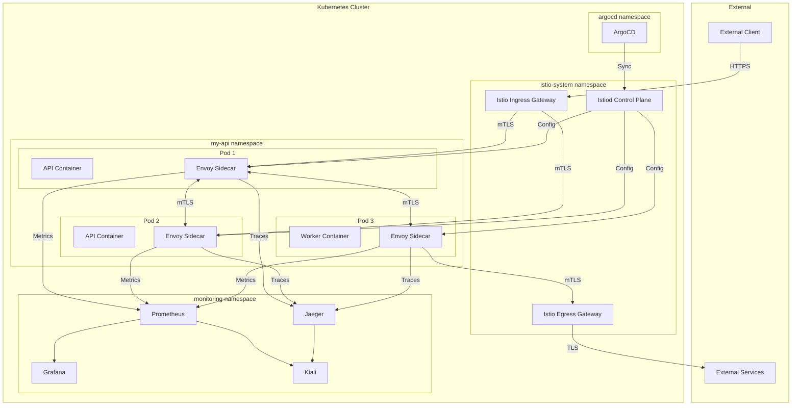
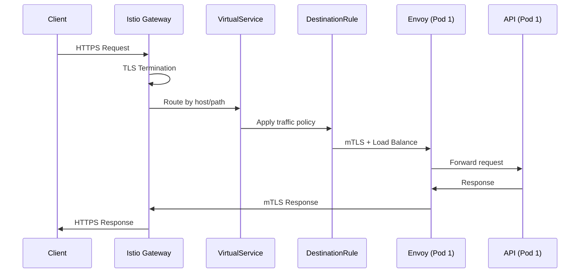

# Design Document: Istio Service Mesh Integration

## Overview

Este documento descreve o design para integração do Istio Service Mesh ao projeto Python API Base. O Istio fornecerá uma camada de infraestrutura para gerenciamento de tráfego, segurança mTLS, observabilidade e resiliência, complementando a stack existente de Kubernetes, Helm e ArgoCD.

### Goals

- Implementar comunicação segura service-to-service com mTLS automático
- Habilitar traffic management avançado (canary, circuit breaker, retries)
- Integrar observabilidade com Prometheus, Grafana, Jaeger e Kiali
- Manter compatibilidade com GitOps workflow via ArgoCD
- Fornecer templates e documentação para fácil adoção

### Non-Goals

- Multi-cluster mesh (fase futura)
- Ambient mesh / sidecar-less mode
- Custom Wasm extensions

## Architecture

### High-Level Architecture



### Traffic Flow



## Components and Interfaces

### Istio Control Plane (istiod)

Componente central que gerencia configuração, certificados e service discovery.

```yaml
# deployments/istio/base/istiod-deployment.yaml
apiVersion: install.istio.io/v1alpha1
kind: IstioOperator
metadata:
  name: istio-control-plane
  namespace: istio-system
spec:
  profile: default
  meshConfig:
    accessLogFile: /dev/stdout
    accessLogFormat: |
      {"timestamp":"%START_TIME%","method":"%REQ(:METHOD)%","path":"%REQ(X-ENVOY-ORIGINAL-PATH?:PATH)%","protocol":"%PROTOCOL%","response_code":"%RESPONSE_CODE%","response_flags":"%RESPONSE_FLAGS%","bytes_received":"%BYTES_RECEIVED%","bytes_sent":"%BYTES_SENT%","duration":"%DURATION%","upstream_service_time":"%RESP(X-ENVOY-UPSTREAM-SERVICE-TIME)%","x_forwarded_for":"%REQ(X-FORWARDED-FOR)%","user_agent":"%REQ(USER-AGENT)%","request_id":"%REQ(X-REQUEST-ID)%","authority":"%REQ(:AUTHORITY)%","upstream_host":"%UPSTREAM_HOST%","upstream_cluster":"%UPSTREAM_CLUSTER%","upstream_local_address":"%UPSTREAM_LOCAL_ADDRESS%","downstream_local_address":"%DOWNSTREAM_LOCAL_ADDRESS%","downstream_remote_address":"%DOWNSTREAM_REMOTE_ADDRESS%","requested_server_name":"%REQUESTED_SERVER_NAME%","route_name":"%ROUTE_NAME%"}
    defaultConfig:
      tracing:
        sampling: 1.0  # 1% in production
        zipkin:
          address: jaeger-collector.monitoring:9411
    outboundTrafficPolicy:
      mode: REGISTRY_ONLY
  components:
    pilot:
      k8s:
        resources:
          requests:
            cpu: 500m
            memory: 512Mi
          limits:
            cpu: 2000m
            memory: 2Gi
    ingressGateways:
      - name: istio-ingressgateway
        enabled: true
        k8s:
          resources:
            requests:
              cpu: 100m
              memory: 128Mi
            limits:
              cpu: 1000m
              memory: 1Gi
    egressGateways:
      - name: istio-egressgateway
        enabled: true
```

### Gateway Configuration

```yaml
# deployments/istio/base/gateway.yaml
apiVersion: networking.istio.io/v1beta1
kind: Gateway
metadata:
  name: api-gateway
  namespace: my-api
spec:
  selector:
    istio: ingressgateway
  servers:
    - port:
        number: 443
        name: https
        protocol: HTTPS
      tls:
        mode: SIMPLE
        credentialName: api-tls-cert  # cert-manager managed
      hosts:
        - "api.example.com"
    - port:
        number: 80
        name: http
        protocol: HTTP
      hosts:
        - "api.example.com"
      tls:
        httpsRedirect: true
```

### VirtualService for Traffic Management

```yaml
# deployments/istio/base/virtualservice.yaml
apiVersion: networking.istio.io/v1beta1
kind: VirtualService
metadata:
  name: api-virtualservice
  namespace: my-api
spec:
  hosts:
    - "api.example.com"
  gateways:
    - api-gateway
  http:
    - match:
        - uri:
            prefix: /api/v1
      route:
        - destination:
            host: my-api
            subset: stable
            port:
              number: 80
          weight: 90
        - destination:
            host: my-api
            subset: canary
            port:
              number: 80
          weight: 10
      timeout: 30s
      retries:
        attempts: 3
        perTryTimeout: 10s
        retryOn: 5xx,reset,connect-failure
      corsPolicy:
        allowOrigins:
          - exact: "https://app.example.com"
        allowMethods:
          - GET
          - POST
          - PUT
          - DELETE
          - OPTIONS
        allowHeaders:
          - authorization
          - content-type
          - x-request-id
        maxAge: "24h"
```

### DestinationRule with Circuit Breaker

```yaml
# deployments/istio/base/destinationrule.yaml
apiVersion: networking.istio.io/v1beta1
kind: DestinationRule
metadata:
  name: api-destinationrule
  namespace: my-api
spec:
  host: my-api
  trafficPolicy:
    connectionPool:
      tcp:
        maxConnections: 100
      http:
        h2UpgradePolicy: UPGRADE
        http1MaxPendingRequests: 100
        http2MaxRequests: 1000
    outlierDetection:
      consecutive5xxErrors: 5
      interval: 30s
      baseEjectionTime: 30s
      maxEjectionPercent: 50
      minHealthPercent: 30
    tls:
      mode: ISTIO_MUTUAL
  subsets:
    - name: stable
      labels:
        version: stable
    - name: canary
      labels:
        version: canary
```

### PeerAuthentication for mTLS

```yaml
# deployments/istio/base/peerauthentication.yaml
apiVersion: security.istio.io/v1beta1
kind: PeerAuthentication
metadata:
  name: default
  namespace: my-api
spec:
  mtls:
    mode: STRICT
```

### AuthorizationPolicy

```yaml
# deployments/istio/base/authorizationpolicy.yaml
apiVersion: security.istio.io/v1beta1
kind: AuthorizationPolicy
metadata:
  name: api-authz
  namespace: my-api
spec:
  selector:
    matchLabels:
      app: my-api
  action: ALLOW
  rules:
    - from:
        - source:
            principals:
              - "cluster.local/ns/istio-system/sa/istio-ingressgateway-service-account"
              - "cluster.local/ns/my-api/sa/my-api"
      to:
        - operation:
            methods: ["GET", "POST", "PUT", "DELETE"]
            paths: ["/api/*", "/health/*", "/metrics"]
```

### ServiceEntry for External Services

```yaml
# deployments/istio/base/serviceentry.yaml
apiVersion: networking.istio.io/v1beta1
kind: ServiceEntry
metadata:
  name: external-api
  namespace: my-api
spec:
  hosts:
    - "external-api.example.com"
  ports:
    - number: 443
      name: https
      protocol: HTTPS
  location: MESH_EXTERNAL
  resolution: DNS
---
apiVersion: networking.istio.io/v1beta1
kind: DestinationRule
metadata:
  name: external-api-dr
  namespace: my-api
spec:
  host: external-api.example.com
  trafficPolicy:
    tls:
      mode: SIMPLE
      sni: external-api.example.com
    connectionPool:
      tcp:
        maxConnections: 50
    outlierDetection:
      consecutive5xxErrors: 3
      interval: 30s
      baseEjectionTime: 60s
```

## Data Models

### Istio Resource Schemas

```python
# src/infrastructure/istio/models.py
from dataclasses import dataclass
from enum import Enum
from typing import Optional


class TLSMode(Enum):
    DISABLE = "DISABLE"
    SIMPLE = "SIMPLE"
    MUTUAL = "MUTUAL"
    ISTIO_MUTUAL = "ISTIO_MUTUAL"


class MTLSMode(Enum):
    UNSET = "UNSET"
    DISABLE = "DISABLE"
    PERMISSIVE = "PERMISSIVE"
    STRICT = "STRICT"


class OutboundTrafficPolicy(Enum):
    ALLOW_ANY = "ALLOW_ANY"
    REGISTRY_ONLY = "REGISTRY_ONLY"


@dataclass
class RouteDestination:
    host: str
    subset: str
    port: int
    weight: int


@dataclass
class RetryPolicy:
    attempts: int
    per_try_timeout: str
    retry_on: str


@dataclass
class CircuitBreaker:
    consecutive_5xx_errors: int
    interval: str
    base_ejection_time: str
    max_ejection_percent: int


@dataclass
class VirtualServiceConfig:
    name: str
    hosts: list[str]
    gateways: list[str]
    routes: list[RouteDestination]
    timeout: str
    retries: Optional[RetryPolicy] = None


@dataclass
class DestinationRuleConfig:
    name: str
    host: str
    tls_mode: TLSMode
    circuit_breaker: Optional[CircuitBreaker] = None
    subsets: Optional[list[dict]] = None
```

## Correctness Properties

*A property is a characteristic or behavior that should hold true across all valid executions of a system-essentially, a formal statement about what the system should do. Properties serve as the bridge between human-readable specifications and machine-verifiable correctness guarantees.*

Based on the prework analysis, the following correctness properties have been identified:

### Property 1: Sidecar Injection Label Consistency

*For any* Kubernetes namespace with label `istio-injection=enabled`, the namespace configuration SHALL have sidecar injection enabled in the Istio mesh configuration.

**Validates: Requirements 1.2**

### Property 2: Resource Limits Within Bounds

*For any* Istio component deployment (istiod, ingress gateway, egress gateway), resource limits SHALL be within specified bounds (CPU: 500m-2000m, Memory: 512Mi-2Gi).

**Validates: Requirements 1.3**

### Property 3: mTLS STRICT Mode Enforcement

*For any* PeerAuthentication resource in application namespaces where mTLS is enabled, the mode SHALL be set to STRICT.

**Validates: Requirements 2.1**

### Property 4: TLS Version Configuration

*For any* DestinationRule with TLS configuration, the minimum TLS version SHALL be 1.3 (when explicitly configured).

**Validates: Requirements 2.2**

### Property 5: VirtualService Weight Distribution

*For any* VirtualService with multiple route destinations, the sum of all destination weights SHALL equal 100.

**Validates: Requirements 3.1, 10.2**

### Property 6: Circuit Breaker Configuration Validity

*For any* DestinationRule with outlierDetection configured, the consecutive5xxErrors SHALL be positive, interval SHALL be valid duration, and maxEjectionPercent SHALL be between 0 and 100.

**Validates: Requirements 3.2, 8.5**

### Property 7: Retry Policy Configuration Validity

*For any* VirtualService with retry policy, attempts SHALL be between 1 and 10, and perTryTimeout SHALL be a valid positive duration.

**Validates: Requirements 3.4**

### Property 8: Timeout Configuration Validity

*For any* VirtualService with timeout configured, the timeout value SHALL be a positive duration not exceeding 300 seconds.

**Validates: Requirements 3.5**

### Property 9: Gateway TLS Configuration

*For any* Gateway with HTTPS server, the TLS configuration SHALL include credentialName referencing a valid certificate secret.

**Validates: Requirements 4.1**

### Property 10: Gateway-VirtualService Host Matching

*For any* VirtualService referencing a Gateway, at least one host in the VirtualService SHALL match a host defined in the referenced Gateway.

**Validates: Requirements 4.2**

### Property 11: Rate Limit Configuration Validity

*For any* EnvoyFilter implementing rate limiting, the requests_per_unit SHALL be positive and unit SHALL be a valid time unit.

**Validates: Requirements 4.3**

### Property 12: CORS Configuration Completeness

*For any* VirtualService with CORS policy enabled, allowOrigins, allowMethods, and allowHeaders SHALL be non-empty lists.

**Validates: Requirements 4.4**

### Property 13: Tracing Configuration

*For any* Istio mesh configuration with tracing enabled, the sampling rate SHALL be between 0.0 and 100.0.

**Validates: Requirements 5.2, 5.4**

### Property 14: Access Log Format JSON

*For any* Istio mesh configuration with access logging enabled, the accessLogFormat SHALL be valid JSON template.

**Validates: Requirements 5.5**

### Property 15: AuthorizationPolicy Principal Validity

*For any* AuthorizationPolicy with source principals, each principal SHALL follow the format `cluster.local/ns/{namespace}/sa/{serviceaccount}`.

**Validates: Requirements 6.1, 6.3**

### Property 16: JWT JWKS URI Presence

*For any* RequestAuthentication with JWT rules, each rule SHALL include a valid jwksUri or jwks.

**Validates: Requirements 6.4**

### Property 17: ArgoCD Application Health Checks

*For any* ArgoCD Application managing Istio resources, the spec SHALL include resource customizations for Istio CRD health assessment.

**Validates: Requirements 7.2**

### Property 18: ArgoCD Sync Policy Configuration

*For any* ArgoCD Application for Istio, syncPolicy SHALL be configured with automated sync for non-production or manual sync for production.

**Validates: Requirements 7.3**

### Property 19: ServiceEntry Host Validity

*For any* ServiceEntry, hosts SHALL be valid DNS names or IP addresses, and ports SHALL have valid protocol specifications.

**Validates: Requirements 8.1**

### Property 20: Egress Policy Configuration

*For any* Istio mesh configuration, outboundTrafficPolicy.mode SHALL be set to REGISTRY_ONLY for production environments.

**Validates: Requirements 8.2**

### Property 21: External Service DestinationRule Completeness

*For any* DestinationRule targeting a ServiceEntry host, trafficPolicy SHALL include tls configuration and optionally connectionPool and outlierDetection.

**Validates: Requirements 8.3, 8.4**

### Property 22: Helm Chart Istio Templates

*For any* Helm chart values with Istio enabled, the chart SHALL render valid VirtualService and DestinationRule templates.

**Validates: Requirements 9.4**

## Error Handling

### Istio Configuration Errors

| Error Type | Detection | Response | Recovery |
|------------|-----------|----------|----------|
| Invalid VirtualService | istioctl analyze | Reject deployment | Fix configuration |
| mTLS handshake failure | Envoy logs | 503 response | Check certificates |
| Circuit breaker open | Metrics alert | 503 response | Wait for recovery |
| Authorization denied | Access logs | 403 response | Update policy |
| External service timeout | Envoy logs | 504 response | Retry with backoff |

### Error Response Codes

```yaml
# Standard Istio error responses
responses:
  - code: 503
    description: "Service Unavailable - Circuit breaker open or upstream unavailable"
  - code: 504
    description: "Gateway Timeout - Request exceeded configured timeout"
  - code: 403
    description: "Forbidden - Authorization policy denied access"
  - code: 401
    description: "Unauthorized - JWT validation failed"
  - code: 429
    description: "Too Many Requests - Rate limit exceeded"
```

## Testing Strategy

### Dual Testing Approach

This design employs both unit tests and property-based tests for comprehensive coverage:

1. **Unit Tests**: Verify specific examples, edge cases, and integration points
2. **Property-Based Tests**: Verify universal properties across all valid inputs

### Property-Based Testing Framework

**Framework**: Hypothesis (Python)
**Minimum Iterations**: 100 per property test

### Test Structure

```
tests/
├── properties/
│   └── test_istio_manifests.py      # Property-based tests for Istio resources
├── unit/
│   └── istio/
│       ├── test_virtualservice.py   # Unit tests for VirtualService
│       ├── test_destinationrule.py  # Unit tests for DestinationRule
│       └── test_authz_policy.py     # Unit tests for AuthorizationPolicy
└── integration/
    └── istio/
        ├── test_mtls.py             # mTLS enforcement tests
        └── test_traffic_routing.py  # Traffic routing tests
```

### Property Test Examples

```python
# tests/properties/test_istio_manifests.py
from hypothesis import given, strategies as st, settings
import yaml

# **Feature: istio-service-mesh, Property 5: VirtualService Weight Distribution**
@settings(max_examples=100)
@given(
    weights=st.lists(
        st.integers(min_value=1, max_value=100),
        min_size=2,
        max_size=5
    ).filter(lambda w: sum(w) == 100)
)
def test_virtualservice_weights_sum_to_100(weights):
    """
    **Validates: Requirements 3.1, 10.2**
    For any VirtualService with multiple destinations, weights must sum to 100.
    """
    vs = create_virtualservice_with_weights(weights)
    total = sum(r['weight'] for r in vs['spec']['http'][0]['route'])
    assert total == 100


# **Feature: istio-service-mesh, Property 6: Circuit Breaker Configuration Validity**
@settings(max_examples=100)
@given(
    consecutive_errors=st.integers(min_value=1, max_value=100),
    max_ejection=st.integers(min_value=0, max_value=100)
)
def test_circuit_breaker_config_valid(consecutive_errors, max_ejection):
    """
    **Validates: Requirements 3.2, 8.5**
    Circuit breaker config must have valid positive values.
    """
    dr = create_destinationrule_with_circuit_breaker(
        consecutive_errors=consecutive_errors,
        max_ejection_percent=max_ejection
    )
    od = dr['spec']['trafficPolicy']['outlierDetection']
    assert od['consecutive5xxErrors'] > 0
    assert 0 <= od['maxEjectionPercent'] <= 100
```

### Unit Test Examples

```python
# tests/unit/istio/test_virtualservice.py
import pytest
from src.infrastructure.istio.validators import validate_virtualservice

def test_virtualservice_requires_hosts():
    """VirtualService must have at least one host."""
    vs = {"spec": {"hosts": [], "http": []}}
    with pytest.raises(ValueError, match="hosts cannot be empty"):
        validate_virtualservice(vs)

def test_virtualservice_timeout_within_bounds():
    """Timeout must not exceed 300 seconds."""
    vs = {
        "spec": {
            "hosts": ["api.example.com"],
            "http": [{"timeout": "600s"}]
        }
    }
    with pytest.raises(ValueError, match="timeout exceeds maximum"):
        validate_virtualservice(vs)
```

### CI Integration

```yaml
# .github/workflows/istio-validation.yml
name: Istio Manifest Validation

on:
  pull_request:
    paths:
      - 'deployments/istio/**'

jobs:
  validate:
    runs-on: ubuntu-latest
    steps:
      - uses: actions/checkout@v4
      
      - name: Install istioctl
        run: |
          curl -L https://istio.io/downloadIstio | ISTIO_VERSION=1.20.0 sh -
          sudo mv istio-1.20.0/bin/istioctl /usr/local/bin/
      
      - name: Validate Istio manifests
        run: |
          istioctl analyze deployments/istio/ --use-kube=false
      
      - name: Run property tests
        run: |
          pip install hypothesis pyyaml
          pytest tests/properties/test_istio_manifests.py -v
```

