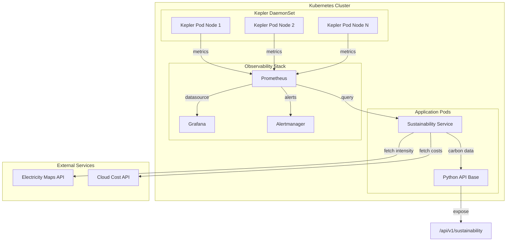

# Design Document: Kepler + GreenOps Sustainability

## Overview

Este documento descreve o design para integração do Kepler e práticas GreenOps no Python API Base. A solução fornece:

1. **Kepler Deployment**: Manifests Kubernetes para deploy do Kepler como DaemonSet
2. **Sustainability Service**: Serviço Python para cálculos de carbono e custos energéticos
3. **API Endpoints**: REST API para consulta de métricas de sustentabilidade
4. **Grafana Dashboards**: Visualização de consumo energético e emissões
5. **Prometheus Alerts**: Alertas para anomalias de consumo

## Architecture



## Components and Interfaces

### 1. Kepler Deployment Component

```
deployments/kepler/
├── base/
│   ├── kustomization.yaml
│   ├── namespace.yaml
│   ├── daemonset.yaml
│   ├── service.yaml
│   ├── serviceaccount.yaml
│   ├── clusterrole.yaml
│   └── clusterrolebinding.yaml
├── overlays/
│   ├── development/
│   │   └── kustomization.yaml
│   └── production/
│       └── kustomization.yaml
└── README.md
```

### 2. Sustainability Service Component

```
src/infrastructure/sustainability/
├── __init__.py
├── models.py           # Data models for metrics
├── calculator.py       # Carbon/cost calculations
├── client.py          # External API clients
├── config.py          # Configuration
├── serializer.py      # JSON serialization
└── service.py         # Main service orchestration
```

### 3. API Router Component

```
src/interface/v1/sustainability_router.py
```

### 4. Monitoring Component

```
deployments/monitoring/
├── grafana-dashboard-sustainability.json
├── prometheus-alerts-sustainability.yml
└── kepler-servicemonitor.yaml
```

## Data Models

### Carbon Metrics Model

```python
from dataclasses import dataclass
from datetime import datetime
from decimal import Decimal
from enum import Enum

class EnergyUnit(Enum):
    JOULES = "J"
    KILOWATT_HOURS = "kWh"
    WATT_HOURS = "Wh"

class CarbonUnit(Enum):
    GRAMS_CO2 = "gCO2"
    KILOGRAMS_CO2 = "kgCO2"
    TONS_CO2 = "tCO2"

@dataclass(frozen=True)
class EnergyMetric:
    """Energy consumption metric."""
    namespace: str
    pod: str
    container: str
    energy_joules: Decimal
    timestamp: datetime
    source: str  # "rapl", "acpi", "model"
    
    @property
    def energy_kwh(self) -> Decimal:
        return self.energy_joules / Decimal("3600000")

@dataclass(frozen=True)
class CarbonIntensity:
    """Regional carbon intensity factor."""
    region: str
    intensity_gco2_per_kwh: Decimal
    timestamp: datetime
    source: str
    is_default: bool = False

@dataclass(frozen=True)
class CarbonMetric:
    """Carbon emission metric."""
    namespace: str
    pod: str
    container: str
    energy_kwh: Decimal
    carbon_intensity: CarbonIntensity
    emissions_gco2: Decimal
    timestamp: datetime
    confidence_lower: Decimal
    confidence_upper: Decimal
    
    @classmethod
    def calculate(
        cls,
        energy: EnergyMetric,
        intensity: CarbonIntensity,
        confidence_margin: Decimal = Decimal("0.1")
    ) -> "CarbonMetric":
        emissions = energy.energy_kwh * intensity.intensity_gco2_per_kwh
        return cls(
            namespace=energy.namespace,
            pod=energy.pod,
            container=energy.container,
            energy_kwh=energy.energy_kwh,
            carbon_intensity=intensity,
            emissions_gco2=emissions,
            timestamp=energy.timestamp,
            confidence_lower=emissions * (1 - confidence_margin),
            confidence_upper=emissions * (1 + confidence_margin),
        )

@dataclass(frozen=True)
class EnergyCost:
    """Energy cost calculation."""
    energy_kwh: Decimal
    price_per_kwh: Decimal
    total_cost: Decimal
    currency: str
    period_start: datetime
    period_end: datetime

@dataclass(frozen=True)
class SustainabilityReport:
    """Aggregated sustainability report."""
    namespace: str
    period_start: datetime
    period_end: datetime
    total_energy_kwh: Decimal
    total_emissions_gco2: Decimal
    total_cost: Decimal
    baseline_emissions_gco2: Decimal | None
    target_emissions_gco2: Decimal | None
    
    @property
    def progress_percentage(self) -> Decimal | None:
        if self.baseline_emissions_gco2 and self.target_emissions_gco2:
            reduction = self.baseline_emissions_gco2 - self.total_emissions_gco2
            target_reduction = self.baseline_emissions_gco2 - self.target_emissions_gco2
            if target_reduction > 0:
                return (reduction / target_reduction) * 100
        return None

@dataclass(frozen=True)
class EnergyEfficiency:
    """Energy efficiency metric."""
    namespace: str
    deployment: str
    energy_per_request_joules: Decimal
    energy_per_transaction_joules: Decimal
    requests_count: int
    transactions_count: int
    period_start: datetime
    period_end: datetime
```

### Alert Configuration Model

```python
@dataclass
class AlertThreshold:
    """Alert threshold configuration."""
    namespace: str | None  # None = cluster-wide
    deployment: str | None  # None = namespace-wide
    energy_threshold_kwh: Decimal
    carbon_threshold_gco2: Decimal
    cost_threshold: Decimal
    severity: str  # "warning", "critical"

@dataclass
class AlertRule:
    """Prometheus alert rule."""
    name: str
    expr: str
    duration: str
    severity: str
    annotations: dict[str, str]
    labels: dict[str, str]
```

## Correctness Properties

*A property is a characteristic or behavior that should hold true across all valid executions of a system-essentially, a formal statement about what the system should do. Properties serve as the bridge between human-readable specifications and machine-verifiable correctness guarantees.*

Based on the prework analysis, the following correctness properties must be validated:

### Property 1: Carbon Metrics Round-Trip Serialization
*For any* valid CarbonMetric object, serializing to JSON and deserializing back SHALL produce an equivalent object with all values preserved.
**Validates: Requirements 7.1, 7.2, 7.3**

### Property 2: Carbon Emission Calculation
*For any* energy consumption (kWh) and carbon intensity (gCO2/kWh), the calculated emissions SHALL equal energy × intensity.
**Validates: Requirements 3.1**

### Property 3: Energy Cost Calculation
*For any* energy consumption (kWh) and electricity price ($/kWh), the calculated cost SHALL equal energy × price.
**Validates: Requirements 6.1**

### Property 4: Emissions Aggregation Consistency
*For any* set of carbon metrics grouped by namespace, the sum of individual emissions SHALL equal the aggregated total.
**Validates: Requirements 3.3**

### Property 5: Goal Progress Calculation
*For any* baseline, current, and target emissions values, progress percentage SHALL equal ((baseline - current) / (baseline - target)) × 100.
**Validates: Requirements 3.5**

### Property 6: Energy Efficiency Calculation
*For any* total energy and request count (> 0), energy per request SHALL equal total_energy / request_count.
**Validates: Requirements 2.4**

### Property 7: Cost Savings Calculation
*For any* baseline cost and current cost, savings SHALL equal baseline_cost - current_cost.
**Validates: Requirements 6.3**

### Property 8: Trend Calculation
*For any* two period values, trend percentage SHALL equal ((current - previous) / previous) × 100.
**Validates: Requirements 6.4**

### Property 9: Alert Rule Generation
*For any* AlertThreshold configuration, the generated Prometheus alert rule SHALL contain the correct threshold value in the expression.
**Validates: Requirements 5.1, 5.3**

### Property 10: API Response Structure
*For any* valid sustainability query, the API response SHALL contain energy_kwh, emissions_gco2, and confidence interval fields.
**Validates: Requirements 4.1, 4.2**

### Property 11: Prometheus Metrics Format
*For any* generated metric, the output SHALL conform to Prometheus exposition format with required labels.
**Validates: Requirements 8.1, 8.3**

### Property 12: ServiceMonitor Configuration
*For any* ServiceMonitor YAML, the configuration SHALL contain valid selector, endpoints, and namespace fields.
**Validates: Requirements 8.2**

### Property 13: Dashboard Panel Configuration
*For any* Grafana dashboard JSON, each panel SHALL contain valid datasource, targets, and title fields.
**Validates: Requirements 2.1**

### Property 14: Export Format Validity
*For any* sustainability data, CSV export SHALL produce valid CSV with headers, and JSON export SHALL produce valid JSON array.
**Validates: Requirements 2.5**

### Property 15: Malformed JSON Rejection
*For any* malformed JSON input, deserialization SHALL raise ValidationError with descriptive message.
**Validates: Requirements 7.4**

### Property 16: JWT Authentication Enforcement
*For any* request without valid JWT token, the API SHALL return HTTP 401 Unauthorized.
**Validates: Requirements 4.4**

## Error Handling

### Error Categories

```python
class SustainabilityError(Exception):
    """Base exception for sustainability module."""
    pass

class CarbonIntensityUnavailableError(SustainabilityError):
    """Carbon intensity data not available for region."""
    pass

class MetricsQueryError(SustainabilityError):
    """Error querying Prometheus metrics."""
    pass

class SerializationError(SustainabilityError):
    """Error serializing/deserializing data."""
    pass

class ValidationError(SustainabilityError):
    """Invalid input data."""
    pass

class ExternalServiceError(SustainabilityError):
    """External API call failed."""
    pass
```

### Error Handling Strategy

1. **External API Failures**: Use circuit breaker pattern with fallback to cached/default values
2. **Prometheus Query Failures**: Retry with exponential backoff, return partial data with warning
3. **Serialization Errors**: Raise ValidationError with field-level details
4. **Authentication Failures**: Return 401 with WWW-Authenticate header

## Testing Strategy

### Dual Testing Approach

The testing strategy combines unit tests for specific examples and property-based tests for universal properties.

### Property-Based Testing

**Library**: Hypothesis (Python)

**Configuration**:
```python
from hypothesis import settings, Phase

settings.register_profile(
    "sustainability",
    max_examples=100,
    phases=[Phase.generate, Phase.target, Phase.shrink],
)
```

**Test Structure**:
```
tests/properties/
└── test_sustainability_properties.py
```

Each property test will:
1. Generate random valid inputs using Hypothesis strategies
2. Execute the function under test
3. Assert the property holds
4. Be annotated with the property number and requirement reference

### Unit Tests

**Test Structure**:
```
tests/unit/infrastructure/sustainability/
├── test_calculator.py
├── test_serializer.py
├── test_service.py
└── test_models.py
```

Unit tests cover:
- Edge cases (zero values, empty collections)
- Error conditions (invalid inputs, missing data)
- Integration points (API responses, Prometheus queries)

### Integration Tests

**Test Structure**:
```
tests/integration/
└── test_sustainability_api.py
```

Integration tests verify:
- API endpoint responses
- Authentication/authorization
- Rate limiting behavior
