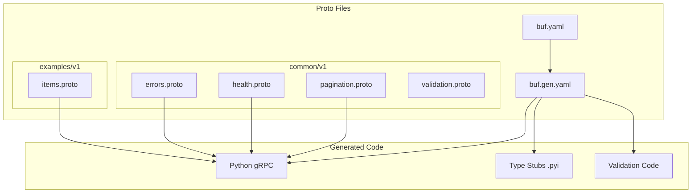
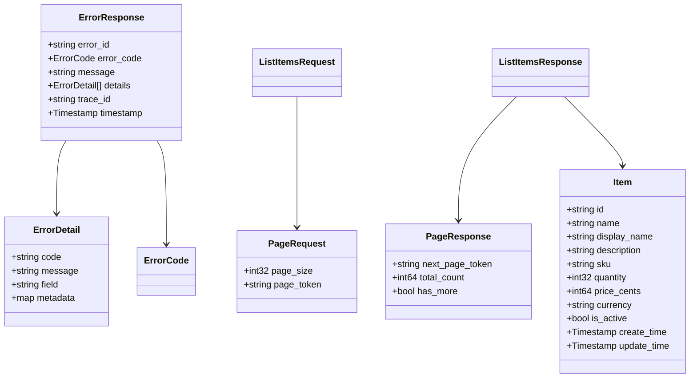

# Design Document: Protocol Buffers Code Review and Refactoring

## Overview

Este documento descreve o design para refatoração dos arquivos Protocol Buffers do projeto Python API Base, elevando-os ao estado da arte seguindo Google AIP, Buf best practices, e padrões enterprise de gRPC.

### Current State Analysis

**Problemas identificados:**

| Arquivo | Problema | Severidade |
|---------|----------|------------|
| buf.yaml | Falta COMMENTS rules, PACKAGE_VERSION_SUFFIX excepted | Medium |
| buf.gen.yaml | Falta mypy stubs, betterproto | Medium |
| errors.proto | timestamp como string, falta ErrorCode enum | High |
| health.proto | Adequado, segue padrão gRPC | Low |
| items.proto | Falta ListResponse, FieldMask, validação, versão | High |

### Goals

1. Conformidade 100% com buf lint STANDARD + COMMENTS
2. Validação com protovalidate em todos os campos
3. Timestamps usando well-known types
4. Paginação adequada com cursor-based pagination
5. Field masks para updates parciais
6. Documentação completa em todos os elementos
7. Versionamento de API nos packages

## Architecture



## Components and Interfaces

### 1. buf.yaml Configuration

```yaml
version: v2
name: buf.build/python-api-base/protos
deps:
  - buf.build/googleapis/googleapis
  - buf.build/bufbuild/protovalidate
lint:
  use:
    - STANDARD
    - COMMENTS
  except: []  # Remove PACKAGE_VERSION_SUFFIX exception
breaking:
  use:
    - FILE
```

### 2. buf.gen.yaml Configuration

```yaml
version: v2
managed:
  enabled: true
  override:
    - file_option: go_package_prefix
      value: github.com/python-api-base/gen/go
plugins:
  # Standard Python protobuf
  - remote: buf.build/protocolbuffers/python
    out: src/infrastructure/grpc/generated
  # gRPC Python
  - remote: buf.build/grpc/python
    out: src/infrastructure/grpc/generated
  # Type stubs for mypy
  - remote: buf.build/protocolbuffers/pyi
    out: src/infrastructure/grpc/generated
  # Protovalidate Python
  - remote: buf.build/bufbuild/protovalidate-python
    out: src/infrastructure/grpc/generated
```

### 3. Common Proto Files Structure

#### 3.1 common/v1/errors.proto

```protobuf
syntax = "proto3";

package common.v1;

import "google/protobuf/timestamp.proto";
import "buf/validate/validate.proto";

option python_generic_services = true;

// ErrorCode represents semantic error categories
enum ErrorCode {
  ERROR_CODE_UNSPECIFIED = 0;
  ERROR_CODE_VALIDATION = 1;
  ERROR_CODE_NOT_FOUND = 2;
  ERROR_CODE_ALREADY_EXISTS = 3;
  ERROR_CODE_PERMISSION_DENIED = 4;
  ERROR_CODE_UNAUTHENTICATED = 5;
  ERROR_CODE_RESOURCE_EXHAUSTED = 6;
  ERROR_CODE_INTERNAL = 7;
  ERROR_CODE_UNAVAILABLE = 8;
  ERROR_CODE_DEADLINE_EXCEEDED = 9;
}

// ErrorDetail represents a single error detail with context
message ErrorDetail {
  // Error code identifier
  string code = 1 [(buf.validate.field).string.min_len = 1];
  // Human-readable error message
  string message = 2 [(buf.validate.field).string.min_len = 1];
  // Field that caused the error (for validation errors)
  string field = 3;
  // Additional metadata about the error
  map<string, string> metadata = 4;
}

// ErrorResponse represents a complete error response
message ErrorResponse {
  // Unique error identifier for tracking (UUID format)
  string error_id = 1 [(buf.validate.field).string.uuid = true];
  // Error code category
  ErrorCode error_code = 2;
  // Main error message
  string message = 3 [(buf.validate.field).string.min_len = 1];
  // Detailed error information
  repeated ErrorDetail details = 4;
  // Trace ID for distributed tracing (UUID format)
  string trace_id = 5 [(buf.validate.field).string.uuid = true];
  // Timestamp when error occurred
  google.protobuf.Timestamp timestamp = 6;
}
```

#### 3.2 common/v1/pagination.proto

```protobuf
syntax = "proto3";

package common.v1;

import "buf/validate/validate.proto";

option python_generic_services = true;

// PageRequest contains pagination parameters for list operations
message PageRequest {
  // Maximum number of items to return (1-100, default 20)
  int32 page_size = 1 [(buf.validate.field).int32 = {gte: 1, lte: 100}];
  // Token for cursor-based pagination
  string page_token = 2;
}

// PageResponse contains pagination metadata for list responses
message PageResponse {
  // Token for the next page (empty if no more pages)
  string next_page_token = 1;
  // Total count of items (optional, may be expensive to compute)
  int64 total_count = 2;
  // Whether there are more pages
  bool has_more = 3;
}
```

### 4. Items Proto Refactored

#### 4.1 examples/v1/items.proto

```protobuf
syntax = "proto3";

package examples.v1;

import "google/protobuf/empty.proto";
import "google/protobuf/field_mask.proto";
import "google/protobuf/timestamp.proto";
import "buf/validate/validate.proto";
import "common/v1/errors.proto";
import "common/v1/pagination.proto";

option python_generic_services = true;

// ItemService provides CRUD operations for items
service ItemService {
  // GetItem retrieves a single item by ID
  rpc GetItem(GetItemRequest) returns (GetItemResponse);
  // CreateItem creates a new item
  rpc CreateItem(CreateItemRequest) returns (CreateItemResponse);
  // UpdateItem updates an existing item with field mask support
  rpc UpdateItem(UpdateItemRequest) returns (UpdateItemResponse);
  // DeleteItem removes an item by ID
  rpc DeleteItem(DeleteItemRequest) returns (google.protobuf.Empty);
  // ListItems returns a paginated list of items
  rpc ListItems(ListItemsRequest) returns (ListItemsResponse);
  // BatchCreateItems creates multiple items in a single request
  rpc BatchCreateItems(stream CreateItemRequest) returns (BatchCreateItemsResponse);
  // SyncItems provides bidirectional streaming for item synchronization
  rpc SyncItems(stream ItemSyncRequest) returns (stream ItemSyncResponse);
}

// Item represents a domain item entity
message Item {
  // Unique identifier (UUID format)
  string id = 1 [(buf.validate.field).string.uuid = true];
  // Resource name following AIP-122 (e.g., "items/123")
  string name = 2 [(buf.validate.field).string.pattern = "^items/[a-zA-Z0-9-]+$"];
  // Display name (1-255 characters)
  string display_name = 3 [(buf.validate.field).string = {min_len: 1, max_len: 255}];
  // Detailed description (max 2000 characters)
  string description = 4 [(buf.validate.field).string.max_len = 2000];
  // Stock Keeping Unit (unique identifier)
  string sku = 5 [(buf.validate.field).string = {min_len: 1, max_len: 50}];
  // Quantity in stock (non-negative)
  int32 quantity = 6 [(buf.validate.field).int32.gte = 0];
  // Price in cents (non-negative)
  int64 price_cents = 7 [(buf.validate.field).int64.gte = 0];
  // Currency code (ISO 4217)
  string currency = 8 [(buf.validate.field).string = {len: 3}];
  // Whether the item is active
  bool is_active = 9;
  // Creation timestamp
  google.protobuf.Timestamp create_time = 10;
  // Last update timestamp
  google.protobuf.Timestamp update_time = 11;
}

// GetItemRequest is the request to retrieve a single item
message GetItemRequest {
  // Item ID to retrieve (UUID format)
  string id = 1 [(buf.validate.field) = {required: true, string: {uuid: true}}];
}

// GetItemResponse is the response containing the requested item
message GetItemResponse {
  // The requested item
  Item item = 1;
}

// CreateItemRequest is the request to create a new item
message CreateItemRequest {
  // Display name for the item
  string display_name = 1 [(buf.validate.field) = {required: true, string: {min_len: 1, max_len: 255}}];
  // Description of the item
  string description = 2 [(buf.validate.field).string.max_len = 2000];
  // Stock Keeping Unit
  string sku = 3 [(buf.validate.field) = {required: true, string: {min_len: 1, max_len: 50}}];
  // Initial quantity
  int32 quantity = 4 [(buf.validate.field).int32.gte = 0];
  // Price in cents
  int64 price_cents = 5 [(buf.validate.field).int64.gte = 0];
  // Currency code (ISO 4217)
  string currency = 6 [(buf.validate.field) = {required: true, string: {len: 3}}];
}

// CreateItemResponse is the response after creating an item
message CreateItemResponse {
  // The created item
  Item item = 1;
}

// UpdateItemRequest is the request to update an existing item
message UpdateItemRequest {
  // The item with updated fields
  Item item = 1 [(buf.validate.field).required = true];
  // Field mask specifying which fields to update
  // If empty, all non-empty fields are updated
  google.protobuf.FieldMask update_mask = 2;
}

// UpdateItemResponse is the response after updating an item
message UpdateItemResponse {
  // The updated item
  Item item = 1;
}

// DeleteItemRequest is the request to delete an item
message DeleteItemRequest {
  // Item ID to delete (UUID format)
  string id = 1 [(buf.validate.field) = {required: true, string: {uuid: true}}];
}

// ListItemsRequest is the request to list items with pagination
message ListItemsRequest {
  // Pagination parameters
  common.v1.PageRequest page = 1;
  // Filter expression (AIP-160 format)
  string filter = 2 [(buf.validate.field).string.max_len = 1000];
  // Order by expression (e.g., "create_time desc")
  string order_by = 3 [(buf.validate.field).string.max_len = 100];
}

// ListItemsResponse is the response containing a list of items
message ListItemsResponse {
  // List of items
  repeated Item items = 1;
  // Pagination metadata
  common.v1.PageResponse page = 2;
}

// BatchCreateItemsResponse is the response for batch item creation
message BatchCreateItemsResponse {
  // Number of items successfully created
  int32 created_count = 1;
  // IDs of created items
  repeated string created_ids = 2;
  // Errors for failed items
  repeated common.v1.ErrorDetail errors = 3;
}

// ItemSyncAction represents the type of sync action
enum ItemSyncAction {
  ITEM_SYNC_ACTION_UNSPECIFIED = 0;
  ITEM_SYNC_ACTION_UPSERT = 1;
  ITEM_SYNC_ACTION_DELETE = 2;
}

// ItemSyncRequest is the request for bidirectional item sync
message ItemSyncRequest {
  // Sync action type
  ItemSyncAction action = 1;
  // Item to upsert (required for UPSERT action)
  Item item = 2;
  // Item ID to delete (required for DELETE action)
  string delete_id = 3 [(buf.validate.field).string.uuid = true];
  // Client-generated request ID for correlation
  string request_id = 4 [(buf.validate.field) = {required: true, string: {uuid: true}}];
}

// ItemSyncResponse is the response for bidirectional item sync
message ItemSyncResponse {
  // Item ID affected
  string id = 1;
  // Whether the operation succeeded
  bool success = 2;
  // Error details if operation failed
  common.v1.ErrorDetail error = 3;
  // Correlation request ID
  string request_id = 4;
}
```

## Data Models

### Message Hierarchy



## Correctness Properties

*A property is a characteristic or behavior that should hold true across all valid executions of a system-essentially, a formal statement about what the system should do. Properties serve as the bridge between human-readable specifications and machine-verifiable correctness guarantees.*

### Property 1: Buf Lint Compliance
*For any* proto file in the Proto_System, running `buf lint` with STANDARD and COMMENTS categories SHALL produce zero errors.
**Validates: Requirements 1.1, 1.2, 1.3, 1.4, 1.5, 2.1, 2.2, 2.3, 2.4, 2.5**

### Property 2: Protovalidate Validation
*For any* message with validation annotations, generating a message instance with invalid field values SHALL be rejected by the protovalidate validator.
**Validates: Requirements 3.1, 3.2, 3.3, 3.4**

### Property 3: Timestamp Well-Known Types
*For any* field representing a point in time, the field type SHALL be `google.protobuf.Timestamp` and JSON serialization SHALL produce ISO 8601 format.
**Validates: Requirements 4.1, 4.3, 5.4**

### Property 4: Pagination Structure Completeness
*For any* List RPC operation, the request message SHALL contain page_size and page_token fields, and the response message SHALL contain next_page_token and items collection.
**Validates: Requirements 7.1, 7.2, 7.3, 7.4**

### Property 5: Field Mask Update Semantics
*For any* Update RPC operation with a FieldMask, only the fields specified in the mask SHALL be modified in the resulting entity.
**Validates: Requirements 8.1, 8.2, 8.3**

### Property 6: Package Version Suffix
*For any* package declaration in the Proto_System, the package name SHALL end with a version suffix matching pattern `v[0-9]+`.
**Validates: Requirements 9.1, 9.3**

### Property 7: Resource Name Format
*For any* resource message with a `name` field, the value SHALL follow the pattern `{collection}/{resource_id}` as per AIP-122.
**Validates: Requirements 10.1, 10.2, 10.3**

## Error Handling

### gRPC Status Codes Mapping

| ErrorCode | gRPC Status | HTTP Status |
|-----------|-------------|-------------|
| ERROR_CODE_VALIDATION | INVALID_ARGUMENT | 400 |
| ERROR_CODE_NOT_FOUND | NOT_FOUND | 404 |
| ERROR_CODE_ALREADY_EXISTS | ALREADY_EXISTS | 409 |
| ERROR_CODE_PERMISSION_DENIED | PERMISSION_DENIED | 403 |
| ERROR_CODE_UNAUTHENTICATED | UNAUTHENTICATED | 401 |
| ERROR_CODE_RESOURCE_EXHAUSTED | RESOURCE_EXHAUSTED | 429 |
| ERROR_CODE_INTERNAL | INTERNAL | 500 |
| ERROR_CODE_UNAVAILABLE | UNAVAILABLE | 503 |
| ERROR_CODE_DEADLINE_EXCEEDED | DEADLINE_EXCEEDED | 504 |

### Error Response Structure

```json
{
  "error_id": "550e8400-e29b-41d4-a716-446655440000",
  "error_code": "ERROR_CODE_VALIDATION",
  "message": "Validation failed",
  "details": [
    {
      "code": "FIELD_REQUIRED",
      "message": "Field 'display_name' is required",
      "field": "display_name",
      "metadata": {}
    }
  ],
  "trace_id": "abc123-def456",
  "timestamp": "2025-12-05T10:30:00Z"
}
```

## Testing Strategy

### Dual Testing Approach

#### Unit Tests
- Verify proto file structure matches expected schema
- Test individual message serialization/deserialization
- Validate error code mappings

#### Property-Based Tests

**Framework:** Hypothesis (Python)

**Configuration:**
- Minimum 100 iterations per property
- Seed for reproducibility

**Properties to Test:**

1. **Buf Lint Compliance Property**
   - Generate valid proto structures
   - Run buf lint
   - Assert zero errors

2. **Protovalidate Validation Property**
   - Generate random field values (valid and invalid)
   - Run protovalidate
   - Assert invalid values are rejected

3. **Timestamp Serialization Property**
   - Generate random timestamps
   - Serialize to JSON
   - Assert ISO 8601 format

4. **Pagination Completeness Property**
   - Parse List RPC definitions
   - Assert required fields exist

5. **Field Mask Update Property**
   - Generate random items and field masks
   - Apply update
   - Assert only masked fields changed

6. **Package Version Property**
   - Parse all package declarations
   - Assert version suffix pattern

7. **Resource Name Property**
   - Generate resource names
   - Assert pattern compliance

### Test File Structure

```
tests/
├── infrastructure/
│   └── grpc/
│       └── protos/
│           ├── test_buf_lint.py
│           ├── test_protovalidate.py
│           ├── test_pagination.py
│           ├── test_field_mask.py
│           └── test_resource_names.py
```
