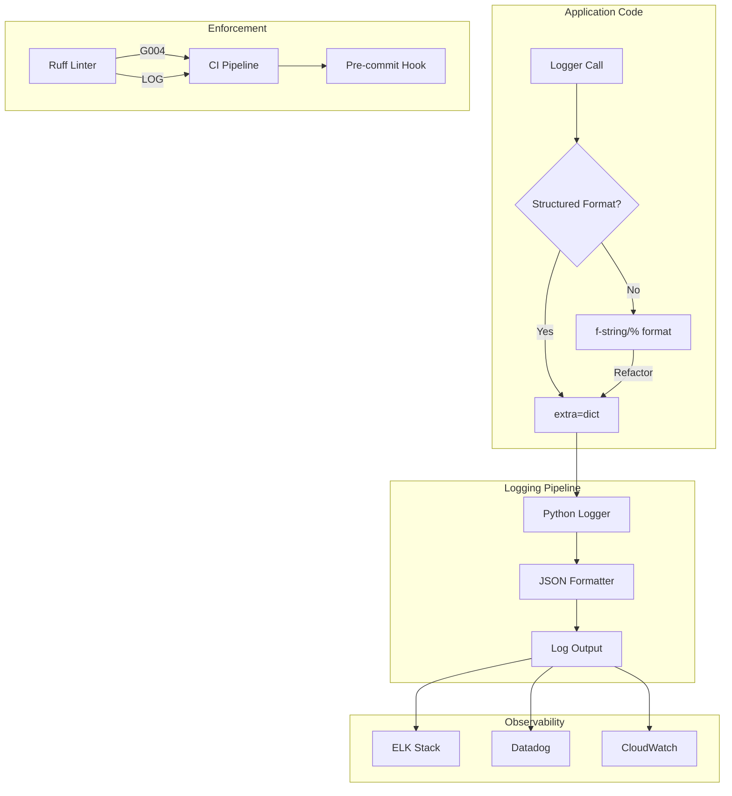

# Design Document: Structured Logging Standardization

## Overview

This design document describes the approach for standardizing structured logging across the Python API Base project. The implementation replaces all f-string and % formatting in logging calls with structured logging using `extra={}`, ensuring lazy evaluation, better observability, and consistent security practices.

The project already has the ruff linter configured with `LOG` and `G` rules enabled, which will enforce the pattern going forward. This refactoring focuses on converting existing non-compliant code.

## Architecture



## Components and Interfaces

### 1. Structured Log Entry Pattern

The standard pattern for all logging calls:

```python
logger.info(
    "Static message without interpolation",
    extra={
        "field1": value1,
        "field2": value2,
        "operation": "OPERATION_NAME",
    },
)
```

### 2. Operation Tags Convention

Standardized operation tags for filtering:

| Layer | Pattern | Examples |
|-------|---------|----------|
| Infrastructure | `{COMPONENT}_{ACTION}` | `REDIS_CONNECT`, `KAFKA_CONSUME`, `OUTBOX_PUBLISH` |
| Application | `{SERVICE}_{ACTION}` | `CACHE_HIT`, `RETRY_ATTEMPT`, `CIRCUIT_OPENED` |
| Interface | `{ENDPOINT}_{ACTION}` | `HEALTH_CHECK`, `AUTH_VALIDATE`, `REQUEST_RECEIVED` |

### 3. Log Formatter Interface

```python
from typing import Protocol, Any
from dataclasses import dataclass

@dataclass(frozen=True, slots=True)
class StructuredLogEntry:
    """Immutable log entry with structured data."""
    message: str
    level: str
    timestamp: str
    extra: dict[str, Any]
    
class ILogFormatter(Protocol):
    """Protocol for log formatters."""
    
    def format(self, entry: StructuredLogEntry) -> str:
        """Format a log entry to string."""
        ...
    
    def parse(self, formatted: str) -> StructuredLogEntry:
        """Parse a formatted string back to log entry."""
        ...
```

## Data Models

### StructuredLogEntry

```python
@dataclass(frozen=True, slots=True)
class StructuredLogEntry:
    """Represents a structured log entry.
    
    Attributes:
        message: Static log message without interpolation.
        level: Log level (DEBUG, INFO, WARNING, ERROR, CRITICAL).
        timestamp: ISO 8601 UTC timestamp.
        extra: Dictionary of contextual key-value pairs.
    """
    message: str
    level: str
    timestamp: str
    extra: dict[str, Any]
    
    def __post_init__(self) -> None:
        if "operation" not in self.extra:
            raise ValueError("Log entry must include 'operation' field")
```

## Correctness Properties

*A property is a characteristic or behavior that should hold true across all valid executions of a system-essentially, a formal statement about what the system should do. Properties serve as the bridge between human-readable specifications and machine-verifiable correctness guarantees.*

Based on the prework analysis, most requirements are enforced by linter rules (G004, LOG) rather than runtime properties. However, two key properties can be tested:

### Property 1: Operation Field Presence

*For any* structured log entry emitted by the system, the `extra` dictionary SHALL contain an `operation` field with a non-empty string value.

**Validates: Requirements 1.4**

### Property 2: Log Entry Round-Trip Consistency

*For any* valid StructuredLogEntry, formatting to string and parsing back SHALL produce an equivalent entry with identical message, level, timestamp, and extra fields.

**Validates: Requirements 8.1, 8.2, 8.3**

## Error Handling

### Logging Errors

- If `extra` parameter is missing required fields, raise `ValueError` at development time
- If JSON serialization fails for `extra` values, convert to string representation
- Never let logging errors crash the application - wrap in try/except at formatter level

### Migration Errors

- If a file cannot be automatically converted, flag for manual review
- Track conversion progress in the issue checklist

## Testing Strategy

### Dual Testing Approach

This feature uses both linter-based static analysis and property-based testing:

1. **Static Analysis (Primary)**: Ruff linter with G004 rule catches f-string logging at commit time
2. **Property-Based Testing**: Hypothesis library validates runtime behavior of log formatting

### Property-Based Testing Configuration

- **Library**: Hypothesis (already in project dependencies)
- **Iterations**: Minimum 100 per property
- **Annotation Format**: `**Feature: structured-logging-standardization, Property {N}: {description}**`

### Test Structure

```python
from hypothesis import given, strategies as st, settings

@settings(max_examples=100)
@given(
    message=st.text(min_size=1, max_size=200),
    level=st.sampled_from(["DEBUG", "INFO", "WARNING", "ERROR", "CRITICAL"]),
    operation=st.text(min_size=1, max_size=50).filter(str.strip),
    extra_fields=st.dictionaries(
        keys=st.text(min_size=1, max_size=20).filter(str.isidentifier),
        values=st.one_of(st.integers(), st.text(), st.booleans(), st.floats(allow_nan=False)),
        max_size=10,
    ),
)
def test_log_entry_round_trip(message, level, operation, extra_fields):
    """
    **Feature: structured-logging-standardization, Property 2: Log Entry Round-Trip Consistency**
    **Validates: Requirements 8.1, 8.2, 8.3**
    """
    ...
```

### Unit Tests

Unit tests cover:
- Edge cases for log formatting (empty extra, special characters)
- Error handling when serialization fails
- Integration with Python's logging module

### Linter Verification

Run `ruff check --select=G,LOG` to verify all files comply with structured logging rules.

## Files to Modify

### High Priority (Infrastructure)

| File | Estimated Occurrences |
|------|----------------------|
| `src/infrastructure/redis/operations.py` | ~10 |
| `src/infrastructure/redis/connection.py` | ~3 |
| `src/infrastructure/redis/invalidation.py` | ~5 |
| `src/infrastructure/kafka/consumer.py` | ~8 |
| `src/infrastructure/kafka/event_publisher.py` | ~5 |
| `src/infrastructure/cache/providers/redis_jitter.py` | ~12 |
| `src/infrastructure/scylladb/client.py` | ~6 |
| `src/infrastructure/scylladb/repository.py` | ~4 |
| `src/infrastructure/idempotency/middleware.py` | ~3 |
| `src/infrastructure/idempotency/handler.py` | ~4 |
| `src/infrastructure/observability/tracing.py` | ~5 |
| `src/infrastructure/observability/metrics.py` | ~3 |
| `src/infrastructure/observability/telemetry/service.py` | ~4 |
| `src/infrastructure/observability/elasticsearch_buffer.py` | ~3 |
| `src/infrastructure/security/rbac.py` | ~4 |
| `src/infrastructure/sustainability/client.py` | ~3 |
| `src/infrastructure/tasks/rabbitmq/queue.py` | ~5 |
| `src/infrastructure/tasks/rabbitmq/worker.py` | ~6 |
| `src/infrastructure/rbac/audit.py` | ~4 |
| `src/infrastructure/db/repositories/item_example.py` | ~3 |
| `src/infrastructure/db/repositories/pedido_example.py` | ~3 |

### Medium Priority (Application)

| File | Estimated Occurrences |
|------|----------------------|
| `src/application/common/services/generic_service.py` | ~15 |
| `src/application/common/services/cache/cache_service.py` | ~5 |
| `src/application/common/use_cases/base_use_case.py` | ~4 |
| `src/application/examples/order/use_cases/place_order.py` | ~3 |

### Low Priority (Interface/Scripts)

| File | Estimated Occurrences |
|------|----------------------|
| `src/interface/v1/core/health_router.py` | ~2 |
| `src/interface/v1/features/kafka_router.py` | ~3 |
| `src/interface/middleware/middleware_chain.py` | ~4 |
| `src/interface/middleware/production/audit.py` | ~5 |
| `src/interface/middleware/production/multitenancy.py` | ~3 |
| `src/interface/middleware/production/resilience.py` | ~4 |
| `scripts/seed_examples.py` | ~2 |
