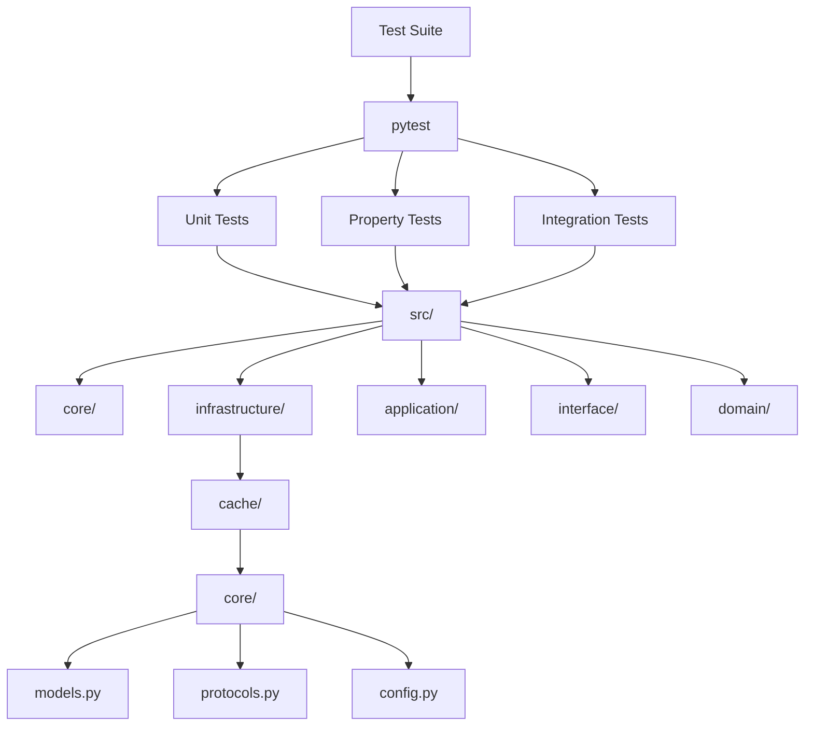

# Design Document: Test Coverage 80%

## Overview

Este documento descreve o design para corrigir os problemas de importação de módulos e atingir 80% de cobertura de testes no projeto Python API Base. O principal problema identificado é a estrutura incorreta de imports no módulo `infrastructure.cache`.

## Architecture



## Components and Interfaces

### 1. Cache Module Structure Fix

**Problema Atual:**
- `infrastructure/cache/__init__.py` importa de `infrastructure.cache.models`
- O arquivo real está em `infrastructure/cache/core/models.py`

**Solução:**
- Corrigir os imports em `infrastructure/cache/__init__.py` para usar `infrastructure.cache.core.models`
- Ou criar arquivos de re-export em `infrastructure/cache/models.py` e `infrastructure/cache/protocols.py`

### 2. Test Configuration

**conftest.py:**
- Já configura o path para `src/`
- Cria alias `my_app` para compatibilidade

**pytest.ini_options:**
- `testpaths = ["tests"]`
- `asyncio_mode = "auto"`

### 3. Coverage Configuration

**pyproject.toml:**
```toml
[tool.coverage.run]
source = ["src"]
branch = true

[tool.coverage.report]
exclude_lines = [
    "pragma: no cover",
    "def __repr__",
    "raise NotImplementedError",
    "if TYPE_CHECKING:",
]
```

## Data Models

### CacheStats
```python
@dataclass(frozen=True, slots=True)
class CacheStats:
    hits: int
    misses: int
    hit_rate: float
    memory_usage_bytes: int
    entry_count: int
```

### CacheEntry[T]
```python
@dataclass(frozen=True, slots=True)
class CacheEntry[T]:
    key: str
    value: T
    created_at: datetime
    ttl: int | None = None
    expires_at: datetime | None = None
    tags: tuple[str, ...] = ()
```

### CacheKey[T]
```python
@dataclass(frozen=True, slots=True)
class CacheKey[T]:
    pattern: str
```

## Correctness Properties

*A property is a characteristic or behavior that should hold true across all valid executions of a system-essentially, a formal statement about what the system should do. Properties serve as the bridge between human-readable specifications and machine-verifiable correctness guarantees.*

### Property 1: Module Import Resolution
*For any* module in the src/ directory, importing that module SHALL succeed without ImportError when the Python path is correctly configured.
**Validates: Requirements 1.1, 1.2**

### Property 2: Cache Module Exports Completeness
*For any* expected export name in the cache module (CacheStats, CacheEntry, CacheKey, CacheProvider, JsonSerializer), the name SHALL be accessible via `from infrastructure.cache import <name>`.
**Validates: Requirements 2.1, 2.2, 2.3**

### Property 3: Lifecycle Hook Execution Order
*For any* sequence of registered shutdown hooks, the LifecycleManager SHALL execute them in reverse registration order.
**Validates: Requirements 5.2**

## Error Handling

### Import Errors
- Capturar `ImportError` e `ModuleNotFoundError`
- Fornecer mensagem clara indicando o módulo faltante
- Sugerir correção baseada na estrutura do projeto

### Test Collection Errors
- Validar imports antes de executar testes
- Usar `pytest --collect-only` para detectar problemas

### Coverage Failures
- Se cobertura < 80%, falhar o build
- Gerar relatório HTML para análise

## Testing Strategy

### Unit Testing
- Framework: pytest
- Localização: `tests/unit/`
- Foco: Funções isoladas, classes, módulos

### Property-Based Testing
- Framework: Hypothesis
- Localização: `tests/properties/`
- Configuração: `max_examples = 100`
- Cada property test DEVE ter comentário: `**Feature: test-coverage-80-percent-v2, Property N: <description>**`

### Integration Testing
- Framework: pytest + pytest-asyncio
- Localização: `tests/integration/`
- Foco: Interação entre componentes

### Coverage Requirements
- Mínimo: 80% line coverage
- Branch coverage: habilitado
- Relatório: HTML + terminal

