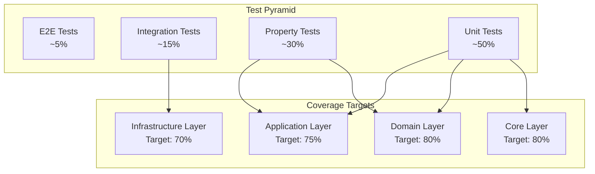

# Design Document: Test Coverage 80%

## Overview

Este documento descreve a estratégia e arquitetura para aumentar a cobertura de testes do projeto Python API Base de 51% para 80%. A abordagem combina testes unitários tradicionais com property-based testing usando Hypothesis para garantir cobertura abrangente e descoberta automática de edge cases.

### Current State
- Cobertura atual: 51%
- Meta: 80%
- Gap: ~29 pontos percentuais
- Módulos críticos com baixa cobertura identificados

### Target Modules (Priority Order)
1. `src/application/common/export/` - 0% coverage (alta prioridade)
2. `src/application/common/base/use_case.py` - 25% coverage
3. `src/application/common/base/generic_mapper.py` - 17% coverage
4. `src/application/common/cqrs/event_bus.py` - 27% coverage
5. `src/application/common/middleware/` - 28-39% coverage
6. `src/application/examples/` - handlers e use_cases com ~40% coverage

## Architecture



## Components and Interfaces

### Test Organization Structure

```
tests/
├── unit/                    # Testes unitários por camada
│   ├── application/
│   │   ├── common/
│   │   │   ├── test_base.py
│   │   │   ├── test_cqrs.py
│   │   │   ├── test_export.py
│   │   │   └── test_middleware.py
│   │   ├── examples/
│   │   │   ├── test_item_handlers.py
│   │   │   └── test_pedido_handlers.py
│   │   └── services/
│   │       ├── test_feature_flags.py
│   │       ├── test_file_upload.py
│   │       └── test_multitenancy.py
│   ├── core/
│   │   ├── test_config.py
│   │   └── test_types.py
│   └── domain/
│       ├── test_entities.py
│       ├── test_value_objects.py
│       └── test_specifications.py
├── properties/              # Property-based tests
│   ├── test_mapper_roundtrip.py
│   ├── test_cqrs_properties.py
│   ├── test_domain_invariants.py
│   ├── test_export_roundtrip.py
│   └── test_security_properties.py
└── factories/               # Test data factories
    ├── entity_factory.py
    ├── dto_factory.py
    └── hypothesis_strategies.py
```

### Key Interfaces

```python
# Test Factory Protocol
class TestFactory(Protocol[T]):
    def create(self, **overrides: Any) -> T: ...
    def create_batch(self, count: int, **overrides: Any) -> list[T]: ...

# Hypothesis Strategy Builder
class StrategyBuilder(Protocol[T]):
    def build(self) -> st.SearchStrategy[T]: ...
    def with_constraint(self, constraint: Callable[[T], bool]) -> Self: ...
```

## Data Models

### Test Configuration

```python
@dataclass
class CoverageConfig:
    min_overall: float = 80.0
    min_branch: float = 70.0
    fail_under: float = 80.0
    exclude_patterns: list[str] = field(default_factory=list)

@dataclass  
class PropertyTestConfig:
    max_examples: int = 100
    deadline_ms: int = 5000
    derandomize: bool = False
```

### Test Result Models

```python
@dataclass
class CoverageResult:
    total_statements: int
    covered_statements: int
    total_branches: int
    covered_branches: int
    
    @property
    def statement_coverage(self) -> float:
        return (self.covered_statements / self.total_statements) * 100
    
    @property
    def branch_coverage(self) -> float:
        return (self.covered_branches / self.total_branches) * 100
```

## Correctness Properties

*A property is a characteristic or behavior that should hold true across all valid executions of a system-essentially, a formal statement about what the system should do. Properties serve as the bridge between human-readable specifications and machine-verifiable correctness guarantees.*

Based on the prework analysis, the following correctness properties will be implemented:

### Property 1: Mapper Round-trip Consistency
*For any* valid domain entity, converting to DTO and back to entity should preserve all essential data fields.
**Validates: Requirements 2.2, 8.3**

### Property 2: CQRS Command Bus Dispatch
*For any* registered command and handler pair, dispatching the command should invoke exactly the registered handler once.
**Validates: Requirements 2.3**

### Property 3: CQRS Event Bus Publishing
*For any* domain event and set of subscribers, publishing the event should notify all registered subscribers.
**Validates: Requirements 2.3**

### Property 4: Middleware Retry Behavior
*For any* transient failure, the retry middleware should attempt the operation up to the configured maximum retries with exponential backoff.
**Validates: Requirements 2.4**

### Property 5: Domain Entity Invariants
*For any* valid entity creation parameters, the resulting entity should satisfy all domain invariants (non-null ID, valid timestamps, consistent state).
**Validates: Requirements 3.1, 3.2**

### Property 6: Value Object Equality
*For any* two value objects with identical field values, they should be considered equal, and their hash codes should match.
**Validates: Requirements 3.2**

### Property 7: Specification Composition
*For any* two specifications A and B, the composition (A AND B) should be satisfied only when both A and B are satisfied individually.
**Validates: Requirements 3.3**

### Property 8: Config Validation
*For any* configuration with valid field values, loading should succeed; for invalid values, loading should raise a validation error.
**Validates: Requirements 4.1**

### Property 9: JWT Round-trip
*For any* valid payload, encoding to JWT and decoding back should return the original payload (excluding standard claims added during encoding).
**Validates: Requirements 4.2**

### Property 10: Password Hash Verification
*For any* password string, hashing and then verifying with the same password should return True; verifying with a different password should return False.
**Validates: Requirements 4.2**

### Property 11: Result Type Monad Laws
*For any* Result value, the map operation should satisfy the functor laws: map(identity) == identity and map(f . g) == map(f) . map(g).
**Validates: Requirements 4.3**

### Property 12: Export/Import Round-trip
*For any* list of valid entities, exporting to JSON/CSV and importing back should produce an equivalent list.
**Validates: Requirements 6.1, 6.2, 6.3**

### Property 13: Feature Flag Evaluation Consistency
*For any* feature flag configuration and user context, evaluating the flag multiple times with the same context should return the same result.
**Validates: Requirements 7.1**

### Property 14: File Upload Validation
*For any* file with size exceeding the limit or with disallowed extension, the validator should reject it; valid files should be accepted.
**Validates: Requirements 7.2**

### Property 15: Tenant Isolation
*For any* two different tenant contexts, data operations in one tenant context should not affect or be visible to the other tenant.
**Validates: Requirements 7.3**

## Error Handling

### Test Failure Categories

1. **Assertion Failures**: Test expectations not met
   - Action: Review test logic and implementation
   
2. **Property Falsification**: Hypothesis found counterexample
   - Action: Fix implementation bug or refine property
   
3. **Timeout Failures**: Test exceeded deadline
   - Action: Optimize code or increase deadline
   
4. **Setup Failures**: Test fixtures failed
   - Action: Review factory/fixture implementation

### Error Reporting

```python
@dataclass
class TestFailure:
    test_name: str
    failure_type: FailureType
    message: str
    counterexample: Optional[Any] = None  # For property tests
    stack_trace: Optional[str] = None
```

## Testing Strategy

### Unit Testing Approach

- **Framework**: pytest 8.3+
- **Async Support**: pytest-asyncio
- **Coverage**: pytest-cov with branch coverage enabled
- **Mocking**: unittest.mock and respx for HTTP

### Property-Based Testing Approach

- **Framework**: Hypothesis 6.115+
- **Configuration**: 
  - `max_examples = 100` (minimum iterations per property)
  - `deadline = 5000ms`
  - `derandomize = False` (for CI reproducibility, use seed)

### Test Annotation Format

Each property-based test MUST include a comment linking to the design document:

```python
@given(entity=entity_strategy())
def test_mapper_roundtrip(entity: Entity) -> None:
    """
    **Feature: test-coverage-80-percent-v3, Property 1: Mapper Round-trip Consistency**
    **Validates: Requirements 2.2, 8.3**
    """
    dto = mapper.to_dto(entity)
    result = mapper.to_entity(dto)
    assert result.id == entity.id
    assert result.name == entity.name
```

### Coverage Targets by Module

| Module | Current | Target | Priority |
|--------|---------|--------|----------|
| application/common/export | 0% | 70% | P0 |
| application/common/base/use_case | 25% | 75% | P0 |
| application/common/base/generic_mapper | 17% | 75% | P0 |
| application/common/cqrs/event_bus | 27% | 75% | P1 |
| application/common/middleware/* | 28-39% | 70% | P1 |
| application/examples/item | ~40% | 70% | P2 |
| application/examples/pedido | ~40% | 70% | P2 |
| application/services/* | 60-80% | 80% | P2 |
| domain/* | 70-90% | 80% | P2 |
| core/* | 70-90% | 80% | P2 |

### Test Execution Commands

```bash
# Run all tests with coverage
pytest --cov=src --cov-report=term-missing --cov-report=html

# Run only property tests
pytest tests/properties/ -v

# Run with coverage threshold enforcement
pytest --cov=src --cov-fail-under=80

# Run specific module tests
pytest tests/unit/application/common/test_export.py -v
```
