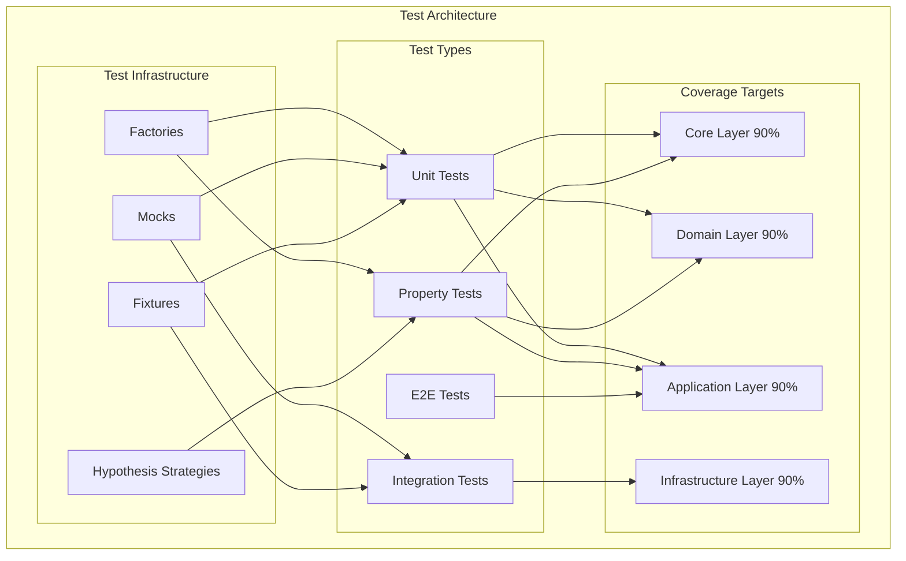

# Design Document: Test Coverage 90%

## Overview

This design document outlines the strategy and architecture for achieving 90% test coverage across the Python API Base project. The current coverage is approximately 55% (line-rate="0.5525"), and this initiative will systematically increase coverage through a combination of unit tests, property-based tests, and integration tests.

The project follows a clean architecture with four main layers:
- **Core Layer**: Base classes, configuration, types, and protocols
- **Domain Layer**: Entities, value objects, specifications, and domain events
- **Application Layer**: Use cases, DTOs, mappers, CQRS handlers, and services
- **Infrastructure Layer**: External integrations (auth, cache, database, messaging, etc.)

## Architecture



## Components and Interfaces

### Test Directory Structure

```
tests/
├── unit/
│   ├── core/
│   │   ├── base/
│   │   │   ├── test_entity.py
│   │   │   ├── test_value_object.py
│   │   │   ├── test_aggregate_root.py
│   │   │   ├── test_specification.py
│   │   │   ├── test_pagination.py
│   │   │   └── test_result.py
│   │   ├── config/
│   │   │   └── test_settings.py
│   │   ├── errors/
│   │   │   └── test_errors.py
│   │   └── types/
│   │       └── test_types.py
│   ├── domain/
│   │   ├── common/
│   │   │   ├── test_specification.py
│   │   │   └── test_value_objects.py
│   │   ├── users/
│   │   │   ├── test_user_aggregate.py
│   │   │   └── test_user_value_objects.py
│   │   └── examples/
│   │       ├── test_item_entity.py
│   │       └── test_pedido_entity.py
│   ├── application/
│   │   ├── common/
│   │   │   ├── test_dto.py
│   │   │   ├── test_mapper.py
│   │   │   ├── test_use_case.py
│   │   │   └── test_batch.py
│   │   ├── users/
│   │   │   ├── test_commands.py
│   │   │   └── test_queries.py
│   │   └── services/
│   │       └── test_feature_flags.py
│   └── infrastructure/
│       ├── auth/
│       │   ├── test_jwt.py
│       │   └── test_password.py
│       ├── cache/
│       │   └── test_cache.py
│       ├── resilience/
│       │   ├── test_circuit_breaker.py
│       │   └── test_retry.py
│       └── security/
│           ├── test_encryption.py
│           └── test_rbac.py
├── properties/
│   ├── test_dto_roundtrip.py
│   ├── test_entity_creation.py
│   ├── test_specification_algebra.py
│   ├── test_pagination_math.py
│   ├── test_id_uniqueness.py
│   └── test_validation_consistency.py
├── integration/
│   ├── test_user_crud.py
│   ├── test_auth_flow.py
│   ├── test_cache_operations.py
│   └── test_batch_operations.py
└── factories/
    ├── entity_factory.py
    ├── dto_factory.py
    └── hypothesis_strategies.py
```

### Key Interfaces

```python
# Test Factory Protocol
class TestFactory(Protocol[T]):
    def create(self, **overrides: Any) -> T: ...
    def create_batch(self, count: int, **overrides: Any) -> list[T]: ...

# Hypothesis Strategy Builder
class StrategyBuilder(Protocol[T]):
    def build(self) -> SearchStrategy[T]: ...
    def with_constraint(self, constraint: Callable[[T], bool]) -> Self: ...
```

## Data Models

### Test Coverage Report Model

```python
@dataclass
class CoverageReport:
    module: str
    line_rate: float
    branch_rate: float
    lines_covered: int
    lines_total: int
    
    @property
    def meets_target(self) -> bool:
        return self.line_rate >= 0.90
```

### Test Result Model

```python
@dataclass
class TestResult:
    test_name: str
    passed: bool
    duration_ms: float
    error_message: str | None = None
```

## Correctness Properties

*A property is a characteristic or behavior that should hold true across all valid executions of a system-essentially, a formal statement about what the system should do. Properties serve as the bridge between human-readable specifications and machine-verifiable correctness guarantees.*

Based on the prework analysis, the following correctness properties will be implemented:

### Property 1: DTO Serialization Round-Trip
*For any* valid DTO instance, serializing to dict and deserializing back should produce an equivalent DTO.
**Validates: Requirements 1.5, 5.1**

### Property 2: Entity Creation Consistency
*For any* valid entity data, creating an entity should result in all provided attributes being correctly set; *for any* invalid entity data, creation should raise a validation error.
**Validates: Requirements 2.4, 2.5**

### Property 3: Specification Algebra
*For any* two specifications A and B, the composition operations should follow boolean algebra:
- `A.and_(B).is_satisfied_by(x)` equals `A.is_satisfied_by(x) and B.is_satisfied_by(x)`
- `A.or_(B).is_satisfied_by(x)` equals `A.is_satisfied_by(x) or B.is_satisfied_by(x)`
- `A.not_().is_satisfied_by(x)` equals `not A.is_satisfied_by(x)`
**Validates: Requirements 5.3**

### Property 4: Pagination Calculations
*For any* total item count and page size, the pagination calculations should be mathematically correct:
- `total_pages = ceil(total_items / page_size)`
- `offset = (page - 1) * page_size`
- `has_next = page < total_pages`
- `has_prev = page > 1`
**Validates: Requirements 5.4**

### Property 5: ID Uniqueness
*For any* batch of N generated IDs, all N IDs should be unique and properly formatted according to their type (UUID, ULID, etc.).
**Validates: Requirements 5.5**

### Property 6: Validation Consistency
*For any* input data, validation should be deterministic - the same input should always produce the same validation result (pass or fail).
**Validates: Requirements 5.2**

### Property 7: Configuration Validation
*For any* configuration with missing required fields, loading should raise a validation error with a clear message indicating which field is missing.
**Validates: Requirements 3.5**

## Error Handling

### Test Failure Handling

```python
class TestError(Exception):
    """Base class for test-related errors."""
    pass

class CoverageTargetNotMet(TestError):
    """Raised when coverage target is not achieved."""
    def __init__(self, module: str, actual: float, target: float = 0.90):
        self.module = module
        self.actual = actual
        self.target = target
        super().__init__(
            f"Coverage target not met for {module}: "
            f"{actual:.1%} < {target:.1%}"
        )

class PropertyTestFailed(TestError):
    """Raised when a property test finds a counterexample."""
    def __init__(self, property_name: str, counterexample: Any):
        self.property_name = property_name
        self.counterexample = counterexample
        super().__init__(
            f"Property '{property_name}' failed with counterexample: {counterexample}"
        )
```

### Error Recovery Strategies

1. **Flaky Test Detection**: Tests that fail intermittently are marked and retried
2. **Isolation Failures**: Tests that fail due to shared state are identified and fixed
3. **Timeout Handling**: Long-running tests are terminated with clear error messages

## Testing Strategy

### Dual Testing Approach

This project uses both unit tests and property-based tests as complementary approaches:

- **Unit Tests**: Verify specific examples, edge cases, and error conditions
- **Property Tests**: Verify universal properties that should hold across all inputs

### Property-Based Testing Framework

The project uses **Hypothesis** as the property-based testing library.

Configuration in `pyproject.toml`:
```toml
[tool.hypothesis]
max_examples = 100
deadline = 5000
derandomize = false
print_blob = true
```

### Test Annotation Format

Each property-based test must be annotated with:
```python
# **Feature: test-coverage-90-percent, Property {number}: {property_text}**
```

### Coverage Measurement

Coverage is measured using `pytest-cov` with the following configuration:
- Source: `src/`
- Branch coverage: enabled
- Minimum target: 90%

### Test Execution Order

1. Unit tests (fastest, most isolated)
2. Property tests (medium speed, many iterations)
3. Integration tests (slower, requires setup)
4. E2E tests (slowest, full system)

### Modules to Test (Priority Order)

#### High Priority (Core Business Logic)
1. `src/core/base/` - Foundation classes
2. `src/domain/` - Domain entities and value objects
3. `src/application/common/` - Shared application logic

#### Medium Priority (Infrastructure)
4. `src/infrastructure/auth/` - Authentication
5. `src/infrastructure/cache/` - Caching
6. `src/infrastructure/resilience/` - Resilience patterns
7. `src/infrastructure/security/` - Security utilities

#### Lower Priority (Already Excluded from Coverage)
- `src/interface/` - HTTP layer (excluded in config)
- `src/infrastructure/dapr/` - Dapr integration (excluded)
- `src/infrastructure/grpc/` - gRPC (excluded)
- `src/infrastructure/kafka/` - Kafka (excluded)
