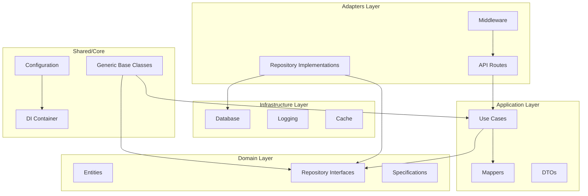
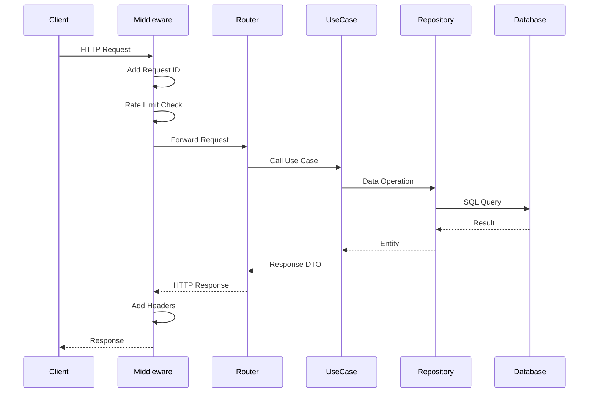

# Architecture

This project follows Clean Architecture principles with a focus on code reuse through Python Generics.

## Layer Diagram



## Request Flow



## Directory Structure

```
src/my_api/
├── core/                    # Application core
│   ├── config.py           # Pydantic Settings
│   ├── container.py        # DI Container
│   └── exceptions.py       # Domain exceptions
│
├── shared/                  # Reusable generics
│   ├── repository.py       # IRepository[T]
│   ├── use_case.py         # BaseUseCase[T]
│   ├── router.py           # GenericCRUDRouter[T]
│   ├── dto.py              # ApiResponse, PaginatedResponse
│   ├── mapper.py           # IMapper[T, DTO]
│   └── entity.py           # BaseEntity
│
├── domain/                  # Business domain
│   └── entities/           # Domain entities
│       └── item.py
│
├── application/             # Application logic
│   ├── use_cases/          # Business operations
│   └── mappers/            # Entity <-> DTO
│
├── adapters/                # External interfaces
│   ├── api/
│   │   ├── routes/         # FastAPI routers
│   │   └── middleware/     # Request processing
│   └── repositories/       # Data access
│
└── infrastructure/          # Technical concerns
    ├── database/           # DB session, migrations
    └── logging/            # Structured logging
```

## Key Design Decisions

### 1. Generic Base Classes
All CRUD operations are implemented once in generic base classes:
- `IRepository[T, CreateDTO, UpdateDTO]` - Data access interface
- `BaseUseCase[T, CreateDTO, UpdateDTO, ResponseDTO]` - Business logic
- `GenericCRUDRouter[T]` - API endpoints

### 2. Dependency Injection
Using `dependency-injector` for:
- Singleton configuration
- Factory-based session management
- Easy testing with overrides

### 3. Unit of Work Pattern
Transaction management through `IUnitOfWork`:
- Atomic operations across repositories
- Automatic rollback on errors

### 4. Result Pattern
Explicit error handling with `Result[T, E]`:
- `Ok[T]` for success
- `Err[E]` for failures
- No hidden exceptions

### 5. Property-Based Testing
Using Hypothesis for:
- Correctness properties
- Edge case discovery
- Round-trip validation

### 6. Domain Events
Decoupled communication through `EventBus`:
- `DomainEvent` base class for all events
- Async and sync handler support
- Global event bus for cross-cutting concerns

### 7. Resilience Patterns
For external service integration:
- `CircuitBreaker` - Prevents cascading failures
- `retry` decorator - Exponential backoff with jitter
- Configurable thresholds and timeouts

### 8. Code Generation
Entity scaffolding with `scripts/generate_entity.py`:
- Generates entity, mapper, use case, and routes
- Follows project conventions automatically
- Reduces boilerplate and ensures consistency
