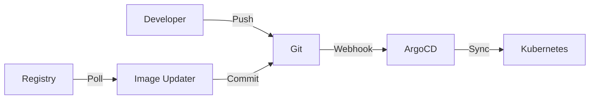

# ADR-015: GitOps Architecture with ArgoCD

## Status

Accepted

## Date

2025-12-04

## Context

O projeto Python API Base necessita de uma estratégia de continuous delivery que:

1. Garanta consistência entre ambientes (dev, staging, prod)
2. Permita rollbacks rápidos e confiáveis
3. Forneça auditoria completa de todas as mudanças
4. Suporte múltiplos clusters Kubernetes
5. Integre com o fluxo de CI/CD existente (GitHub Actions)
6. Mantenha secrets seguros fora do Git

A infraestrutura atual inclui:
- Helm charts para deployment da aplicação
- Kubernetes manifests para recursos base
- Terraform para provisionamento de infraestrutura
- GitHub Actions para CI

## Decision

Adotamos ArgoCD como ferramenta de GitOps continuous delivery com a seguinte arquitetura:

### Componentes Principais

1. **ArgoCD Server**: API e UI para gerenciamento
2. **Application Controller**: Sincronização de estado
3. **Repo Server**: Operações Git
4. **Image Updater**: Atualização automática de imagens
5. **Notifications Controller**: Alertas e notificações
6. **Sealed Secrets**: Gestão segura de secrets

### Estrutura de Configuração

```
deployments/argocd/
├── base/           # Instalação ArgoCD
├── projects/       # AppProjects (RBAC)
├── applications/   # Applications por ambiente
├── applicationsets/# Geração dinâmica
├── notifications/  # Configuração de alertas
├── image-updater/  # Atualização de imagens
├── hooks/          # Pre/Post sync hooks
├── sealed-secrets/ # Secrets criptografados
└── overlays/       # Customizações por ambiente
```

### Políticas por Ambiente

| Ambiente | Auto-Sync | Self-Heal | Prune | Aprovação |
|----------|-----------|-----------|-------|-----------|
| Dev | ✅ | ✅ | ✅ | Automática |
| Staging | ✅ | ❌ | ✅ | Automática |
| Prod | ❌ | ❌ | ❌ | Manual |

### Fluxo GitOps



## Alternatives Considered

### 1. Flux CD

**Prós:**
- Nativo do CNCF
- Menor footprint
- Integração nativa com Helm

**Contras:**
- UI menos madura
- Curva de aprendizado maior
- Menos recursos de RBAC

**Decisão:** Rejeitado devido à UI menos madura e menor adoção no mercado.

### 2. Jenkins X

**Prós:**
- CI/CD completo
- Preview environments automáticos

**Contras:**
- Complexidade alta
- Overhead significativo
- Vendor lock-in

**Decisão:** Rejeitado devido à complexidade e overhead.

### 3. Spinnaker

**Prós:**
- Multi-cloud nativo
- Canary deployments avançados

**Contras:**
- Muito complexo para nosso caso
- Recursos excessivos
- Não é GitOps puro

**Decisão:** Rejeitado por ser over-engineering para nosso caso de uso.

### 4. GitHub Actions + kubectl

**Prós:**
- Simples
- Já temos GitHub Actions

**Contras:**
- Não é GitOps (push-based)
- Sem reconciliação automática
- Difícil auditoria

**Decisão:** Rejeitado por não seguir princípios GitOps.

## Consequences

### Positivas

1. **Single Source of Truth**: Git é a única fonte de verdade
2. **Auditoria Completa**: Histórico Git = histórico de deployments
3. **Rollback Simples**: `git revert` reverte deployment
4. **Consistência**: Estado declarativo garante consistência
5. **Self-Healing**: ArgoCD corrige drift automaticamente
6. **Visibilidade**: UI mostra estado de todos os ambientes
7. **RBAC Granular**: Controle de acesso por projeto/ambiente

### Negativas

1. **Complexidade Adicional**: Mais um componente para manter
2. **Curva de Aprendizado**: Equipe precisa aprender ArgoCD
3. **Recursos**: ArgoCD consome recursos do cluster
4. **Secrets**: Requer solução adicional (Sealed Secrets)

### Neutras

1. **Mudança de Workflow**: Deployments via Git, não kubectl direto
2. **Dependência**: Dependência do ArgoCD para deployments

## Implementation Notes

### Segurança

- RBAC configurado com least-privilege
- Secrets via Sealed Secrets ou External Secrets
- Network policies para isolamento
- TLS em todas as comunicações

### Observabilidade

- Métricas Prometheus expostas
- Notificações Slack para eventos
- Logs estruturados

### Disaster Recovery

- Backup de secrets do ArgoCD
- Documentação de recuperação
- Manifests versionados no Git

## References

- [ArgoCD Best Practices](https://argo-cd.readthedocs.io/en/stable/user-guide/best_practices/)
- [GitOps Principles](https://opengitops.dev/)
- [CNCF GitOps Working Group](https://github.com/cncf/tag-app-delivery/tree/main/gitops-wg)
- [Sealed Secrets](https://sealed-secrets.netlify.app/)

## Review

- **Author:** API Team
- **Reviewers:** Platform Team, Security Team
- **Approved:** 2025-12-04
