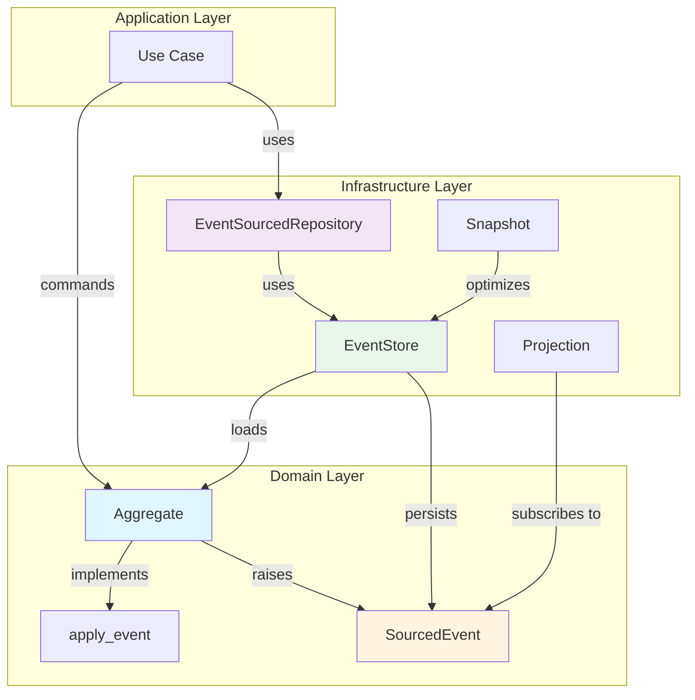
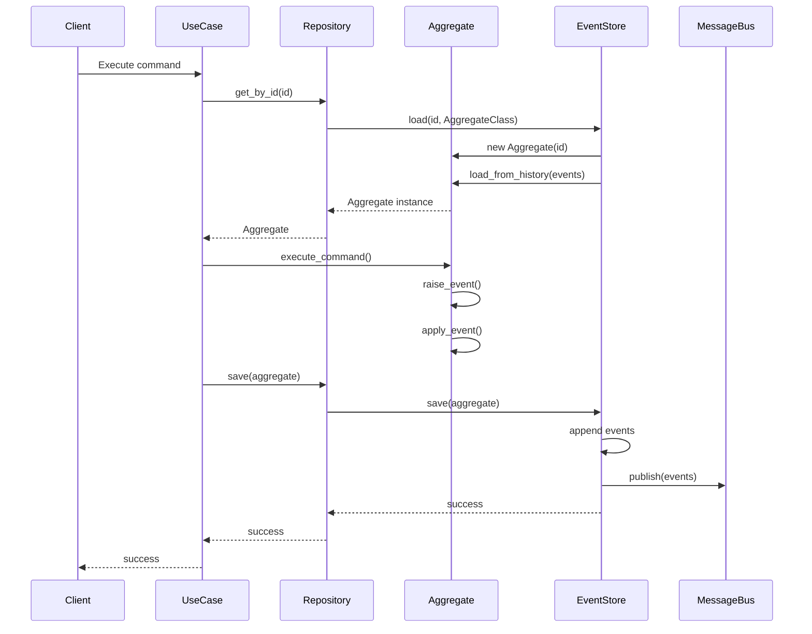
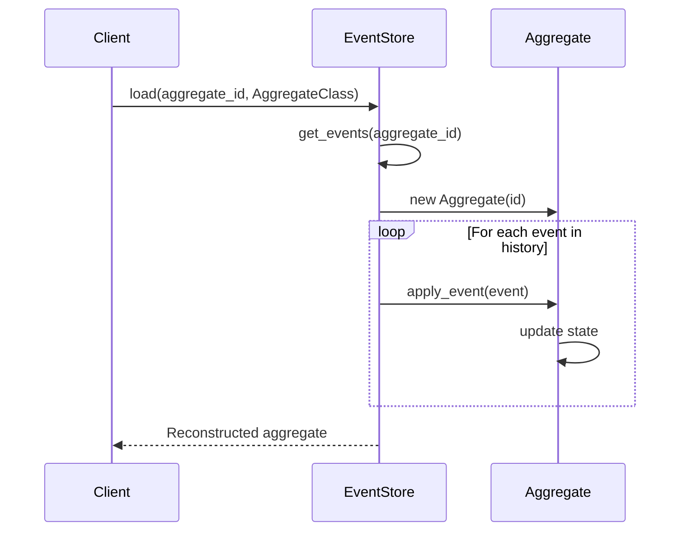
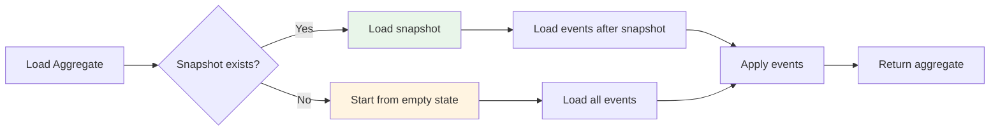

# Event Sourcing Implementation

**Feature**: Infrastructure Code Review - P1-2
**Status**: Production-Ready
**Updated**: 2025-01-02

## Overview

This document describes the Event Sourcing pattern implementation in the Python API Base project. Event Sourcing is a pattern where all changes to application state are stored as a sequence of immutable events, enabling complete audit trails, temporal queries, and event replay capabilities.

### Key Benefits

- **Complete Audit Trail**: Every state change is recorded as an immutable event
- **Temporal Queries**: Reconstruct state at any point in time
- **Event Replay**: Rebuild aggregates from historical events
- **Debugging**: Full visibility into how state evolved
- **Integration**: Events can be published to message queues for CQRS/microservices

## Architecture Components

### 1. Core Components



### 2. Component Descriptions

| Component | Description | Location |
|-----------|-------------|----------|
| **Aggregate** | Base class for event-sourced aggregates | `src/infrastructure/db/event_sourcing/aggregate.py` |
| **SourcedEvent** | Immutable event base class | `src/infrastructure/db/event_sourcing/events.py` |
| **EventStore** | Persistence for event streams | `src/infrastructure/db/event_sourcing/store.py` |
| **EventStream** | Container for aggregate events | `src/infrastructure/db/event_sourcing/events.py` |
| **Snapshot** | Performance optimization | `src/infrastructure/db/event_sourcing/snapshots.py` |
| **Projection** | Read model builder | `src/infrastructure/db/event_sourcing/projections.py` |
| **Repository** | Familiar repository interface | `src/infrastructure/db/event_sourcing/repository.py` |

## Event Store Schema

### Event Structure

```python
@dataclass(frozen=True, slots=True)
class SourcedEvent:
    """Immutable event representing a state change."""

    event_id: str          # Unique event identifier (UUID)
    aggregate_id: str      # ID of aggregate that raised event
    version: int           # Sequential version number
    timestamp: datetime    # When event occurred (UTC)
    metadata: dict[str, Any]  # Additional context (user, correlation ID, etc.)
```

### Event Stream Structure

```python
@dataclass
class EventStream:
    """Stream of events for a single aggregate."""

    aggregate_id: str           # Aggregate identifier
    aggregate_type: str         # Aggregate class name
    events: list[SourcedEvent]  # Ordered event list
    version: int                # Current version (event count)
    created_at: datetime        # Stream creation time
    updated_at: datetime        # Last event time
```

### Database Schema (PostgreSQL/ScyllaDB)

```sql
-- Events table (append-only, never update or delete)
CREATE TABLE events (
    event_id UUID PRIMARY KEY,
    aggregate_id VARCHAR(255) NOT NULL,
    aggregate_type VARCHAR(100) NOT NULL,
    event_type VARCHAR(100) NOT NULL,
    version INT NOT NULL,
    data JSONB NOT NULL,
    metadata JSONB,
    timestamp TIMESTAMPTZ NOT NULL DEFAULT NOW(),
    UNIQUE (aggregate_id, version)
);

CREATE INDEX idx_events_aggregate ON events(aggregate_id, version);
CREATE INDEX idx_events_type ON events(aggregate_type);
CREATE INDEX idx_events_timestamp ON events(timestamp);

-- Snapshots table (optional, for performance)
CREATE TABLE snapshots (
    aggregate_id VARCHAR(255) PRIMARY KEY,
    aggregate_type VARCHAR(100) NOT NULL,
    version INT NOT NULL,
    state JSONB NOT NULL,
    created_at TIMESTAMPTZ NOT NULL DEFAULT NOW()
);
```

## Usage Examples

### 1. Define Domain Events

```python
from dataclasses import dataclass
from infrastructure.db.event_sourcing import SourcedEvent


@dataclass(frozen=True, slots=True)
class OrderCreated(SourcedEvent):
    """Event raised when an order is created."""
    customer_id: str
    total_amount: float


@dataclass(frozen=True, slots=True)
class OrderItemAdded(SourcedEvent):
    """Event raised when item is added to order."""
    product_id: str
    quantity: int
    price: float


@dataclass(frozen=True, slots=True)
class OrderShipped(SourcedEvent):
    """Event raised when order is shipped."""
    tracking_number: str
    carrier: str
```

### 2. Create Event-Sourced Aggregate

```python
from infrastructure.db.event_sourcing import Aggregate


class Order(Aggregate[str]):
    """Order aggregate using event sourcing."""

    def __init__(self, order_id: str) -> None:
        super().__init__(order_id)
        self.customer_id: str = ""
        self.items: list[OrderItem] = []
        self.status: OrderStatus = OrderStatus.PENDING
        self.total: float = 0.0

    # Command methods (business logic)
    def create(self, customer_id: str) -> None:
        """Create a new order."""
        if self.customer_id:
            raise ValueError("Order already created")

        # Raise event - this records the state change
        self.raise_event(OrderCreated(
            customer_id=customer_id,
            total_amount=0.0
        ))

    def add_item(self, product_id: str, quantity: int, price: float) -> None:
        """Add item to order."""
        if self.status != OrderStatus.PENDING:
            raise ValueError("Cannot modify shipped order")

        self.raise_event(OrderItemAdded(
            product_id=product_id,
            quantity=quantity,
            price=price
        ))

    def ship(self, tracking_number: str, carrier: str) -> None:
        """Ship the order."""
        if not self.items:
            raise ValueError("Cannot ship empty order")

        self.raise_event(OrderShipped(
            tracking_number=tracking_number,
            carrier=carrier
        ))

    # Event handlers (state mutations)
    def apply_event(self, event: SourcedEvent) -> None:
        """Apply event to update aggregate state."""
        match event:
            case OrderCreated():
                self.customer_id = event.customer_id
                self.total = event.total_amount
                self.status = OrderStatus.PENDING

            case OrderItemAdded():
                self.items.append(OrderItem(
                    product_id=event.product_id,
                    quantity=event.quantity,
                    price=event.price
                ))
                self.total += event.price * event.quantity

            case OrderShipped():
                self.status = OrderStatus.SHIPPED

            case _:
                pass  # Unknown event type
```

### 3. Use Event Store

```python
from infrastructure.db.event_sourcing import InMemoryEventStore

# Create event store
event_store = InMemoryEventStore[Order, SourcedEvent]()

# Create new order
order = Order("order-123")
order.create(customer_id="customer-456")
order.add_item("product-1", quantity=2, price=29.99)
order.add_item("product-2", quantity=1, price=49.99)

# Save events (append-only)
await event_store.save(order)

# Load order from events
loaded_order = await event_store.load("order-123", Order)

# Order state is reconstructed by replaying all events
assert loaded_order.customer_id == "customer-456"
assert len(loaded_order.items) == 2
assert loaded_order.total == 109.97
```

### 4. Use Repository Pattern

```python
from infrastructure.db.event_sourcing import EventSourcedRepository

# Create repository
repository = EventSourcedRepository(
    event_store=event_store,
    aggregate_class=Order,
    snapshot_frequency=100  # Snapshot every 100 events
)

# Save with optimistic concurrency
order = await repository.get_by_id("order-123")
if order:
    order.ship(tracking_number="TRK-123", carrier="DHL")
    await repository.save(order, expected_version=order.version)
```

### 5. Optimistic Concurrency

```python
from infrastructure.db.event_sourcing import ConcurrencyError

try:
    # Two concurrent operations
    order1 = await repository.get_by_id("order-123")  # version=3
    order2 = await repository.get_by_id("order-123")  # version=3

    # First save succeeds
    order1.add_item("product-3", 1, 19.99)
    await repository.save(order1)  # version becomes 4

    # Second save fails with concurrency error
    order2.add_item("product-4", 1, 9.99)
    await repository.save(order2, expected_version=3)  # Fails!

except ConcurrencyError as e:
    # Handle conflict - reload and retry
    order = await repository.get_by_id("order-123")  # Get latest version
    order.add_item("product-4", 1, 9.99)
    await repository.save(order)
```

### 6. Projections (Read Models)

```python
from infrastructure.db.event_sourcing import Projection

class OrderSummaryProjection(Projection):
    """Build read model from events."""

    def __init__(self):
        self.summaries: dict[str, OrderSummary] = {}

    async def handle(self, event: SourcedEvent) -> None:
        """Update projection based on event."""
        match event:
            case OrderCreated():
                self.summaries[event.aggregate_id] = OrderSummary(
                    order_id=event.aggregate_id,
                    customer_id=event.customer_id,
                    total=0.0,
                    status="pending"
                )

            case OrderItemAdded():
                summary = self.summaries[event.aggregate_id]
                summary.total += event.price * event.quantity

            case OrderShipped():
                summary = self.summaries[event.aggregate_id]
                summary.status = "shipped"

# Subscribe projection to events
projection = OrderSummaryProjection()
events = await event_store.get_all_events()
for event in events:
    await projection.handle(event)
```

## Event Flow Diagrams

### Command Processing Flow



### Event Replay Flow



### Snapshot Optimization



## Best Practices

### 1. Event Design

✅ **DO:**
- Make events immutable (`frozen=True`)
- Use past tense names (`OrderCreated`, not `CreateOrder`)
- Include all data needed to apply the event
- Keep events small and focused
- Version events when schema changes

❌ **DON'T:**
- Store references to external entities (store IDs instead)
- Include computed values (recalculate in apply_event)
- Update or delete events (append-only)
- Use present/future tense names

### 2. Aggregate Design

✅ **DO:**
- Keep aggregates small and focused
- Validate business rules in command methods
- Keep apply_event deterministic and side-effect free
- Use meaningful event types
- Implement strong typing with PEP 695 generics

❌ **DON'T:**
- Load other aggregates in apply_event
- Make external calls in apply_event
- Skip events or reorder them
- Expose uncommitted events publicly

### 3. Performance Optimization

```python
# Use snapshots for aggregates with many events
repository = EventSourcedRepository(
    event_store=event_store,
    aggregate_class=Order,
    snapshot_frequency=100  # Snapshot every 100 events
)

# Load with snapshot
order = await repository.get_by_id("order-123")
# Loads snapshot at version 400, then applies events 401-450
```

### 4. Error Handling

```python
from infrastructure.db.event_sourcing import ConcurrencyError

async def update_order(order_id: str, item: OrderItem):
    max_retries = 3

    for attempt in range(max_retries):
        try:
            order = await repository.get_by_id(order_id)
            order.add_item(item.product_id, item.quantity, item.price)
            await repository.save(order, expected_version=order.version)
            return
        except ConcurrencyError:
            if attempt == max_retries - 1:
                raise
            await asyncio.sleep(0.1 * (2 ** attempt))  # Exponential backoff
```

## Integration with CQRS

Event Sourcing pairs naturally with CQRS (Command Query Responsibility Segregation):

```python
# Command side (write model)
@dataclass
class CreateOrderCommand:
    order_id: str
    customer_id: str

async def handle_create_order(cmd: CreateOrderCommand):
    order = Order(cmd.order_id)
    order.create(cmd.customer_id)
    await repository.save(order)
    # Events are automatically published to message bus

# Query side (read model)
class OrderQueryService:
    def __init__(self, db: AsyncSession):
        self.db = db

    async def get_order_summary(self, order_id: str) -> OrderSummaryDTO:
        # Query optimized read model (projection)
        result = await self.db.execute(
            select(OrderSummaryModel).where(OrderSummaryModel.id == order_id)
        )
        return result.scalar_one_or_none()
```

## Migration Strategy

### From Traditional Persistence

1. **Dual Write**: Write to both traditional DB and event store
2. **Shadow Mode**: Validate event sourcing matches traditional state
3. **Gradual Migration**: Move aggregates one at a time
4. **Cutover**: Switch reads to event-sourced aggregates
5. **Cleanup**: Remove traditional persistence code

### Schema Evolution

```python
# Version 1 event
@dataclass(frozen=True, slots=True)
class OrderCreatedV1(SourcedEvent):
    customer_id: str
    total_amount: float

# Version 2 event (added currency)
@dataclass(frozen=True, slots=True)
class OrderCreatedV2(SourcedEvent):
    customer_id: str
    total_amount: float
    currency: str = "USD"  # Default for backward compatibility

# Upcasting in apply_event
def apply_event(self, event: SourcedEvent) -> None:
    match event:
        case OrderCreatedV1():
            # Upcast to V2 format
            self._apply_order_created(
                event.customer_id,
                event.total_amount,
                currency="USD"
            )
        case OrderCreatedV2():
            self._apply_order_created(
                event.customer_id,
                event.total_amount,
                event.currency
            )
```

## Production Checklist

- ✅ Events are immutable and append-only
- ✅ Optimistic concurrency implemented
- ✅ Snapshots configured for large aggregates
- ✅ Event versioning strategy defined
- ✅ Projection rebuild process documented
- ✅ Backup and disaster recovery tested
- ✅ Event store monitoring configured
- ✅ Performance benchmarks established
- ✅ Integration tests cover event replay
- ✅ Event schema registry maintained

## References

- **Code Location**: `src/infrastructure/db/event_sourcing/`
- **Tests**: `tests/unit/infrastructure/db/test_event_sourcing.py`
- **ADRs**:
  - ADR-015: Event Sourcing Pattern Adoption
  - ADR-016: Event Schema Versioning Strategy
- **Related Patterns**:
  - [Saga Pattern](./saga-pattern.md)
  - [CQRS Pattern](./cqrs-pattern.md)
  - [Outbox Pattern](./outbox-pattern.md)

## Support

For questions or issues:
- Review existing aggregates in `src/domain/*/aggregates.py`
- Check unit tests for usage examples
- Consult Event Sourcing documentation: https://martinfowler.com/eaaDev/EventSourcing.html
