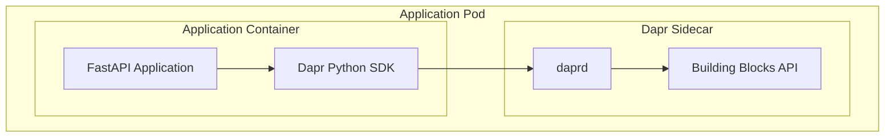

# Dapr Architecture

## Overview

This document describes the architecture of the Dapr 1.14 integration with the Python API Base project. Dapr (Distributed Application Runtime) provides a portable, event-driven runtime that simplifies building resilient microservices.

## Sidecar Pattern

Dapr uses the sidecar pattern, where a separate process (daprd) runs alongside the application container:



## Building Blocks

### Service Invocation

Service-to-service communication with automatic service discovery and mTLS:

```python
from infrastructure.dapr.invoke import ServiceInvoker, HttpMethod

invoker = ServiceInvoker(client)
response = await invoker.invoke(
    app_id="order-service",
    method_name="orders",
    http_verb=HttpMethod.GET,
)
```

### Pub/Sub Messaging

Asynchronous messaging with CloudEvents support:

```python
from infrastructure.dapr.pubsub import PubSubManager, MessageStatus

manager = PubSubManager(client, "pubsub")

# Publish
await manager.publish("orders", {"order_id": "123"})

# Subscribe
@manager.subscribe("orders")
async def handle_order(event: CloudEvent) -> MessageStatus:
    return MessageStatus.SUCCESS
```

### State Management

Key-value state storage with transactions:

```python
from infrastructure.dapr.state import StateManager

state = StateManager(client, "statestore")

# Save
await state.save("user:123", b'{"name": "John"}')

# Get
item = await state.get("user:123")

# Transaction
await state.transaction([
    {"operation": "upsert", "request": {"key": "k1", "value": "v1"}},
    {"operation": "delete", "request": {"key": "k2"}},
])
```

### Secrets Management

Secure secrets retrieval:

```python
from infrastructure.dapr.secrets import SecretsManager

secrets = SecretsManager(client, "vault")
api_key = await secrets.get_secret("api-key")
```

### Virtual Actors

Stateful computation units:

```python
from infrastructure.dapr.actors import Actor, ActorRuntime

class OrderActor(Actor):
    async def on_activate(self) -> None:
        self.order_data = await self.get_state("order")
    
    async def process(self) -> None:
        await self.set_state("status", "processed")
```

### Workflows

Long-running process orchestration:

```python
from infrastructure.dapr.workflow import Workflow, WorkflowActivity

class ProcessOrderWorkflow(Workflow):
    async def run(self, ctx, input):
        await ctx.call_activity(ValidateOrder, input)
        await ctx.call_activity(ProcessPayment, input)
        await ctx.call_activity(ShipOrder, input)
```

## Component Architecture

```
src/infrastructure/dapr/
├── client.py       # DaprClientWrapper
├── state.py        # StateManager
├── pubsub.py       # PubSubManager
├── secrets.py      # SecretsManager
├── invoke.py       # ServiceInvoker
├── bindings.py     # BindingsManager
├── actors.py       # ActorRuntime
├── workflow.py     # WorkflowEngine
├── health.py       # HealthChecker
├── middleware.py   # MiddlewarePipeline
└── errors.py       # Error types
```

## Resiliency

Dapr provides built-in resiliency through policies:

- **Timeouts**: Maximum operation duration
- **Retries**: Automatic retry with backoff
- **Circuit Breakers**: Prevent cascading failures

Configuration in `deployments/dapr/config/resiliency.yaml`.

## Observability

- **Tracing**: OpenTelemetry with Jaeger/Zipkin
- **Metrics**: Prometheus-compatible metrics
- **Logging**: Structured logs with trace context

## Security

- **mTLS**: Automatic encryption between sidecars
- **API Tokens**: Authentication for Dapr APIs
- **Access Control**: App-level policies
