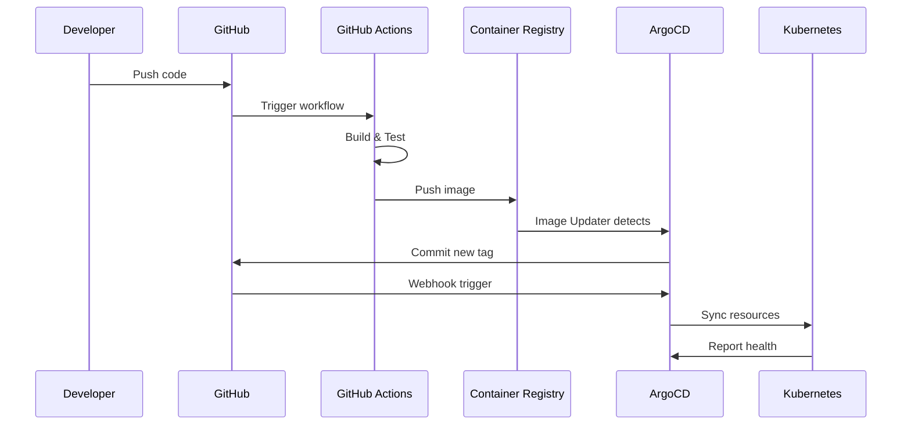

# GitOps Workflow Guide

Este guia documenta o fluxo de trabalho GitOps para deployments do Python API Base usando ArgoCD.

## Visão Geral do Fluxo



## Deployment para Development

### Fluxo Automático

1. Developer faz push para branch `main`
2. GitHub Actions executa build e testes
3. Imagem é publicada com tag `v*.*.*-dev.N`
4. Image Updater detecta nova imagem
5. Image Updater commita nova tag no Git
6. ArgoCD sincroniza automaticamente

### Comandos Úteis

```bash
# Verificar status
argocd app get python-api-base-dev

# Forçar sync
argocd app sync python-api-base-dev

# Ver logs
argocd app logs python-api-base-dev
```

## Deployment para Staging

### Fluxo Semi-Automático

1. Criar release candidate: `git tag v1.2.0-rc.1`
2. GitHub Actions builda imagem com tag RC
3. Image Updater atualiza staging
4. ArgoCD sincroniza automaticamente
5. QA valida em staging

### Promover para Staging

```bash
# Criar tag RC
git tag v1.2.0-rc.1
git push origin v1.2.0-rc.1

# Verificar deployment
argocd app get python-api-base-staging
```

## Deployment para Production

### Fluxo Manual (Aprovação Requerida)

1. Criar release tag: `git tag v1.2.0`
2. GitHub Actions builda imagem final
3. Image Updater atualiza referência no Git
4. ArgoCD detecta mudança (OutOfSync)
5. **Aprovação manual requerida**
6. Operador executa sync

### Processo de Aprovação

```bash
# 1. Verificar diff
argocd app diff python-api-base-prod

# 2. Dry-run
argocd app sync python-api-base-prod --dry-run

# 3. Sync com aprovação
argocd app sync python-api-base-prod

# 4. Monitorar rollout
argocd app wait python-api-base-prod --health
```

### Sync Windows

Production tem janelas de sync configuradas:
- **Permitido:** Segunda a Sexta, 06:00-18:00 UTC
- **Bloqueado:** Finais de semana e fora do horário

Para sync emergencial fora da janela:
```bash
argocd app sync python-api-base-prod --force
```

## Rollback

### Via Git (Recomendado)

```bash
# Identificar commit problemático
git log --oneline

# Reverter
git revert <commit-sha>
git push origin main

# ArgoCD sincroniza automaticamente (dev/staging)
# Para prod, aprovar sync manualmente
```

### Via ArgoCD

```bash
# Listar histórico
argocd app history python-api-base-prod

# Rollback para revisão específica
argocd app rollback python-api-base-prod <revision>
```

### Via Helm (Emergência)

```bash
# Listar releases
helm history python-api-base -n python-api-prod

# Rollback
helm rollback python-api-base <revision> -n python-api-prod
```

## Hotfix em Produção

### Processo

1. Criar branch de hotfix: `git checkout -b hotfix/critical-fix`
2. Implementar fix
3. Criar PR para `main`
4. Após merge, criar tag: `git tag v1.2.1`
5. Aguardar build
6. Aprovar sync em produção

```bash
# Criar hotfix
git checkout -b hotfix/critical-fix main
# ... fazer alterações ...
git commit -m "fix: critical bug"
git push origin hotfix/critical-fix

# Após merge
git checkout main
git pull
git tag v1.2.1
git push origin v1.2.1

# Aprovar deploy
argocd app sync python-api-base-prod
```

## Troubleshooting

### Application OutOfSync

```bash
# Verificar diferenças
argocd app diff python-api-base-dev

# Causas comuns:
# 1. Mudança manual no cluster
# 2. Helm values diferentes
# 3. Image tag atualizada

# Resolver
argocd app sync python-api-base-dev
```

### Sync Failed

```bash
# Ver detalhes do erro
argocd app get python-api-base-dev

# Ver eventos
kubectl describe application python-api-base-dev -n argocd

# Ver logs do controller
kubectl logs -n argocd -l app.kubernetes.io/name=argocd-application-controller --tail=100
```

### Health Degraded

```bash
# Verificar recursos com problema
argocd app resources python-api-base-dev --health-status Degraded

# Ver detalhes do pod
kubectl describe pod -n python-api-dev -l app=python-api-base

# Ver logs
kubectl logs -n python-api-dev -l app=python-api-base --tail=100
```

## Boas Práticas

### DO

- ✅ Sempre usar tags semânticas para releases
- ✅ Testar em staging antes de produção
- ✅ Usar dry-run antes de sync em produção
- ✅ Documentar mudanças significativas
- ✅ Monitorar health após deploy

### DON'T

- ❌ Não fazer `kubectl apply` direto em produção
- ❌ Não usar `latest` tag em produção
- ❌ Não pular staging para hotfixes
- ❌ Não fazer deploy fora das janelas sem aprovação
- ❌ Não ignorar alertas de health degraded

## Referências

- [ArgoCD User Guide](https://argo-cd.readthedocs.io/en/stable/user-guide/)
- [GitOps Principles](https://opengitops.dev/)
- [ADR-015: GitOps Architecture](../architecture/adr/ADR-015-gitops-argocd.md)
